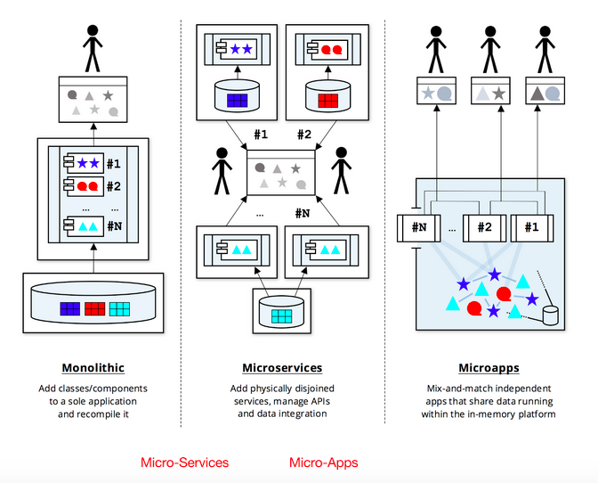

## The Future of Micro-Services

In light of the recent micro-services movement, the inception of a new breed of in-memory technology is a central component.

Figure 2: Evolution of the database; Monolithic, micro-services, and Starcounter’s micro-apps

The currently prevailing multi-tier micro-services platform sees the application and database as two disjoint entities, their communication of data dependent upon the constant exchange of signals. But more points of connection equals more points of system vulnerability. Laws of physics define a strict upper limit to the performance of such a multi-tier architecture: It takes 8 minutes for light to travel from Sun to Earth, 130ms for a signal to get from Australia to the U.S. by wires. Even if these databases and applications were to run on the same machine, they would still communicate and thus signal via a silicon chip. The solution in this context of this architecture is to minimize signaling by placing the separated entities as close together as possible.

First-generation in-memory databases made a significant shift from operating data on disks to operating in-memory by securing log to disk, which is multiple orders of magnitude faster. Software platforms like Starcounter’s, which employ a collapsed stack architecture, demonstrate yet another leap ahead—shrinking database and application tiers into a single layer. Such a collapsed stack architecture offers a high-performing, open-ended node for running a set of upload-able micro-apps. The data integration, which is considered challenging for micro-services, can be solved for micro-apps by way of efficient in-memory data sharing.

Whereas today’s storage procedures will often put chunks of code closer to the database to increase performance, with the collapsed stack approach it is no longer necessary to dissipate logic between database and app code since all applications running in a platform operate physically the same data instances that the database owns. Thus, delivery of data from the database to the app is not needed. This translates to millions of fully ACID transactions per second on a modest server.

What’s more, by shrinking the [database and application tiers into a single layer](/starcounter/integrated-database-and-web-server/), additional value can be realized via the elimination of messages relayed between the web and app server, inter-process communication, data redundancy, and similar “middlemen”. In addition, the glue code which was binding the layers goes away, resulting in the pure, beautiful business logic expressed by concise code.

### Who will Benefit Most from Collapsing the Stack?

Any data or performance-critical business is a strong candidate for collapsing the stack and adopting an in-memory platform. Likewise, any business demanding agility and performance is a good match. Such a platform can be used within any vertical, but likely within industries including banking, finance, retail, internet, telecom and gambling/gaming.

An excellent usage example, documented by the International Data Corporation (IDC), is represented by Swedish retailer Gekås Ullared, who was driven to make the switch to Starcounter’s in-memory application platform at a critical time when their accelerated growth was overwhelming their databases— and their IT budget.

In Starcounter Gekås found a system architecture equipped to keep up with their scaling data volumes and changeable application requirements, without necessitating a corresponding increase in workforce.

According to the IDC study results, “Gekås is still growing, but as the business growth ramps up and the database expands to keep up, performance remains a constant. Today, the company has two Starcounter databases; one to manage logistics, and the other for in-store management, including the point-of-sale terminals (POSTs). All these systems, including system, application, and database maintenance, are handled by a staff of seven people.”