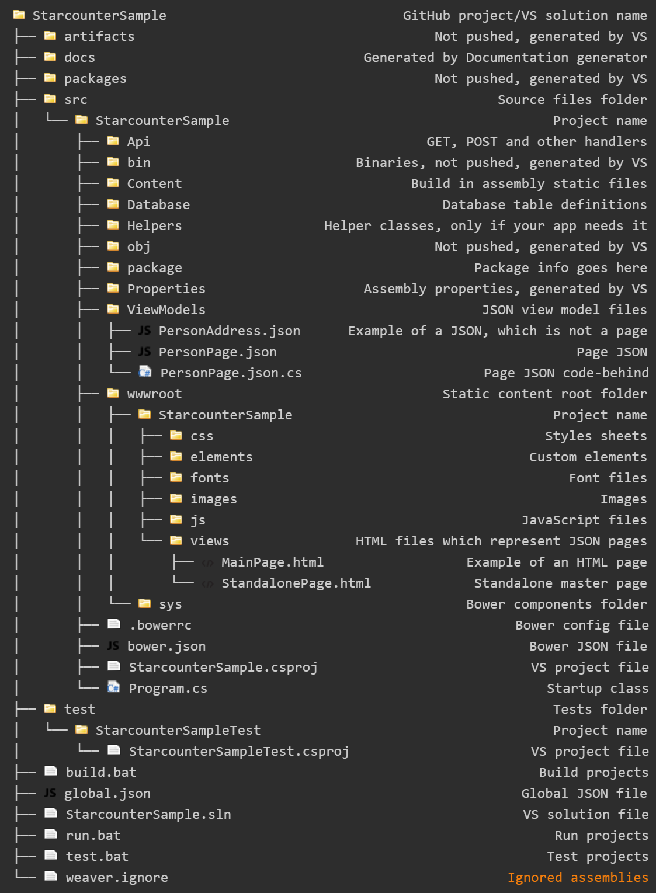

# How to organize projects

The Starcounter app project structure is inspired by [the structure of ASP.NET 5 projects](http://gunnarpeipman.com/2014/10/asp-net-5-new-structure-of-solutions-and-projects/). The difference is that ASP.NET has `Controllers`, `Models`, `Scripts`, and `Views` while Starcounter has `Api` handlers, JSON + HTML `viewmodels` and `database` classes.

This tree displays the structure of a Starcounter project:

## Custom elements

The html files which do not represent any of json page should be stored inside `elements` folder. The name of a file should be exactly the same as name of the element inside.

## JavaScript libraries

Most Starcounter sample apps don't use custom JavaScript libraries except for WebComponents.  
If you need a custom JavaScript library then it should be scoped to your application and saved inside a `js` folder.

## Visual Studio files

Visual Studio solution \(`sln`\) and project \(`csproj`, `kproj`\) files should be checked in to the version control system.

User preference files \(`suo`\), which carry information about unloaded projects in a solution or breakpoints in a project, should not be checked in to the version control system.

