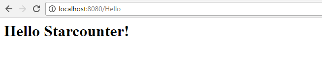

# Getting started

## 1. Install Visual Studio

Start by installing Visual Studio to use as a development environment. It's not strictly necessary, but it makes everything simpler.

If you don't already have Visual Studio 2015 or 2017 installed, install it from [visualstudio.com](https://www.visualstudio.com/downloads/). The community edition is completely free to download.

## 2. Install Starcounter

When you have the development environment set up, you can download Starcounter. When using Starcounter for the first time, we recommend using either the latest release or release candidate. The latest release is likely more stable but has fewer features than the release candidate. If you don't want to make a choice, click [this link](http://downloads.starcounter.com/download/Starcounter/RC/latest) and you'll get the latest release candidate.

Take a look at the [download page](https://starcounter.io/download/) for system requirements. All versions of Starcounter can be found on [downloads.starcounter.com/downloads](http://downloads.starcounter.com/download).

The installer will guide you through the process and install the Visual Studio Starcounter extension.




Starcounter can also be used with Docker, see [Starcounter.Docker.Windows](https://github.com/Starcounter/Starcounter.Docker.Windows).


## 3. Build and run an App

To run your first app, open Visual Studio and choose `File -> New -> Project...`. Create a new Starcounter application by going to `Installed -> Templates -> Visual C# -> Starcounter -> Starcounter Application`. If we call it "HelloStarcounter", it will create a project containing a `Program.cs` file that looks like this:



```csharp
using System;
using Starcounter;

namespace HelloStarcounter
{
    class Program
    {
        static void Main()
        {

        }
    }
}
```



For a first simple application, we'll define a `GET` handler that returns an HTML element:



```csharp
using System;
using Starcounter;

namespace HelloStarcounter
{
    class Program
    {
        static void Main()
        {
            Handle.GET("/Hello", () =>
            {
                return "<h1>Hello Starcounter!</h1>";
            });
        }
    }
}
```



Run the application by pressing `F5` and go to `http://localhost:8080/Hello`.



If you see the screen above, then you've done everything right so far.

## 4. Do the HelloWorld tutorial

With everthing set up, you can start the [HelloWorld tutorial](hello-world-tutorial/). It will teach you the basic features of Starcounter and how to build a standalone app.

## 5. Read more about Starcounter

To get a deeper understanding of Starcounter, read the [technical overview](https://drive.google.com/file/d/0B7ErcI3u1ERkd0lWaEdBc3QxcnJhX2FnYWwwSVFFWjF3ZkdJ/view?usp=sharing) where we describe some of the fundamental concepts. You can then head over to the guides to get deeper into individual concepts.

## 6. Try the sample apps

We've developed a bunch of apps that are available for everyone on [GitHub](https://github.com/starcounterapps). Feel free to run them, change them, make issues, and make pull requests. They should also give you an idea of apps are built to interact with each other.

## 7. Build your own app

With this, it's time to build your own app. When building, don't hesitate to ask questions in the [Home](https://github.com/Starcounter/Home/issues) repo on GitHub. We are always happy to get feedback on what we can improve.

We hope you'll enjoy Starcounter as much as we do!

