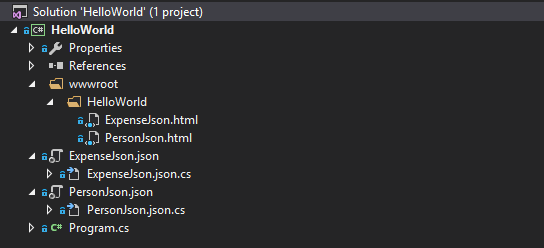
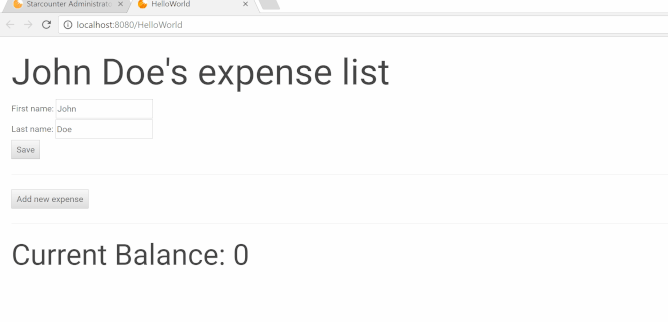

# Expense tracker

We will now turn our application into a simple expense tracker.

With Starcounter, views and view-models can be broken up into parts and nested. This allows for increased composability and modularity. In this case, the two main concepts in this app, `Person` and `Expense`, will be built with separate view-models and views and then nested to create a coherent whole. Let's start by creating the appropriate files.

1. Add a new Starcounter "HTML template with dom-bind" in the HelloWorld folder together with `PersonJson.html`. Name it `ExpenseJson.html`.
2. Add a new Starcounter "Typed JSON with Code-behind" file to the HelloWorld project together with `PersonJson.json` and `PersonJson.json.cs`. Name it `ExpenseJson.json`.



## Define the expenses

To define the expenses, three parts are needed:

1.  A database class which can store the expenses
2.  A view that can display the expenses
3.  A view-model to bind the database class and the view

### Database class

To keep it as simple as possible, the expense only needs to contain information about its cost or amount, a description of the expense, and a reference to the person that spent the expense.

This is how it looks in code:



```csharp
[Database]
public class Expense
{
    public Person Spender { get; set; }
    public string Description { get; set; }
    public decimal Amount { get; set; }
}
```



### View-model

The information that we want to have in the view is the description and the amount, which should be writable from the view since we're building an expense tracker, so that's what we add to the view-model in addition to the HTML path.

This is the result:



```javascript
{
  "Html": "/HelloWorld/ExpenseJson.html",
  "Description$": "",
  "Amount$": 0
}
```



### View

The view for the expense can be extremely simple. It will only contain two input fields that are bound to the properties in the view-model:



```markup
<template>
    <dom-bind>
        <template is="dom-bind">
            <input value="{{model.Description$::input}}">
            <input value="{{model.Amount$::input}}">
        </template>
    </dom-bind>
</template>
```



## Nest expenses in Person

Now that the concept of an expense is defined, it should be connected to the concept of a person so that a person owns multiple expenses. There are a couple of steps to follow to make that happen.

1. The `Person` class should be linked to its expenses. Right now, each expense is bound to a `Person`. To create a one-to-many relationship, the `Person` should also be linked to the expenses.
2. The view-models of the expenses of a specific `Person` object should be nested into the view-model `PersonJson`. This nesting makes it easy to display the expenses of a person. 
3. The views corresponding to the nested expense view-models should be stamped out inside the person view.

### Extending the Person class

To link each `Person` object with its `Expense` objects, we'll utilize the fact that each `Expense` has the property `Spender`. Thus, a SQL query can be made to find all the `Expense` objects where the `Spender` is the current `Person`. In addition to containing a reference to all its `Expense` objects, it might be useful for the `Person` class to contain a property for the aggregated `Amount` of the `Expense` objects it has. This can also be accomplished with a SQL query.

In code, it looks like this:



```csharp
[Database]
public class Person
{
    public string FirstName { get; set; }
    public string LastName { get; set; }
    public IEnumerable<Expense> Expenses => Db.SQL<Expense>(
            "SELECT e FROM Expense e WHERE e.Spender = ?", this);
            
    public decimal CurrentBalance => Db.SQL<Expense>(
            "SELECT e FROM Expense e WHERE e.Spender = ?", this)
            .Sum(e => e.Amount);
}
```



### Extending the view-model

With the properties `Expenses` and `CurrentBalance` in place, we can bind them to the view-model in order to use them in the view.



```javascript
{
  "Html": "/HelloWorld/PersonJson.html",
  "FirstName$": "",
  "LastName$": "",
  "SaveTrigger$": 0,
  "FullName": "",
  "Expenses": [{}],
  "CurrentBalance": 0
}
```



When binding the view-model with properties of database classes, the types have to be specified. `Expenses` is defined as an array of objects, that is not quite enough. We also need to set what type of object it should contain. This can be done in the code-behind for `PersonJson` by creating a constructor that specifies the type to be `ExpenseJson`. This is how it looks in code:



```csharp
static PersonJson()
{
    DefaultTemplate.Expenses.ElementType.InstanceType = typeof(ExpenseJson);
}
```



### Nesting the view

With the expenses in the view-model, they are easy to include in the view. We simply need to loop over and stamp them out on the page. This can be done with the custom HTML template element `dom-repeat`. It is similar to C\# `foreach` loop.

The elements that it should loop over are the expenses. For each expense it should stamp out the view for that particular expense. `imported-template` is a custom element that helps with that by acting as an insertion point.

In addition to this, we want to display the current balance and change the headline to reflect the actual purpose of the page:



```markup
<template>
    <dom-bind>
        <template is="dom-bind">
            <h1>{{model.FullName}}'s expense list</h1>

            <fieldset>
                <label>First name:</label>
                <input value="{{model.FirstName$::input}}">
            </fieldset>

            <fieldset>
                <label>Last name:</label>
                <input value="{{model.LastName$::input}}">
            </fieldset>

            <button value="{{model.SaveTrigger$::click}}" onmousedown="++this.value">Save</button>

            <hr>

            <template is="dom-repeat" items="{{model.Expenses}}">
                <div>
                    <imported-template model="{{item}}" href$="{{item.Html}}">
                    </imported-template>
                </div>
            </template>

            <hr>

            <h2>Current Balance: {{model.CurrentBalance}}</h2>
        </template>
    </dom-bind>
</template>
```



## Create new expenses

If you start the application now, you will not see any expenses because no expenses have been added to the database yet. Implementing the functionality to add new expenses is quite simple. Three things are needed:

1. A trigger in the view-model to signal when to add an expense
2. A button to activate the trigger
3. A handler to add the new expense

### Add trigger property

The trigger property will look almost identical to the save trigger:



```javascript
{
  "Html": "/HelloWorld/PersonJson.html",
  "FirstName$": "",
  "LastName$": "",
  "SaveTrigger$": 0,
  "FullName": "",
  "Expenses": [{}],
  "NewExpenseTrigger$": 0,
  "CurrentBalance": 0
}
```



### Add button

The button to create new expenses simply have to increment the trigger we just defined. It should look like this:



```markup
<button value="{{model.NewExpenseTrigger$::click}}" onmousedown="++this.value">Add new expense</button>
```



This button should be added below the list of expenses.

### Implement the handler

To act on the trigger, we'll create a handler in the code-behind. Since the view-model is bound to the `Person` object that holds a reference to a collection of `Expense` objects, we only need to add an `Expense` object to the database and it will immediately be synched to the view-model and placed in the view.



```csharp
void Handle(Input.NewExpenseTrigger action)
{
    new Expense()
    {
        Spender = this.Data as Person,
        Amount = 1
    };
}
```



`This.Data` is the current database object, which in this case is the `Person` that added a new expense.

## Result

Run the program and try to add expenses, change their cost, and see the current balance change in real time.




With every keystroke, the UI is updated almost instantly from the database. Starcounter's in-memory database makes this possible. There's no delay, everything simply happens at the moment the user interacts with the view.

