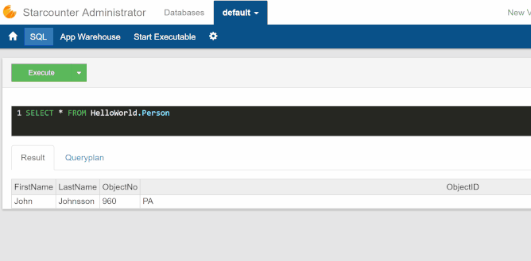

# First interactive UI

The initial UI will allow us to change the name of a person and save those changes to the database. This requires a couple of things:  
1. The database should be able to commit changes to the database at any time  
2. The view-model needs to be writable from the view  
3. The view has to allow input and bind the input to the view-model

## Creating a long-running transaction

To be able to commit changes to the database at any time, a [long running transaction](../../topic-guides/transactions/long-running-transactions.md) is needed. This transaction should be attached to the `PersonJson` view-model.

In code, that is done by wrapping everything in our handler inside a `Db.Scope`:



```csharp
Handle.GET("/HelloWorld", () =>
{
    return Db.Scope(() =>
    {
        Session.Ensure();
        var person = Db.SQL<Person>("SELECT p FROM Person p")
            .FirstOrDefault();
        return new PersonJson { Data = person };
    });
});
```



## Writable view-model

To make properties in the view-model writable from the view, a dollar sign it added to the end of it. With this, `"FirstName"` becomes `"FirstName$"` and `"LastName"` becomes `"LastName$"`. The view-model should then look like this:



```javascript
{
  "Html": "/HelloWorld/PersonJson.html",
  "FirstName$": "",
  "LastName$": ""
}
```



## Trigger property

As mentioned earlier, we also want the possibility to save at will. In order to do this, there needs to be some kind of communication between the view and the [code-behind](../../topic-guides/typed-json/code-behind.md). This can be accomplished using a trigger property which is basically an integer that can be changed from the client and handled in the code-behind.

This is how it should look:



```javascript
{
  "Html": "/HelloWorld/PersonJson.html",
  "FirstName$": "",
  "LastName$": "",
  "SaveTrigger$": 0
}
```



## Handling changes in the code-behind

To act on the change in the view-model that is triggered from the view, an event handler can be registered in the code-behind.

In this case, where the goal is to save, the following code can be used:



```csharp
using Starcounter;

namespace HelloWorld
{
    partial class PersonJson : Json
    {
        void Handle(Input.SaveTrigger action)
        {
            AttachedScope.Commit();
        }
    }
}
```



`Input.SaveTrigger action` makes the method run when a change is detected in the `SaveTrigger` value. Note that we do not need to use a `$` here like in the view-model. The rule is that we use `$` for the view, and view-model, but not in the application code.

`AttachedScope.Commit()` commits the current state of the view-model to the database so that the data is accessible from other transactions.

With server-side view-models like this, you don't have to write a single line of "glue code" to update the view in HTML. Any change in the view-model made in C\# will instantly be synced to the client using [Palindrom](../../topic-guides/blendable-web-apps/palindrom.md), which in turn automatically renders because of Polymer's data bindings. This saves you from creating single-purpose REST APIs, need for double validation of user input, and more. This also means that all logic that can be written on the server-side should be written on the server-side to enjoy these benefits.

### Creating interactive elements

Now, with a view-model that is writable and a database which allows commits at any point in time, the view can include elements that change the properties in the view-model.

We'll change our previous text elements to input elements and add a button:



```markup
<template>
    <dom-bind>
        <template is="dom-bind">
            <fieldset>
                <label>First name:</label>
                <input value="{{model.FirstName$::input}}">
            </fieldset>

            <fieldset>
                <label>Last name:</label>
                <input value="{{model.LastName$::input}}">
            </fieldset>

            <button value="{{model.SaveTrigger$::click}}" onmousedown="++this.value">Save</button>
        </template>
    </dom-bind>
</template>
```



The `::input` declaration on the input value sets up an event listener. It updates the property it's bound to on every keystroke. This means that every time a change is made in the input field, the view-model will reflect that change.

To increment the `SaveTrigger$` value in the view-model, we bind it to the value on the button and attach a `::click` event listener. We then increment this value when the button is pressed.

## Result

We now have a program where we can change the view-model in real time and then commit our changes to the database at will. To see how it looks, start the application with F5 and go to `http://localhost:8080/HelloWorld` in the browser. You should see two input boxes with their respective label and a button below.

If you are an especially curious person, you can try to change the name and then take a look at the database again with SQL. Here's how it should work:



Neat! Right? The next step is to display the name change in real time and let the code-behind calculate the full name.

