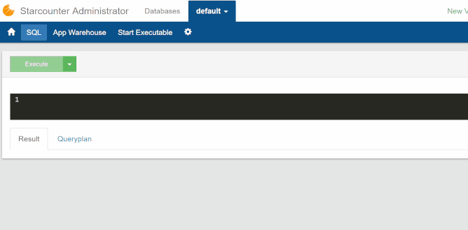

# Create a database class

Welcome to the first part of our Hello World tutorial!

We will start by creating a Starcounter application in Visual Studio by going to `New Project -> Templates -> Visual C# -> Starcounter -> Starcounter 2.3 Application`. We will name the application `HelloWorld`.

## Add a persistent class

Create a new class called `Person` with the attribute [`[Database]`](../../guides/database/creating-database-classes.md) in the `Program.cs` file. This attribute tag will make all instances of the class persistent.

Add the properties `FirstName` and `LastName` to this class. Your code should now look like this:



```csharp
using Starcounter;

namespace HelloWorld
{
    [Database]
    public class Person
    {
        public string FirstName { get; set; }
        public string LastName { get; set; }
    }

    class Program
    {
        static void Main()
        {

        }
    }
}
```



## Add an instance to the class

Add a first instance to the class by defining a new person, its properties, and wrapping it in a [`Db.Transact()`](../../guides/transactions/short-running-transactions.md). Using a transaction allows us to access database objects and makes the changes inside the transaction atomic and isolated. 





```csharp
class Program
{
    static void Main()
    {
        Db.Transact(() =>
        {
            var person = Db.SQL<Person>("SELECT p FROM Person p")
                .FirstOrDefault();
            if (person == null)
            {
                new Person
                {
                    FirstName = "John",
                    LastName = "Doe"
                };
            }
        });
    }
}
```



The if statement here checks if you already have a `Person` in the database by accessing the first result that we get from the query. If that is the case, you do not need to create a new one. Without it, we would create a new instance of `Person` every time we run the program, which we do not intend to do.  
  
Remember to import `System.Linq` for `FirstOrDefault`.

## Result

Start your program with Starcounter by clicking F5 in Visual Studio. To see for yourself, open the administrator at `localhost:8181/#/databases/default/sql` and enter `SELECT * FROM HelloWorld.Person`. This will display all the instances, represented as rows, of the `Person` class. Note that these instances are persistent. You can restart the application, or even the computer, and the instances will still be there.



For the next step, we'll add a UI which will help us to display the data in the browser.

If you get any errors, check your code against the [source code](https://github.com/StarcounterApps/HelloWorld/commit/4c91c301444dc074172851df7d4153ad9b5869c1).

