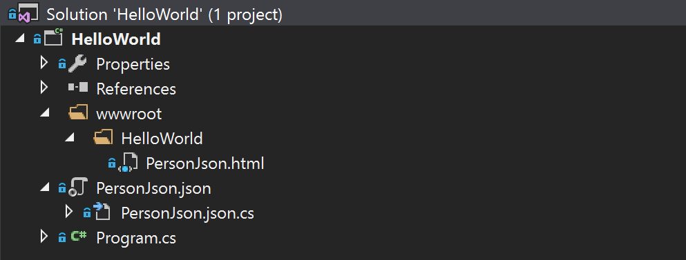
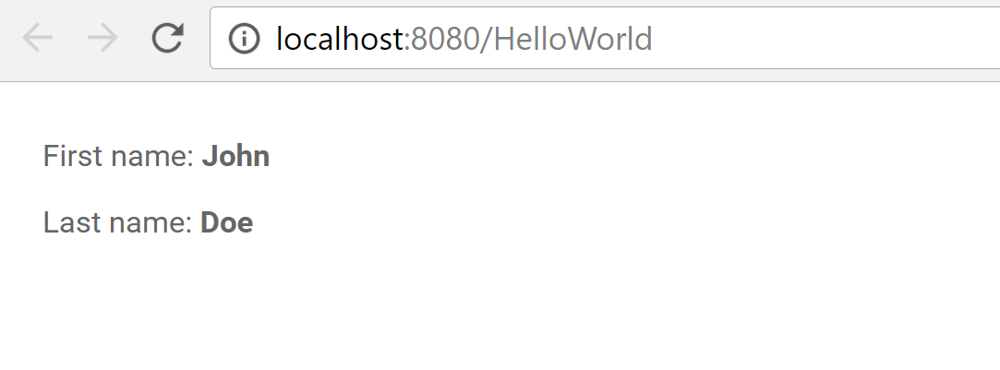

# Create a real time UI

To create a user interface \(UI\), we establish a [MVVM](https://en.wikipedia.org/wiki/Model–view–viewmodel) pattern by adding a view-model and a corresponding view. The view-model will act as a representation of the view and as a midpoint between the view and the database.

## Setup the file structure

Let's create the file structure to contain a view and a view-model. Follow these steps to create the structure:

1. In the Solution Explorer in Visual Studio, add a folder with the name `wwwroot` in the `HelloWorld` project.
2. Inside this folder, create another folder with the name `HelloWorld`, the same name as the project.
3. Add an HTML file into this folder by right-clicking and then choosing `Add -> New Item... -> Starcounter -> Starcounter HTML template with dom-bind`. Name this file `PersonJson.html`.
4. Add a JSON file, which will be the view-model, into the root of the project by going to `Add -> New Item... -> Starcounter -> Starcounter Typed JSON with Code-behind`. By doing this, you create a `json` and `json.cs` file. Both of these should have the name PersonJson.



With a solid file structure, we can continue by creating the view-model.

## Define the view-model

In the JSON file, create three properties called `Html`, `FirstName`, and `LastName`. The values of the properties `FirstName` and `LastName` will be bound to the view _and_ the database. Because of that, it is crucial, for this example, that you name these properties the same as the properties that we have in the `Person` class. That will allow Starcounter to recognize that the `Person` object and the `PersonJson` view-model represents the same things and bind the values of their properties.

The value of the `Html` property is the path to the view that the view-model should be connected to.



```javascript
{
  "Html": "/HelloWorld/PersonJson.html",
  "FirstName": "",
  "LastName": ""
}
```



## Create the HTTP handler

To get the view-model and the corresponding view to the client, an HTTP handler has to be created. This handler sets the specific database object that the view-model should be bound to, creates a [session](../../guides/web-apps/sessions.md), and returns the view-model to the client.

This handler will only return the JSON tree that we defined earlier and not any HTML, which is what we want to render. The solution is to use [middleware](../../guides/network/middleware.md). For this app, and most other Starcounter apps, we use the `HtmlFromJsonProvider` and `PartialToStandaloneHtmlProvider` middleware. These affect the pipeline by catching the outgoing JSON, finding the HTML at the `Html` path, wrapping the HTML to form a complete HTML document, and forwarding it to the client. By doing this, a complete HTML document can be sent to the client, even if the only thing that's returned from the handler is a simple JSON tree.

This is how the handler and middleware looks in code:



```csharp
Application.Current.Use(new HtmlFromJsonProvider());
Application.Current.Use(new PartialToStandaloneHtmlProvider());

Handle.GET("/HelloWorld", () =>
{
    Session.Ensure();
    var person = Db.SQL<Person>("SELECT p FROM Person p")
        .FirstOrDefault();
    return new PersonJson { Data = person };
});
```



## Define the view

The view will initially be a simple interface displaying the `FirstName` and `LastName` of a `Person` instance.

Since the middleware wraps the HTML to create a complete HTML document, we only need to define an HTML fragment wrapped in the `template` element.

To create a two-way binding between the view and the view model, we choose to use Polymer. There are three parts needed to make the bindings work:  
1. Import Polymer  
2. Use `<template is="dom-bind">` to allow the use of bindings in a fragment  
3. Bind the specific properties using the double bracket syntax like this: `{{model.FirstName}}`. `model` represents the JSON file, so `{{model.FirstName}}` is the `FirstName` value in `PersonJson.json`.

This is how it looks in code:



```markup
<link rel="import" href="/sys/polymer/polymer.html"/>
<template>
    <template is="dom-bind">
        <fieldset>
            <label>First name:</label>
            <strong>{{model.FirstName}}</strong>
        </fieldset>

        <fieldset>
            <label>Last name:</label>
            <strong>{{model.LastName}}</strong>
        </fieldset>
    </template>
</template>
```



## Result

Now, we have established a real-time model-view-view-model \(MVVM\) binding. The JSON, which is our view-model, is bound to the model \(database\) with no latency; our view, the HTML, is in turn bound to the JSON, which is synced in real time using WebSocket and HTTP. Polymer helps us display this instantaneously to the user.

Check out how it looks by starting the application with F5 and go to `http://localhost:8080/HelloWorld` in your web browser.



It's impossible for us to see the immediate changes as there is no way for the user to change the info. Let us fix that by adding some interactivity!

If you get any errors, you can check your code against the [source code](https://github.com/StarcounterApps/HelloWorld/commit/ce3e787313aacbd6d8f6d18956ab39e24befc452).

