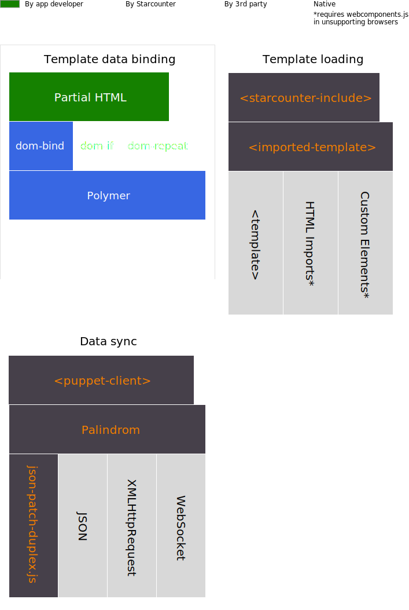

# Client-Side Stack

## Introduction

Apart from data sync with Palindrom, we propose the complete stack for maximum benefit of building thin client SPAs. The other important parts are: a template engine \(with two-way data binding\) and a template loading infrastructure.

This stack lets you stay on the bleeding edge of development, using the new APIs such as Web Components that turn the web browser into a powerful, interactive presentation layer for apps.

All the client side libraries mentioned on this page come preinstalled with Starcounter. Starcounter auto-configures this stack for you, so don't bother reading this page unless your are interested in the internals.

The stack attempts to add as few new components as possible. The existing established patterns and web standards are used wherever possible.

## Client-Side Libraries

### Data Sync

Palindrom web apps use [Palindrom](https://github.com/Palindrom/Palindrom) for server-client data synchronization. Palindrom makes use of the JSON and [JSON-Patch](https://tools.ietf.org/html/rfc6902) web standards. It uses the JSON,  `XMLHttpRequest` and WebSocket APIs that are built into every modern web browser.

The implementation of JSON-Patch is provided by `json-patch-duplex.js`, which comes from the [fast-json-patch](https://github.com/Starcounter-Jack/JSON-Patch) library and provides tools for applying and generating patches.

The implementation of operational transformation in Palindrom is provided by the following libraries: [json-patch-queue](https://github.com/Palindrom/JSON-Patch-Queue), [json-patch-ot-agent](https://github.com/Palindrom/JSON-Patch-OT-agent), [json-patch-ot](https://github.com/Palindrom/JSON-Patch-OT).

To make it easy to use, Palindrom including all the dependencies is wrapped into a helper Custom Element [palindrom-polymer-client](https://github.com/Palindrom/palindrom-polymer-client). Adding this Custom Element into the DOM automatically loads and configures all the dependencies.

### Template Engine

Since Palindrom provides a JavaScript object that reflects the server-side view-model, it needs a template engine to present the UI in web browser DOM. JavaScript libraries, such as D3 or React, can consume this object.

  
To render HTML templates in the DOM we recommend the [`dom-bind`](https://www.polymer-project.org/1.0/docs/devguide/data-binding) Custom Element that is part of the [Polymer](https://github.com/Polymer/polymer) library. It supports binding annotations using curly braces \(`{{}}`\), conditional fragments \(using [`dom-if`](https://www.polymer-project.org/1.0/docs/devguide/templates#dom-if)\) and loops \(using [`dom-repeat`](https://www.polymer-project.org/1.0/docs/devguide/templates#dom-repeat)\).

Our solution is based on the Web Components APIs from the latest specs for bleeding edge HTML. It's approved by all major browser vendors and is [widely adopted](https://www.webcomponents.org/). However, not everything is there yet, some browsers will still require the `webcomponents.js` polyfill to be loaded to support for these APIs.

### Template Loading

To build modular apps out of many partial views, use the `imported-template` Custom Element. It loads the templates from separate HTML files and stamp them to the DOM, it plays well with Polymer's data-bindings and regular DOM APIs.

To make it easier to use with Starcounter, `importet-template` is wrapped in the [starcounter-include](https://github.com/Starcounter/starcounter-include) Custom Element, which also sets up the data binding between Palindrom and imported-template.

## The Stack, Visualized

The following chart shows the bird-eye's view on the client side libraries used.

## Versions

See the file `ClientFiles\bower-list.txt` in your Starcounter installation directory \(usually `C:\Program Files\Starcounter`\) for the list of client side libraries bundled with your Starcounter instance, including their version numbers.

