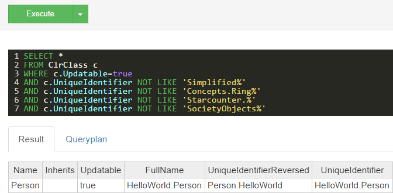

# Query for database tables

## Introduction

The class `ClrClass` can be used to retrieve the classes in the database.

## Getting all classes

For example, if the goal is to get all the classes in the database, a query like this would be used in the Starcounter Administrator which is found at `http://localhost:8181/#/databases/default/sql` when Starcounter is running:

```sql
SELECT * FROM ClrClass
```

This would give back all the classes, including the built-in ones.

## Getting user-created classes

To get the user-created classes, use this query:

```sql
SELECT *
FROM ClrClass c
WHERE c.Updatable=true
AND c.UniqueIdentifier NOT LIKE 'Simplified%'
AND c.UniqueIdentifier NOT LIKE 'Concepts.Ring%'
AND c.UniqueIdentifier NOT LIKE 'Starcounter.%'
AND c.UniqueIdentifier NOT LIKE 'SocietyObjects%'
```

For example, if the query is run after following the steps in [part one](../../getting-started/tutorial/create-a-database-class.md) of the tutorial, it should look like this:




