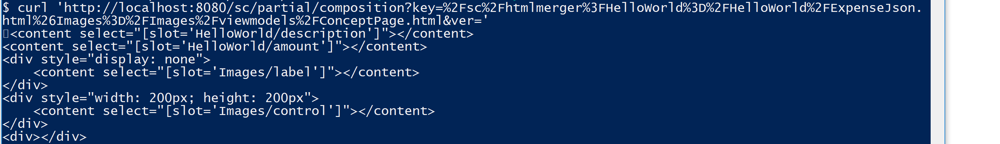

# Import HTML composition

When you want to deploy your custom HTML composition, you have two options:

* Use the REST API for importing HTML compositions
* Use the [CompositionEditor](https://github.com/starcounterapps/compositioneditor)

### REST API for importing HTML compositions

The REST API allows importing compositions for sets of blended HTML partials. The CompositionEditor has to run for this API to work.

### Importing composition

Place your HTML composition in a file like this one of Hello World:


```markup
<content select="[slot='helloworld/description']"></content>
<content select="[slot='helloworld/amount']"></content>
<div style="display: none">
  <content select="[slot='images/label']"></content>
</div>
<div style="width: 200px; height: 200px">
  <content select="[slot='images/control']"></content>
</div>
```

This code merges the elements from `Images` and `HelloWorld`. It also resizes the images and hides the image labels to make it align better with the rest of the page.

Go to the command prompt where you installed Git Bash, navigate to your `HelloWorld` solution and run:

```bash
curl -XPOST --data-binary '@src/HelloWorldMapper/ExpenseJsonComposition.html' 'http://localhost:8080/sc/partial/composition?key=%2Fsc%2Fhtmlmerger%3FHelloWorld%3D%2FHelloWorld%2FExpenseJson.html
%26Images%3D%2FImages%2Fviewmodels%2FConceptPage.html&amp;ver='
```

If you get a 404 Not Found, it usually means that `HTMLComposition.Register` has not be called. This is solved by running the CompositionEditor or calling `HTMLComposition.Register` in your app.

### GET and DELETE HTML Compositions

In addition to using POST, we can also use the GET and DELETE methods contained in the REST API.

To GET the HTML composition that's posted we can use cURL like we did with our POST command. Here's how a cURL command to get the HTML composition above would look:

```bash
curl 'http://localhost:8080/sc/partial/composition?key=%2Fsc%2Fhtmlmerger%3FHelloWorld%3D%2FHelloWorld%2FExpenseJson.html
%26Images%3D%2FImages%2Fviewmodels%2FConceptPage.html&amp;ver='
```

If we decode the command above, we get the following result:

```bash
curl 'http://localhost:8080/sc/partial/composition?key=/sc/htmlmerger?HelloWorld=/HelloWorld/ExpenseJson.html&amp;Images=/Images/viewmodels/ConceptPage.html&amp;ver='
```

Here we see clearly what it does. There's a key that marks what we will do \(htmlmerger\) and then it directs to the two files that we will merge. In this case the `ExpenseJson.html` and the `ConceptPage.html` file. From this, you can build your own keys to use in your programs.

And here's the output:





If the key or the version is invalid, a 404 is returned. Otherwise, the response status is 200.

To delete, insert `-X DELETE` before the URI in the GET call. It look like this:

```bash
curl -X DELETE 'http://localhost:8080/sc/partial/composition?key=%2Fsc%2Fhtmlmerger%3FHelloWorld%3D%2FHelloWorld%2FExpenseJson.html
%26Images%3D%2FImages%2Fviewmodels%2FConceptPage.html&amp;ver='
```

This method always returns the status code 204. To delete all HTML compositions, use `all` for the key.

The result of these calls can be validated by querying the database in the Starcounter Administrator with `SELECT * FROM Starcounter.HTMLComposition`.

