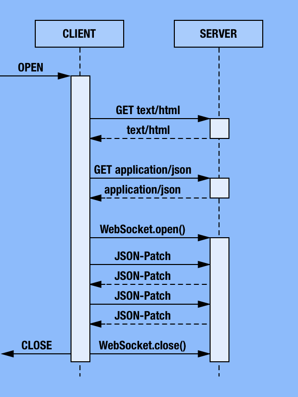

# Palindrom

Palindrom is a library that implements a radically simple, standards-compliant protocol for thin client web apps. It allows to create Single Page Applications with zero logic on the client side.

### Palindrom protocol

Starcounter is embracing web standards to allow stateful, thin client web apps done by existing web standards. The application state is simply kept in JSON. Any changes to it, coming from the client or the server, are expressed in automatically generated JSON-Patch \([RFC 6902](http://tools.ietf.org/html/rfc6902)\). HTTP PATCH and WebSocket are used to send the changes over the network.

Together, with this protocol, the server 'owns' the view-model and dictates its content. The clients merely suggest changes by sending user input \(using PATCHes\). In other words, server becomes the "Puppeteer" and the clients become its "Puppets".

The protocol is defined in [Palindrom wiki](https://github.com/Palindrom/Palindrom/wiki/Server-communication).

### Palindrom implementation

To make it super easy to use this pattern in your web apps, we are using a library called [Palindrom](https://github.com/Palindrom/Palindrom). It is possible to use Palindrom implicitly in your web apps, so using it becomes self-configurable and as easy as putting few lines of code in your app.

For the maximum benefit, use a two-way data binding framework such as Polymer or AngularJS to render your UI in HTML without writing a single line of JavaScript. If you have needs for client-side coding, a JavaScript object is exposed and can be used with any library, such as D3 or React.

In most of the code samples we stay on the bleeding edge of web development by using Palindrom with Polymer and Web Components.

