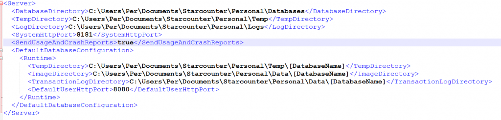
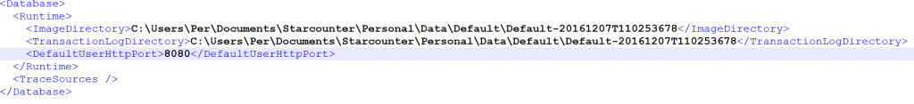

# Configuration structure

## Introduction

This page describes how the Starcounter configuration structure looks after downloading Starcounter 2.3 and where to find the essential directories and configuration files.

## Established directories on installation

The Starcounter installer establishes two directories: the _installation directory_ and the _server repository_.

The paths of these can be customized on installation. By default they are:

* Installation directory: `%ProgramFiles%\Starcounter`
* Server repository: `%UserProfile%\Documents\Starcounter\Personal`

### Installation directory

All Starcounter binaries are stored under the installation directory. This includes:

* Tools such as `star.exe`, `staradmin.exe` and, `starpack.exe`
* Public reference assemblies, specifically `Starcounter.dll`
* Internal runtime libraries \(native and managed\)
* Supportive executables, such as the gateway executable and the data manager executable

**How to find the installation directory**

As part of installing, we populate an environment variable with the path to the installation directory. It can easily be viewed from a prompt doing:

```text
C:\Users\Per>set StarcounterBin
StarcounterBin=C:\Program Files\Starcounter
```

### Server repository

This directory store configurations concerning each database. At the root of it is the server configuration file. This file is consumed by Starcounter to find additional configurations. Currently, all configurations are in XML format.

**How to find the server repository**  
In the installation directory, we store a file \(`Personal.xml`\) under the Configuration folder:

```text
\Program Files\Starcounter
  \Configuration\
    Personal.xml
```

The XML-path `service\server-dir` in this file will reveal the path to the server repository:

```text
<?xml version="1.0" encoding="UTF-8"?>
<service>
  <server-dir>C:\Users\Per\Documents\Starcounter\Personal</server-dir>
</service>
```

## The server configuration file

The server configuration file is called **Personal.server.config**. At the root is the `Server` node. Some of the more important elements are:

**Database directory:**  
The directory where we look for the configuration describing each database. Default value: %ServerRepo%\Databases.

**LogDirectory:**  
The directory where we write all event logs to. Normally accessed by the user in the Web Administrator "Logs" tab. Default value: %ServerRepo%\Logs.

**TempDirectory:**  
The directory used by us when storing temporary data. Should normally be OK to delete all content from. Default value: %ServerRepo%\Temp.

**SystemHttpPort:**  
The port we expose the Web Adminstrator on. Can be customized in the installer. Default:8181.

**DefaultDatabaseConfiguration:**  
Default configuration values we use when a new database is created. Customizing this allow a user to fine tune defaults for all future databases.

Example file \(trimmed and simplified\):



## Database configuration files

Each database is described by a configuration file. Starcounter will look for such files in the `DatabaseDirectory` as specified in the server configuration file \(see above\). For a database configuration file to be recognized, it must be stored in a directory that has the name of that database. The file itself must use a pattern using the same name.

Example of two configured files:

```text
\Databases\
  Default\
    Default.db.config
  Northwind\
    Northwind.db.config
```

The root of each database configuration file is the Database node. Here are the more important elements:

**ImageDirectory:**  
The directory where the main database data files reside. Default value: %ServerConfigFile%\DefaultDatabaseConfiguration\Runtime\ImageDirectory. At the time of creation, Starcounter will add a unique string to the end of that path before creating files.

**TransactionLogDirectory:**  
The directory where transaction logs are stored. Default value: same principle as ImageDirectory applies.

**DefaultUserHttpPort:**  
The port used for handlers registered in user code, if no port is explicitly given: Default:8080.

Example file \(trimmed and simplified\):



