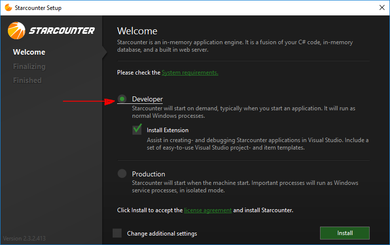
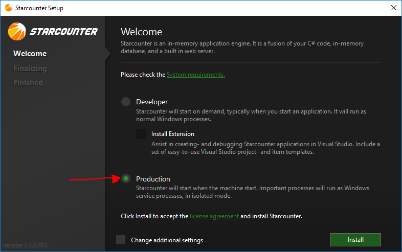

# Installation

Starcounter can be installed in two different modes namely `Developer Mode` and `Production Mode`

 Following section describes these modes:

## Developer Mode

This is the default installation mode where the  `Starcounter Server Service`  can be started on-demand, typically when you start a Starcounter Application. 

### How to install

* Run the  `<Your setup file name>.exe`  by double clicking on it.
* Select `Production` on the Setup screen :



## Production Mode

In `Production Mode` the installer starts `Starcounter Server Service` as part of the installation process and also sets the `Startup Type` of the service to `Automatic` so that it can be started on Windows Logon. 

### How to install

There are two ways you can install Starcounter in Production Mode :

* Run the  `<Your setup file name>.exe`  by double clicking on it.
* Select `Production` on the Setup screen :



### Installing with command line

* Open a `Command Prompt`window with `Administrator` privileges
* Browse the directory where the Starcounter setup file exists.
* Run the following command :

```text
<Your setup file name>.exe productionmode
```

## Silent Installation

In `Silent Installation`the Starcounter installation process runs seamlessly without prompting any messages to the user or asking about any choices - Yes/No popups. This is particularly useful in production environments where user wants to install Starcounter in an unattended fashion with some commands or scripts.  

### How to install

* Open a `Command Prompt`window with `Administrator` privileges
* Browse the directory where the Starcounter setup file exists.
* Run the following command :

```text
<Your setup file name>.exe Silent productionmode unattended
```


* It should install Starcounter seamlessly

**Note**: By default the  `Starcounter Server Service` runs under the `Local Service` account.

## Docker

Starcounter can also be installed and run in Docker containers. For more information, see [Starcounter.Docker.Windows](https://github.com/Starcounter/Starcounter.Docker.Windows).

