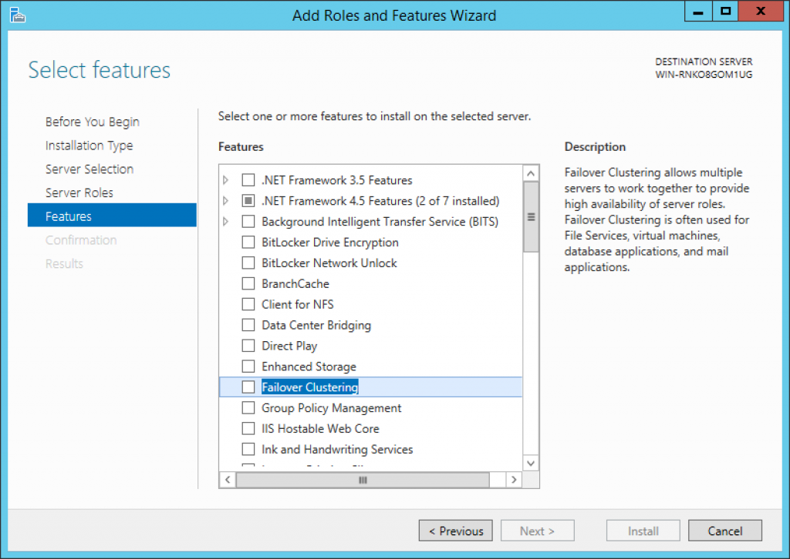

# Run Starcounter in Production

## Introduction

While Starcounter offers replication facilities for the enterprises to implement their high availability business scenarios \(e.g., when a point-of-sales is disconnected from a main server, but continues to operate autonomously until the connection resumes\), it doesn't provide a built-in support for disasters-related scenarios such as hot failover, regular backups and disaster recovery. A large variety of ready-made facilities are available today to support those disaster-related scenarios out of the box. E.g., most of the facilities needed for those are shipped with Windows Server 2012 R2 Standard off the shelf.

When it comes to running applications, developers want to perform the "full replication" of their apps, which means not only data itself, but also database configurations, static files, text log files, bulk data database files, user downloads etc. This goes beyond the scope of pure database replication for disaster recovery \(like SQL Server AlwaysOn\): either you try to store everything in the database to rely on its facilities for failover, or you run database facilities along with manual maintenance of failover machine. Instead of pure database facilities, it is possible to choose more general facility which will fit in most of use cases and works on the level of operating system.

Starcounter is not taking a goal to outperform those with any of our potential house-grown tools, preferring to focus on our core unique features. Instead, we do our best to supply our customers with the latest information on doing these scenarios with the OS standard facilities. This article aims to provide such information for community version users as well.

## Installation

Starcounter can be installed in three different modes namely  `Developer Mode`, `Production Mode` and `Silent Mode` Following section describes these modes:

### Developer Mode

This is the default installation mode where the  `Starcounter Server Service`  can be started on-demand, typically when you start a Starcounter Application.

#### How to install

There are two ways you can install Starcounter in Production Mode :

* Run the  `<Your setup file name>.exe`  by double clicking on it.
* Select `Production` on the Setup screen :


### Production Mode

In `Production Mode` the installer starts `Starcounter Server Service` as part of the installation process and also sets the `Startup Type` of the service to `Automatic` so that it can be started on Windows Logon.

#### How to install

There are two ways you can install Starcounter in Production Mode :

* Run the  `<Your setup file name>.exe`  by double clicking on it.
* Select `Production` on the Setup screen :


#### OR

* Open a `Command Prompt`window with `Administrator` privileges
* Browse the directory where the Starcounter setup file exists.
* Run the following command :

  ```text
  <Your setup file name>.exe productionmode
  ```

### Silent Mode

In `Silent Mode`the Starcounter installation process runs seamlessly without prompting any messages to the user or asking about any choices - Yes/No popups. This is particularly useful in production environments where user wants to install Starcounter in an unattended fashion with some commands or scripts.  

#### How to install

* Open a `Command Prompt`window with `Administrator` privileges
* Browse the directory where the Starcounter setup file exists.
* Run the following command :

```text
<Your setup file name>.exe Silent productionmode unattended
```


* It should install Starcounter seamlessly

## Logs and Checkpoint Files

Starcounter is an in-memory technology, hence it only uses disks for persistence and recovery rather than a primary storage. Starcounter streams changes in your data to disk, while uses only primary memory to read data. Changes from committed transactions are logged to disk by a means of log writer and stored in Starcounter `.log` files. Periodically a disk image of the database is updated. This image, which is also known as a checkpoint, is stored in `.sci` and `.sci2` files. When checkpoint creation is executed, log files with records that the checkpoint now incorporates become redundant and thus are renamed from `.log` to `.log.bak` and are a subject of manual deletion. The fraction of `.log` files that are still in work along with snapshot image files together represent a current durable state of the database.

**Having **`.log.bak`** files regularly erased.** In order to clean `.log.bak` files you need to create a task in your preferred task scheduler for Windows or in Windows Task Scheduler to run `del` command on your `.log.bak` files. Please make sure that the created task in Task Scheduler do actually run as expected. Sometimes it will not run because the correct user privileges aren't set.

## Backup and Failover

Fault-tolerance is a property of a system to continue operating correctly after a software or a hardware failure. Fault-tolerance is achieved by redundancy on physical level together with some failover strategy. Failover strategies entail preventing malfunctions of hard drives \(RAID, SAN\), electricity chains problems \(backup battery pack\), general hardware failure \(running multiple standby machines with different level of steadiness, running multiple active load-balanced machines\).

Note that doing backups of data and providing failover strategy are not mutually exclusive. In general, you might end up with hot failover machine with a corrupted database if you corrupt your data within a human factor \(e.g., uploading of a wrong application to production\). Backups save you from human factor failure, failover is used for hardware factor failure.

While failover is about disaster recovery, scaling-out a system to multiple replicated nodes is done for high availability. Not only a hardware disaster may affect availability of a system, but also can do a deny of its service due to increased workloads. You might be familiar with situations when some database server "dies" under 1000 of simultaneous connections. Starcounter is highly available by design, so that a single node is capable of millions transactions per second out of the box. However, hardware issues might happen and you need to get ready for them. Different strategies for failover/disaster recovery are discussed in a checklist further.

## Database Backups

Starcounter works with data files on a byte level, so that some of these files are locked and other processes and users are secured from reading them. This locking prevents users and services from making inconsistent copies of the files that are currently under operation.

The simplest way to backup your data is a **cold backup**: stop Starcounter, wait when log writer finishes writing changes to disk, copy data files, start Starcounter. We do not recommend doing cold data backup unless you have a strong reason to "stop the world". A better, stop-less way to backup data is regularly available within all workstation and server editions of Windows operating system.

Windows [Volume Shadow Copy Service \(VSS\)](https://en.wikipedia.org/wiki/Shadow_Copy) allows making consistent copies of data files \(known as VSS snapshots\) even when the files are in use, and hence enables **hot backup** of your data. A VSS snapshot is a read-only point-in-time copy of a \(disk\) volume. Snapshots allow the creation of consistent backups of the volume, ensuring that the contents do not change and are not locked while the backup is being made. This is indeed an optimistic snapshot isolation technique similar to [how transactions work in Starcounter](../transactions/), applied on a disk volume level by the operating system. While VSS snapshots the whole volume, it enables extraction of separate files from a snapshot, which is a point-in-time consistent backup of these files.

**Hot backup of database files using VSS**. Native tools to create and access VSS snapshots are available in Windows Server \(`diskshadow.exe`\), but are not included in other Windows environments. We will use a tool that works effortlessly on all modern Windows operating systems \(desktop and server\). The below instruction explains how to backup the most recently available VSS snapshot of all files from a given location to another given location.

Objective: backup a location `c:\Users\User\Documents\Starcounter\Personal\Data\Default\Default-20150915T100722555\` to `Y:\Backup`.

Start by downloading the latest version of the `shadowspawn.exe` utility from [https://github.com/candera/shadowspawn/downloads](https://github.com/candera/shadowspawn/downloads). Put the utility on your machine in a globally available location, such as `C:\Windows\System32`.

Run this backup command

```text
shadowspawn C:\Users\User\Documents\Starcounter\Personal\Data\default\Default-20150915T100722555\ Q:\ robocopy Q:\ "Y:\Backup\%date:~10,4%.%date:~4,2%.%date:~7,2%-%TIME:~0,2%.%TIME:~3,2%.%TIME:~6,2%" /s
```

This will create a shadow copy of a drive, mount shadowed copy of a source folder to `Q:` \(the drive letter `Q` must be free, otherwise choose other letter\), copy contents of `Q:\` to a sub-folder in `Y:\Backup` named after the current date and time, such as `Y:\Backup\2015-09-15_16-41-48`, unmount and destroy a shadow copy. Copying is done with `robocopy` utility that ships with Windows, you can use any other command, e.g. you can call your favorite incremental binary backup utility and store the result in a cloud.


Read more about robocopy in the [robycopy documentation](https://www.computerhope.com/robocopy.htm).



Creating and removing a VSS snapshot during the described backup routine may affect performance of your Starcounter application when you have user activity peaks. Consider running backup scenario in periods of time when you have less than hundreds of thousands of simultaneously connected users.


**Working with VSS snapshots.** VSS snapshot is a powerful tool. You can use the native Windows tool `vssadmin` to manage snapshots in a command line. We recommend a GUI-based tool [ShadowExplorer](http://www.shadowexplorer.com/) \(free\) and [Z-VSSCopy](http://www.z-dbackup.com/vss-shadow-copy-open-file-backup.html) \(free for non-commercial use\) to create, view and mount VSS snapshots.

**Files to backup:**  
The files necessary for backup are:

* `<database_name>.cfg`
* `<database_name>.*.log`
* `<database_name>.*.optlog`

Follow these steps to find these files:

1. Go to the server repository that is found, by default, at `%UserProfile%\Documents\Starcounter\Personal`. If configurations have been done in the installer, then it might reside somewhere else. In that case, it can be found by following the `<server-dir>` path at `Program Files\Starcounter\configuration\Personal.xml`, if the default setting were accepted in the installer.
2. Open `Personal.server.config` in this repository.
3. Go to the path specified by `<DatabaseDirectory>`. It's normally something like: `%UserProfile%\Documents\Starcounter\Personal\Databases`.
4. In this directory, there will be a directory for each database with the same name as the database.
5. Open the directory for the database that will be backed up.
6. Open the file with the name `<database_name>.db.config`.
7. Find the parameter `TransactionLogDirectory`and go to the path specified. There you will find the files that are necessary for backup.
8. Use the directory above for the VSS backup.

In the case that there is no full `.log` file in the directory, there will be no `.optlog` file.

## Restoring a Database From a Backup

Database is a set of files you have made backup for. To recover your database to one of the backups, you can create a new database in Starcounter Administrator and then, without starting it, copy all backup files into that database data folder. After doing so, you can shut down the old database and run your application on a new database with minimal downtime. If you have a failover machine, you can switch your web-frontend to route requests to a failover machine. The simplest way to restore a database from backup is to stop Starcounter, remove all database data files, copy backup files in data files location and start Starcounter.

## Starcounter in a Virtual Machine

Virtual machine is a convenient tool to make production environment easily deployable and manageable. For Starcounter apps running in virtual machine, the simplest way to do cold backup is to shut down VM, copy VM image, turn on VM. To perform hot backups of VMs, one should use Hyper-V facilities for shadow copying and [Hyper-V asynchronous replication](http://blogs.technet.com/b/yungchou/archive/2013/01/10/hyper-v-replica-explained.aspx) for disaster recovery. Please refer to the [official Microsoft documentation](https://technet.microsoft.com/en-us/library/jj134172.aspx) on Hyper-V high availability features. Note that, since Starcounter is capable of doing millions of DB transactions per second on a single commodity server, it has a nice overcapacity to run with extreme performance even inside a VM.

## SSD or HDD?

Starcounter streams changes to disk sequentially. Modern HDDs can stream terrabytes of data in seconds with sequential writes. That's why you can run your app suite on big commodity HDDs with our in-memory engine safely and performantly. Choice of HDD, SSD or PCI flash appliance will not affect your read performance at all, in most cases it is a choice of your preference. What is more, with cheap HHDs you can setup inexpensive RAID-1 array to make your solution be tolerant towards hardware faults and make your regular backups onto more disks. If you run an application with a vast amount of writes \(more that 30% of writes among all database operations\), consider going for faster storage devices to increase throughput while having tens of thousands of users operating simultaneously.

## Disabling Anti-Virus Scan of Database Files

For higher performance, disable your anti-virus from scanning the database files in the [server directory](configuration-structure.md#server-repository). 

## Checklist: Starcounter in Production

1. Always have enough spare space for the database log files and images on your hard-drive: 2-3x RAM.
2. Install task to clean `.log.bak` files in Windows Task Scheduler. Avoid disk overflow with `.bak` files that you don't need! Verify that the task is actually executed as expected, since you might miss certain task settings so that Windows disallows it to run.
3. Verify that a VSS-based backup routine is set. Always perform backups on a regular basis. Ensure that backup goes to a separate drive or to several independent drives. Please always remember that if you copy those files to a separate machine and use it as a failover replica, that replica is asynchronous!
4. For hot \(seamless downtime\) failover: consider synchronous replication \(or adjustable asynchronous replication, when applicable in your business domain\) with Windows Server 2016 Datacenter Edition Storage Replica and Failover Cluster features, or [3-rd party solutions](http://www.evidian.com/products/high-availability-software-for-application-clustering/file-replication-byte-level-with-failover-mirror-cluster/) available.
5. For hot asyncronous failover: consider running Starcounter is a VM over [Hyper-V hypervisor with Replica feature](http://blogs.technet.com/b/yungchou/archive/2013/01/10/hyper-v-replica-explained.aspx). This also enables a convenient backup scheme: the replica will be the backup of the recent point-in-time for the master machine.
6. For warm \(seconds downtime\) synchronous failover: consider [shared disk setup](https://en.wikipedia.org/wiki/Shared_disk_architecture) \(SAN or NAS + round-robin front-end machine\). Assert that there should always be a single master in such scheme: only one machine at a time can be active, several machines must not write to the same data files on a shared disk! As a commodity alternative, Microsoft Windows Server 2008, 2008 R2, 2012 and 2012 R2 provides a new feature called [cluster shared volume](https://en.wikipedia.org/wiki/Cluster_Shared_Volumes). Coupled with Hyper-V Failover Cluster
7. Running on-premise: consider RAID-1 as a failover tool. The failure rates of modern HDDs vary from 1% to 10%, hence running some RAID-based solution is a necessity. In case of a cloud provider, most likely it will take care of making your data secured for hardware failures. However, problems occur in clouds sometimes, so you should care of backing up your data in the cloud environment.

**Please always remember that your data is one of your most important assets!** Implement the proper strategy for backup, failover and disaster recovery from day one. Using advices from the article, you can make your data safety strategy gradual. First of all, start with simple Shadow Copy backups. Use Dropbox for Business and asynchronous cryptography \(with private and public keys\) to store terabytes of backups for just hundreds of dollars per year. If you run Starcounter in a cloud like Amazon, then you most likely run Windows Server 2012 R2 Standard, which ships with Failover Clustering role out of the box. Use the facilities like Failover Clustering that go for free with your operating system. Create a simple Failover Cluster with one master machine and one hot-standby machine which would always be a replica of your master machine. Store your database image files on a Cluster Shared Volume, so that the hot-standby machine will continue to run on exact the same data. It will take some seconds for the replica machine to start Starcounter \(since two machines cannot open the same database at one time\), so the resulted failover will be warm. However, today you can achieve true synchronous hot failover using Windows Server 2016 Storage Replica \(Datacenter edition is required\).



