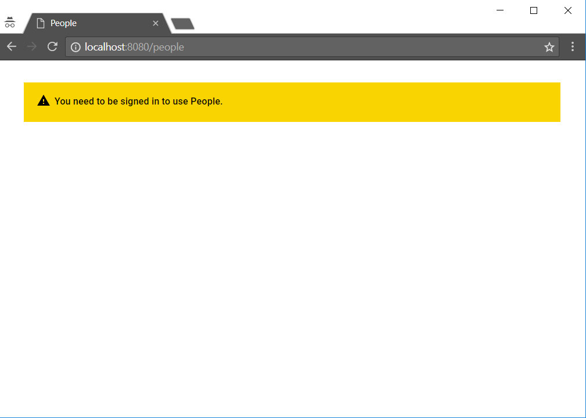
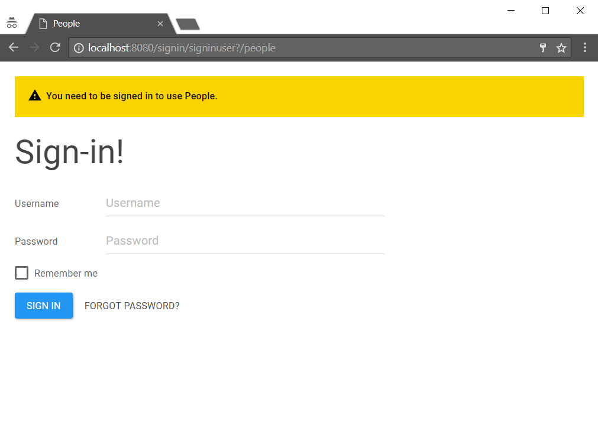

# How to request users to authenticate

To separate the concerns, your app should not directly deal with user authentication. Rather than that, it should have a view that blends in an authentication view from another app that deals with that.

Below instruction shows how to provide an authentication notice that blends in the authentication form from the [SignIn](https://github.com/Starcounter/SignIn) app.

When your app decides that the view cannot be presented without authentication, it redirects to its own "Unauthenticated" view.  
For example: `/your-app/partial/unauthenticated?return_uri={?}`

```csharp
if (!IsSignedIn()) {
    return Self.GET(
        "/your-app/partial/unauthenticated?return_uri=" + getURI);
}
```

The `getURI` is the URI requested in the original GET request.

Then define a new handler for the "Unauthenticated" partial.

```csharp
Handle.GET("/your-app/partial/unauthenticated?return_uri={?}", 
    (string returnURI) => new UnauthenticatedPage());
```

The "unauthenticated" view model could be associated with a "Unautheticated.html" which defines a warning message about not being authenticated. The main purpose for this partial is to provide the mapping to the authentication view coming from the [SignIn](https://github.com/Starcounter/SignIn) app using a predifined token.

```javascript
{
  "Html": "/people/viewmodels/Unauthenticated.html"
}
```

```csharp
using Starcounter;

namespace YourApp 
{
    partial class Unauthenticated : Json 
    {
    }
}
```

```markup
<template>
    <template is="dom-bind">
        <div>
            <iron-icon icon="icons:warning"></iron-icon>
            <label>You need to be signed in to use People.</label>
        </div>
    </template>
</template>
```

It should be mapped to a token `userform-return`, which is understood in other apps

```csharp
Blender.MapUri(
    "/your-app/partial/Unauthenticated?return_uri={?}", 
    "userform-return");
```

If [SignIn](https://github.com/Starcounter/SignIn) app is not running, the user will only get a message about not being authenticated.

This message should be defined inside "Unauthenticated.Html" file which has to be set as the `Html` property for "unauthenticated" partial view.



But if [SignIn](https://github.com/Starcounter/SignIn) app is running, it shows its own view blended with the "Unauthenticated" warning message from the "Unauthenticated.Html" file.



That view is clever. Depending on `SignInFormAsFullPage` setting it will decide whether to display the login form right in this view, or redirect to a standalone page that only has the login form.

You can have other apps than [SignIn](https://github.com/Starcounter/SignIn) that do something in this view, but they will be competing for attention.

After successful log in, [SignIn](https://github.com/Starcounter/SignIn) app redirects back to the `return_uri` in your app, so you can present to originally requested view.

