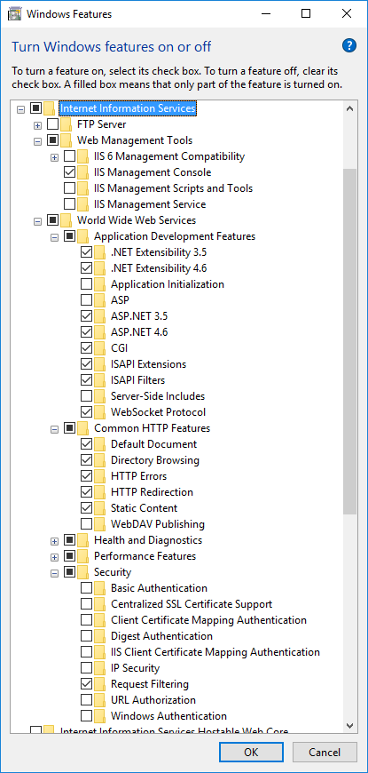
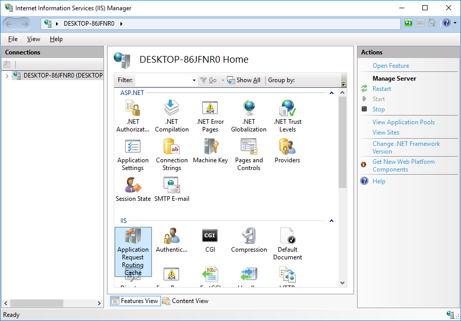

# How to setup HTTPS

## Goal

Secure Socket Layer \(SSL\) is a protocol that offers security through encryption for communications between client and server. The encryption process is made possible through the use of digital certificates verified by a third party Certificate Authority and as we know it is the most commonly implemented in the HTTPS combination protocol.

The SSL protocol aims to provide solutions to two simple security problems:

1. Secure data transmission between the client and the server.
2. Obtain proof that an involved party is the one we want to grant access to the encrypted data.

This page will describe how to setup HTTPS with either NGINX or IIS.

## Steps for NGINX

### Prerequisites

To get started you will need to ensure some basic things are on your server.  
Further, you also need to have the NGINX web server installed. Click here to chose your OS and then follow installation documentation.

We will generate 2 files: the Private-Key file for the decryption of your SSL Certificate, and a certificate signing request \(CSR\) file used to apply for your SSL Certificate. If you remember two problems we aim to avoid with SSL from above, now things should fall into place.

> It is highly important to set proper file permissions on private key file and NGINX server configuration file containing password to the handshake!

### Generate private key

You might have purchased a SSL certificate already from trusted SSL vendor.  
Otherwise you might be interested to use let's encrypt, a free certificate provider. It doesn't compromise security at all and website has a convenient tools that help you go through the process.  
Staging, testing and other non-production apps can use a free self-signed SSL certificate instead of purchasing one. In that case the connection will be encrypted however every time we try to access the corresponding website protected by the SSL certificate we will receive a warning that the certificate was not issued by trusted SSL vendor.

Generating SSL private key in your local environment will require you to install OpenSSL tool.  
Use openssl to generate a new private key.

```bash
$ openssl genrsa -des3 -out master.myserver.pass.key
...
Enter pass phrase for master.myserver.pass.key:
Verifying - Enter pass phrase for master.myserver.pass.key:
```

Generated private key can stripped of its password so it can be loaded without manual password entry. You can do it if it's your test key.

```bash
$ openssl rsa -in master.myserver.pass.key -out master.myserver.key
```

### Generate CSR

Now that you've created your key, it's time to create the Certificate Signing Request, which will be used by the Certificate Authority of your choice to generate the Certificate that SSL will present to other parties during the handshake.

```bash
$ openssl req -x509 -new -key master.myserver.key -out master.myserver.csr
```

The result will be a master.myserver.csr file in your local directory \(alongside the master.myserver.pass.key private key file from the above step\).  
You will be asked to enter a set of information. Before we proceed let's see which information we actually stated in the above command:

* **openssl**: This is the basic command line tool for creating and managing OpenSSL certificates, keys, and other files.
* **req**: This subcommand specifies that we want to use X.509 certificate signing request \(CSR\) management. The "X.509" is a public key infrastructure standard that SSL uses to for its key and certificate management. We want to create a new X.509 cert, so we are using this subcommand.
* **out**: This tells OpenSSL where to place the certificate that we are creating.
* **nodes**: You could add this parameter to skip the option to secure our certificate with a passphrase. We need `NGINX` to be able to read the file, without user intervention, when the server starts up. A passphrase prevents this from happening because we have to enter it after every restart.

You will be asked to enter some information about your location and company. The most important part is the Common Name field which should match the name that you want to use your certificate with - your domain name.  
Example of fill-in:

```bash
Country Name (2 letter code) [SE]:Sweden
State or Province Name (full name) [Some-State]:Stockholm
Locality Name (eg, city) []:Stockholm
Organization Name (eg, company) [Internet Widgits Pty Ltd]:YourName, Inc.
Organizational Unit Name (eg, section) []:YourUnitName
Common Name (e.g. server FQDN or YOUR name) []:your_domain.com
Email Address []:admin@your_domain.com
```

### Configure NGINX to use SSL

We have created our key and certificate files under the NGINX configuration directory.  
The .key file is your private key, and should be kept secure. The .csr file is what you will send to the CA to request your SSL certificate.  
Now we just need to modify server configuration to use those by adjusting our server block file the way it is written below:

```bash
server {
listen 80;
server_name master.myserver;
return 301 https://$host$request_uri;
}

server {
listen 443 ssl;
ssl_certificate     master.myserver.csr;
ssl_certificate_key master.myserver.key;
ssl on;

location / {
proxy_pass http://191.239.210.246:8080;
proxy_set_header Host $host;
proxy_set_header X-Real-IP $remote_addr; }

location /website/update {
root /path/to/master.myserver;
}

location ~ /__(.*)/[A-Z0-9]+ {
                proxy_pass              http://191.239.210.246:8080;
                proxy_set_header        Host            $host;
                proxy_set_header        X-Real-IP       $remote_addr;
                proxy_set_header        Upgrade         $http_upgrade;
                proxy_set_header        Connection      "upgrade";
                proxy_read_timeout      86400;
        }
}
```

When you are done restart NGINX server. This should reload your configuration, now allowing it to respond to both HTTP and HTTPS \(SSL\) requests.  
Don't forget to test your setup, first using normal HTTP

```http
http://server_domain_or_IP
```

then using SSL to communicate

```http
https://server_domain_or_IP
```

## Steps for IIS

This section explains how to use Microsoft [Internet Information Server](https://www.iis.net/) \(IIS\) as an HTTPS proxy on top of Starcounter. While NGINX might be a better web server overall, it requires a separate Linux machine. IIS can be installed alongside Starcounter on the same Windows machine.

### Installing IIS

IIS is available from the `Turn Windows features on or off` console.

The following items should be installed.




You can add any extra features if needed.

### Setting up IIS

Open Internet Information Services \(IIS\) Manager from the Start menu. And install the following components with `Get New Web Platform Components`.

* URL Rewrite 2.0
* Application Request Routing 3.0


Enable `system.webServer/webSocket` configuration section via Configuration Editor.


Restart the machine.

Open `Application Request Routing Cache` section and go to it's settings page.




Enable proxy, update timeout to `600` seconds, and click the `Apply` button.


### Setting up IIS website

By default there should be a `Default Web Site` item in the `Sites` section of IIS. The website should listen on the `80` port. Check that by opening `http://localhost/` in your browser. It should show the default IIS webpage.

Create and configure a new website if the default one is missing or you want to listen on another port rather than `80`.

[Create a self signed HTTPS certificate](https://technet.microsoft.com/en-us/library/cc753127%28v=ws.10%29.aspx) and assign it to the website which should be used as a proxy.

Open `https://localhost/` in your browser and make sure that the default IIS webpage is also shown.

Open or create `web.config` file in the root folder of the website and update it's content to the following.

```markup
<?xml version="1.0" encoding="UTF-8"?>
<configuration>
    <system.webServer>
        <webSocket enabled="true" receiveBufferLimit="4194304" />
        <rewrite>
            <rules>
                <clear />
                <rule name="HTTP -> HTTPS" enabled="true" stopProcessing="true">
                    <match url="(.*)" />
                    <conditions logicalGrouping="MatchAll" trackAllCaptures="false">
                        <add input="{HTTPS}" pattern="^OFF$" />
                    </conditions>
                    <action type="Redirect" url="https://{HTTP_HOST}/{R:1}" redirectType="Temporary" />
                </rule>
                <rule name="80 -> 8080 port" patternSyntax="ECMAScript" stopProcessing="true">
                    <match url="(.*)" />
                    <conditions logicalGrouping="MatchAll" trackAllCaptures="false">
                        <add input="{HTTPS}" pattern="^OFF$" />
                        <add input="{CACHE_URL}" pattern="^(.+)[:][/][/]" />
                    </conditions>
                    <action type="Rewrite" url="{C:1}://localhost:8080/{R:0}" />
                </rule>
                <rule name="80 -> 8080 port, https">
                    <match url="(.*)" />
                    <conditions logicalGrouping="MatchAll" trackAllCaptures="false">
                        <add input="{HTTPS}" pattern="^ON$" />
                    </conditions>
                    <action type="Rewrite" url="http://localhost:8080/{R:0}" />
                </rule>
            </rules>
        </rewrite>
    </system.webServer>
</configuration>
```

**Note:** the rule names can be anything, but better keep it meaningful. The `8080` port should be updated with the port of the Starcounter database IIS should redirect to.

Make sure that Starcounter database is running and the proxy is working.

* `http://localhost/` should redirect to `https://localhost/`
* `https://localhost/` should open `http://localhost:8080/`

## Summary

With this, you should have HTTPS set up with either NGINX or IIS

