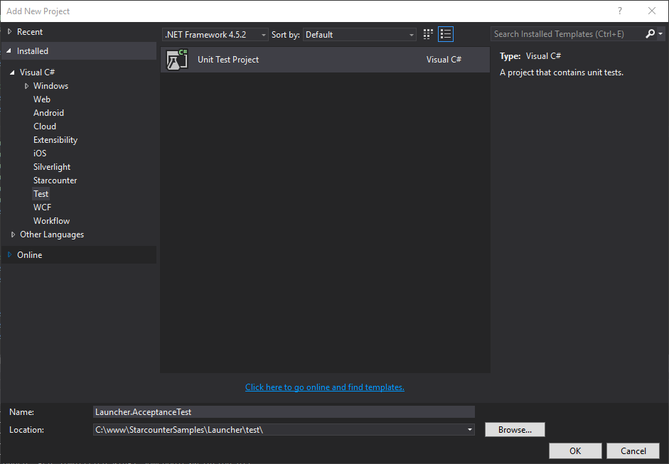
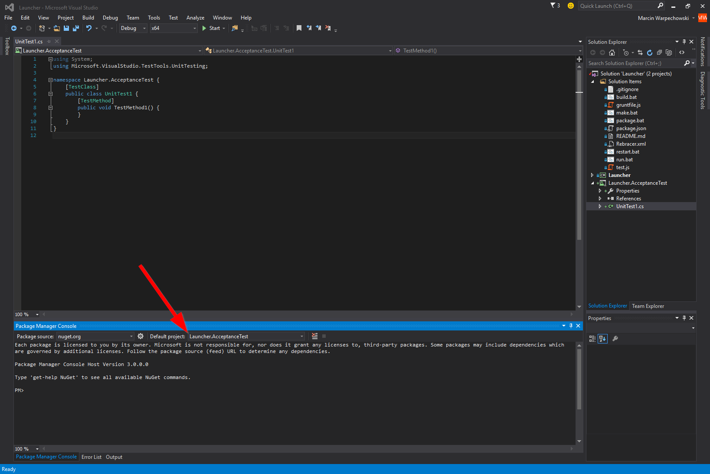
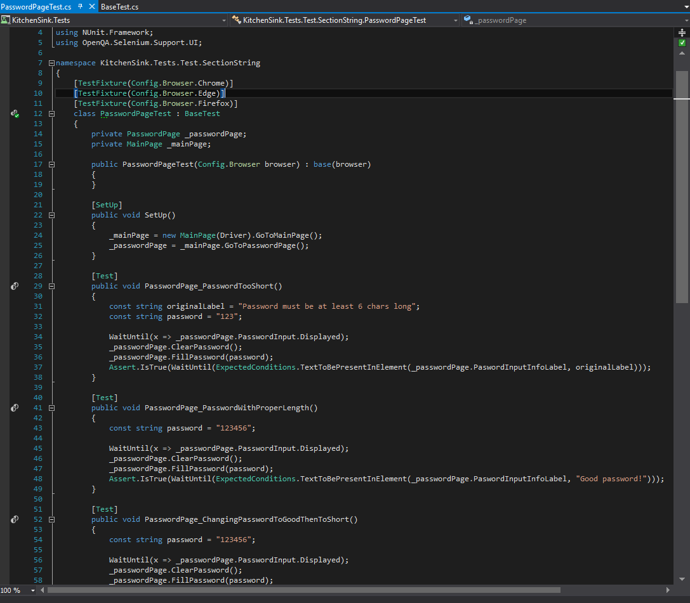
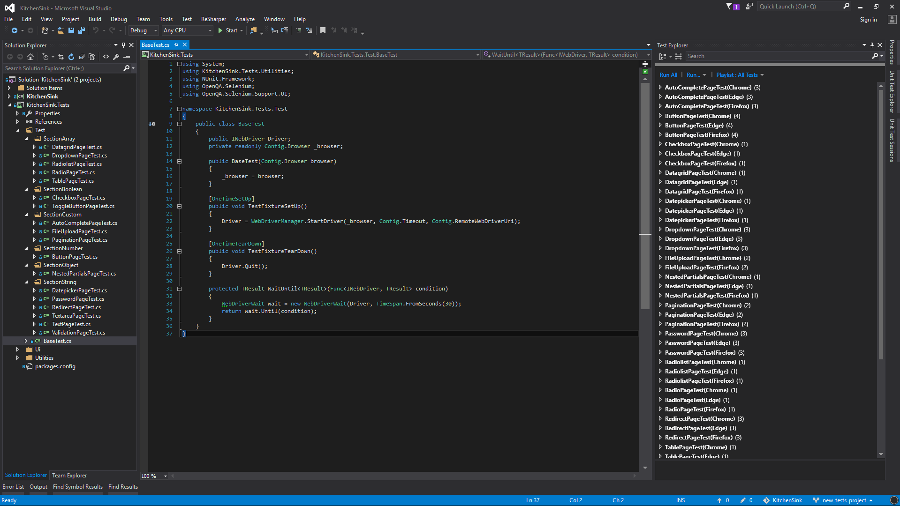
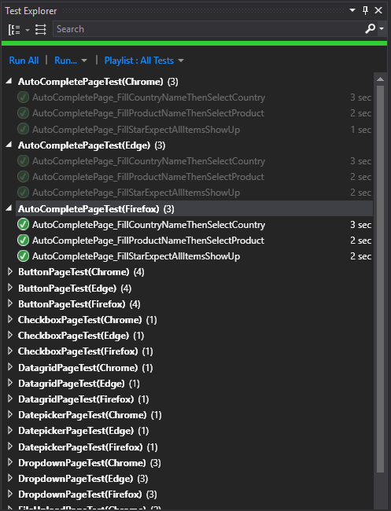

# How to test with Selenium

Palindrom web apps are C\# apps with a thin presentation layer rendered in HTML5. Because of that, acceptance tests need to be executed in a web browser. If you would like to add automated acceptance testing to your project, there is no better tool than Selenium.

This page describes how to use NUnit to run Selenium acceptance tests on Palindrom web apps. 

## What is Selenium

Selenium is a free \(open source\) automated testing suite for web applications across different browsers and platforms.

Selenium is not just a single tool but a suite of tools, each catering to different testing needs. The components that we will use are:

1. **Selenium WebDriver**, which is an API that controls the web browser. It is implemented in all major programming languages, including C\#.
2. **Selenium RemoteWebDriver**, a Selenium WebDriver implementation that we will use, because it allows to execute the tests on the same or different machine. It is implemented in all major programming languages, including C\#.
3. **Selenium Server Standalone**, a Java-based server that runs specific web browser client drivers. RemoteWebDrivers runs the tests through it.
4. **Selenium client drivers** for web browsers such as Firefox, Chrome and Edge.
5. **Selenium IDE**, a Firefox extension that allows to record the tests, so you don't have to write them manually.

You can learn more about Selenium at their [website \(docs.seleniumhq.org\)](http://docs.seleniumhq.org/docs/) or read one of the interesting blog posts:

* [Selenium Tutorial: Learn Selenium WebDriver](https://blog.udemy.com/selenium-ide-tutorial/)
* [Getting Started with Selenium IDE](http://www.softwaretestinghelp.com/selenium-ide-download-and-installation-selenium-tutorial-2/)

## What is NUnit

NUnit is a testing framework that has great integration with Visual Studio as well as continuous integration systems \(TeamCity, etc\). We will use NUnit to run our Selenium tests.

NUnit provides a [test runner](https://github.com/nunit/docs/wiki/Console-Command-Line) \(command line and built into Visual Studio\), [attributes](https://github.com/nunit/docs/wiki/Attributes) to define the classes and functions that carry the testing code, [assertions](https://github.com/nunit/docs/wiki/Assertions) that test the actual values.

You can learn more about NUnit at their [website \(nunit.org\)](https://github.com/nunit/docs/wiki/Getting-Started-in-Visual-Studio) or read one of the interesting blog posts:

* [C\# Unit Test Tutorial](http://www.rhyous.com/programming-development/csharp-unit-test-tutorial/)
* [Unit testing with .NET](http://www.developerfusion.com/article/84847/unit-testing-with-net/)
* [Learning NUnit In Easy Way For Beginners](http://learnseleniumtesting.com/learning-nunit-in-easy-way-for-beginners/)

## Create a test project

It is recommended to keep the testing project in the same solution as the tested project. Note that they are two different projects.

In the following example, we will add acceptance tests to Launcher. Let's create a new test project in Visual Studio, by clicking Add New Project → Visual C\# → Test → Unit Test Project.

Call the new project "Launcher.AcceptanceTest". We will use `Launcher\test\` as the project location.



## Install required packages

Open the newly created test project. Now, we need to install a bunch of libraries mentioned above.

Open the package manager \(Tools → NuGet Packet Manager → Packet Manager Console\).


 In the console, choose your test project from the "Default project" drop-down.




Run the following commands in the console to install the required dependencies:

```bash
Install-Package Selenium.WebDriver
Install-Package Selenium.Support
Install-Package NUnit
Install-Package NUnit.ConsoleRunner
Install-Package NUnit3TestAdapter
```

## Running in multiple browsers

Use Selenium RemoteWebDriver to run tests in multiple browsers. Selenium RemoteWebDriver adds a layer of abstraction that allows us to use multiple browser and remote machines for testing.

### Install Selenium Standalone Server and browser drivers

To run Selenium in multiple browsers, some additional software is required.

* Download and install Java, required by Selenium Standalone Server
* Create a directory `C:\Selenium`
* Download the following files from [Selenium Downloads](http://docs.seleniumhq.org/download/):
  * Selenium Standalone Server \(`selenium-server-standalone-3.*.jar`\)
  * Gecko Driver \(`geckodriver.exe`\)
  * Microsoft Edge Driver \(`MicrosoftWebDriver.exe`\)
  * Google Chrome Driver \(`chromedriver.exe`\)
* Put the `jar` file as well as 3 `exe` files directly in `C:\Selenium`

Open your Properties in the Tests project. Go to Reference Paths, enter `C:\Selenium` and click `Add Folder`.

### Use BaseTest class

BaseTest is a helper class that makes it easier to test multiple browsers. The source code is available:

* BaseTest helper class [here](https://github.com/Starcounter/KitchenSink/blob/master/test/KitchenSink.Tests/Test/BaseTest.cs)
* Using of BaseTest class [here](https://github.com/Starcounter/KitchenSink/blob/master/test/KitchenSink.Tests/Test/SectionBoolean/CheckboxPageTest.cs)

When you rebuild the test project now, you should see each test for every browser.

The final setup looks like this:



Before you can execute the tests, start Selenium Server Standalone by calling `java -jar selenium-server-standalone-3.*.jar`.

## Wait for asynchronous content

There is one common pitfall when writing Selenium tests. The test is executed with disregard of the asynchronously loaded content. This means that your tests need to explicitly wait for UI elements to appear before running any actions or assertions on them.

It is a good practice to always wait:

* Wait for a text element to be present before you check the content of that element
  * An example can be found in the method `TextareaPage_WriteToTextArea` in KitchenSink 

    Tests \(see [TextareaPageTest.cs lines 28-38](https://github.com/Starcounter/KitchenSink/blob/master/test/KitchenSink.Tests/Test/SectionString/TextareaPageTest.cs#L28-L38)\). The method `WaitForText()` is used to 

    compare the text value of `TextareaInfoLabel` asynchronously. The assertion passes if the 

    text is found within 5 seconds, otherwise it fails.
* Wait for a button to be present before you click on that button
  * An example can be found in the method `ButtonPage_RegularButton` in the KitchenSink 

    tests \(see [ButtonPageTest.cs lines 29-46](https://github.com/Starcounter/KitchenSink/blob/master/test/KitchenSink.Tests/Test/SectionNumber/ButtonPageTest.cs#L29-L46)\). The method `WaitUntil()` is used to 

    asynchronously check the state of the `Displayed` property of a button. It halts the test 

    for a default maximum time of 10 seconds. If the button is not displayed within that 

    time, it throws an exception.
* Wait for presence of an input field before typing in it and wait for text to be present in label
  * An example can be found in the method `TextPage_TextPropagationOnUnfocus` in the 

    KitchenSink tests \(see [TextPageTest.cs lines 28-38](https://github.com/Starcounter/KitchenSink/blob/master/test/KitchenSink.Tests/Test/SectionString/TextPageTest.cs#L28-L38)\). This test mixes the other examples 

Source file: [TextareaPageTest.cs](https://github.com/Starcounter/KitchenSink/blob/f44d0fec964b7a076bb3bc9f4186280c1b68bce2/test/KitchenSink.Tests/Test/SectionString/TextareaPageTest.cs#L28-L38).

 Waiting for a button to exist before clicking on it:

```csharp
[Test]
public void ButtonPage_RegularButton()
{
    WaitUntil(x => _buttonPage.VegetablesButtonInfoLabel.Displayed);
    Assert.AreEqual(
        "You don't have any carrots",
        _buttonPage.VegetablesButtonInfoLabel.Text);

    WaitUntil(x => _buttonPage.ButtonInlineScript.Displayed);
    _buttonPage.ClickButtonInlineScript();
    Assert.IsTrue(
        WaitForText(_buttonPage.VegetablesButtonInfoLabel, 
        "You have 1 imaginary carrots", 5));

    WaitUntil(x => _buttonPage.ButtonFunction.Displayed);
    _buttonPage.ClickButtonFunction();
    Assert.IsTrue(WaitForText(
        _buttonPage.VegetablesButtonInfoLabel, 
        "You have 2 imaginary carrots", 5));

    WaitUntil(x => _buttonPage.SpanFunction.Displayed);
    _buttonPage.ClickSpanFunction();
    Assert.IsTrue(WaitForText(
        _buttonPage.VegetablesButtonInfoLabel, 
        "You have 3 imaginary carrots", 5));
}
```

Source file: [ButtonPageTest.cs](https://github.com/Starcounter/KitchenSink/blob/cbe1d43c9b226bed232a947048f4d850f4c762e9/test/KitchenSink.Tests/Test/SectionNumber/ButtonPageTest.cs#L30-L47).

Waiting for an input field to exist before typing in it and wait for text to be present in label:

```csharp
[Test]
public void TextPage_TextPropagationOnUnfocus()
{
    WaitUntil(x => _textPage.Input.Displayed);

    _textPage.FillInput(_textPage.Input, "Krystian");
    Assert.IsTrue(WaitForText(
        _textPage.InputInfoLabel, 
        "Hi, Krystian!", 5));
        
    _textPage.ClearInput(_textPage.Input);
    WaitUntil(x => _textPage.Input.Text == string.Empty);
    Assert.AreEqual(
        "What's your name?", 
        _textPage.InputInfoLabel.Text);
}
```

Source file: [TextPageTest.cs](https://github.com/Starcounter/KitchenSink/blob/6c8c4afd5b418444d8e7dd1b87f028116299ad9e/test/KitchenSink.Tests/Test/SectionString/TextPageTest.cs#L29-L39).

## Run the first test

Clone [KitchenSink repo](https://github.com/Starcounter/KitchenSink) from the [Starcounter organisation](https://github.com/Starcounter) on GitHub.  
Follow the steps that were presented at `Install Selenium Standalone Server and browser drivers`.

Build your test project. If it builds correctly, you should see this:



Now, the only thing left to do is to run that test. In the Test Explorer, click on the "Run All" button. If it works well, you should see your tests passing.



## Sample test suites

The [KitchenSink](https://github.com/Starcounter/KitchenSink) sample app includes a Selenium test case for every UI pattern that is presented in that app. You can learn from the test project \(in the `test` directory\), how to achieve Selenium testing of particular actions, such as button clicks, page changing, typing in forms, etc.

