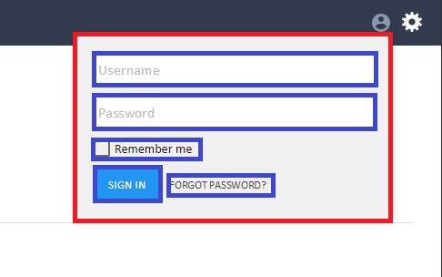

# Avoiding CSS conflicts

## Introduction

When your system is composed of HTML responses from multiple apps, there's always a risk of naming conflicts and cascading side effects in your CSS. A solution to this is to use a convention that isolates styles coming from different apps.

We recommend BEM, a well-known convention that solves this problem.

## What is BEM?

In the BEM naming convention, you **only use classes** in your stylesheets.  There are three kinds of classes at your disposal: blocks, elements, and modifiers.

A **block** is a basic class that represents a logical area of your app's UI \(_a menu, login form, a search form_\).

An **element** is a part of a block that performs a particular function \(_a link in the menu, a password input in the login form, a search icon_\).

A **modifier** is a variation of a block or of an element \(_an expanded menu, an active menu item, a password input with an invalid value, a disabled search button_\).

Possible combinations of blocks, elements and modifiers are the following:

```css
.block {}
.block__element {} /*The element part starts after __*/
.block--modifier {} /*The modifier part starts after --*/
.block__element--modifier {} /*Both blocks and elements can have modifiers*/
```

When applied to an HTML structure, the above CSS class names are used in the following way:

```markup
<div class="block">
  <div class="block__element"> ... </div>
  <div class="block__element--modifier"> ... </div>
</div>

<div class="block--modifier">
  <div class="block__element"> ... </div>
  <div class="block__element--modifier"> ... </div>
</div>
```

Note here that **everything at the root level must be a block**. A block can have multiple element and modifier sections and every element and modifier has to belong to a block.

## Example

Consider the [SignIn app](https://github.com/starcounterapps/signin):



Here, the block is marked in red and the element sections in blue.

From this, these BEM classes can be derived:

```css
.signin-form {}
.signin-form--expanded {}
.signin-form__text-input {}
.signin-form__labeled-checkbox {}
.signin-form__labeled-checkbox--checked {}
```

Check out the source code of [People](https://github.com/StarcounterApps/People) or [KitchenSink](https://github.com/StarcounterApps/KitchenSink). These sample apps show how to apply BEM in practice.

## BEM in Starcounter apps

We recommend the following rules when using BEM selectors in Starcounter apps.

* **Only use BEM class selectors in your stylesheets**. Do not use element selectors, id selectors, or inline styles for the purpose of styling.
* **Give meaningful names** to the block, element and modifier sections. For example, `.chatter-avatar` is much more descriptive than `.chatter-img`.
* **Use resusable names** for the block, element, and modifier sections. As seen in the example above, `.signin-form__text-input` is preferred over `.signin-form__firstname-input` since `text-input` is more resusable than `firstname-input`.
* **Prefix block sections with the app name** to isolate your classes from other apps. For example, the class for a menu block in the "Chatter" app should be `.chatter-menu`.
* **Use lowercase classes**. `.Chatter-Menu` is wrong, `.chatter-menu` is right.
* **Separate words with a hyphen** when there are multiple words in a block, element or modifier section. For example: `.chatter-chat-message__message-text`.
* **Block and element must be in the same HTML template**. Otherwise, implicit couplings are created between templates which might break when the partial mapping changes. If you want to define `.chatter-menu` in a parent partial and the menu items in a nested partials, these menu items will become new blocks \(`.chatter-menu-item`, not `.chatter-menu__item`\).
* **Modifier classes should extend base classes**.

  When you set a `.chatter-menu__item--active` class on an element, it should not be needed to add the `.chatter-menu__item` base class.

  In your stylesheet, the definition for the base class should include all the modifiers, like this:

  ```css
  .chatter-menu__item,
  .chatter-menu__item--active {
    font-size: 11px;
  }

  .chatter-menu__item--active {
    font-weight: bold;
  }
  ```

* **Never nest blocks inside blocks and elements inside elements.**

  If there’s need for more nesting, it means there’s too much complexity and the elements should be stripped down into smaller blocks.

* **Mixing BEM with Uniform.css**

  Starcounter sample apps use Uniform.css to create a unified look and feel.

  There are no issues with mixing Uniform.css and your styles by following BEM. In fact, by just looking at the class, you can immediately tell if that class is shared with other apps \(Uniform.css\) or if it's private to this particular app \(BEM\).

  It is **not** fine to override Uniform.css classes in your app's stylesheet. The only proper way to extend style is to with a BEM selector, for example:


  ```markup
  <style>
      .kitchensink-section-primary-grid {
          display: grid;
          grid-gap: var(--uni-section-padding-vertical, var(--uni-default-section-padding-vertical));
      }
  </style>
  <div class="uni-section-primary kitchensink-section-primary-grid">
      <div class="uni-card">
          <div class="uni-title">
              <slot name="kitchensink/buttonpage-regular-heading"></slot>
          </div>
          <slot name="kitchensink/buttonpage-regular-description"></slot>
      </div>
  </div>
  ```

## Further reading

* [BEM: Key concepts \(bem.info\)](https://en.bem.info/method/key-concepts/)
* [Naming convention \(bem.info\)](https://en.bem.info/method/naming-convention/)
* [BEM-like Naming \(cssguidelin.es\)](http://cssguidelin.es/#bem-like-naming)
* [MindBEMding – getting your head ’round BEM syntax \(csswizardry.com\)](http://csswizardry.com/2013/01/mindbemding-getting-your-head-round-bem-syntax/)
* [An Introduction to the BEM Methodology \(tutsplus.com\)](http://webdesign.tutsplus.com/articles/an-introduction-to-the-bem-methodology--cms-19403)

