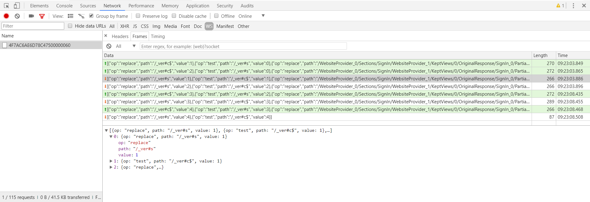
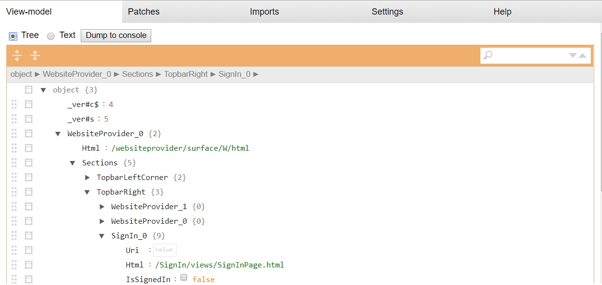
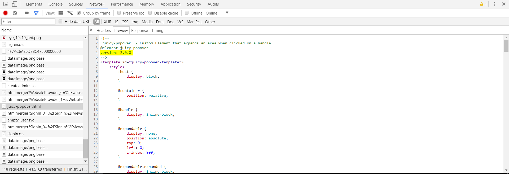
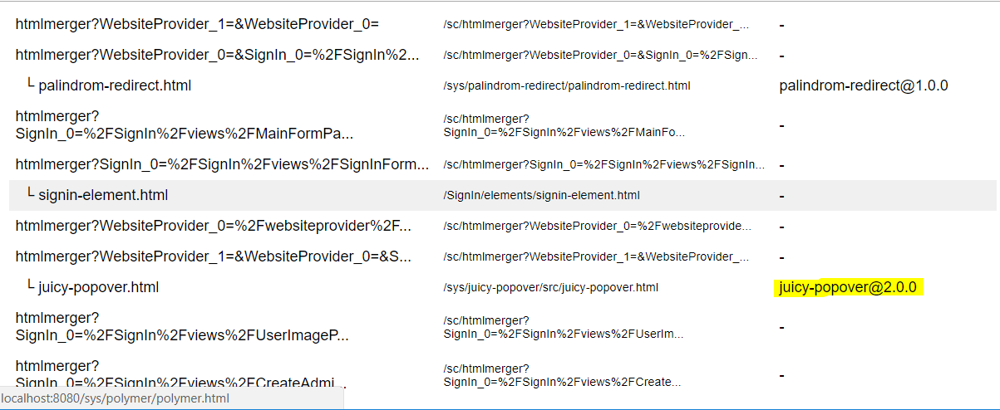
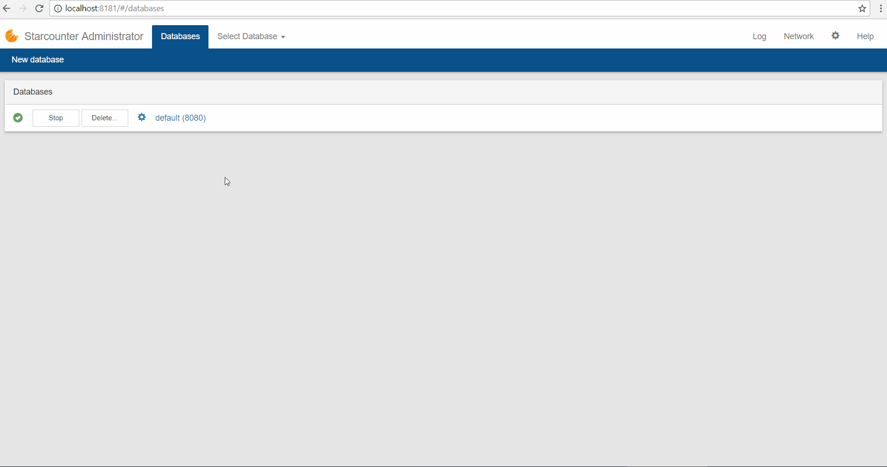
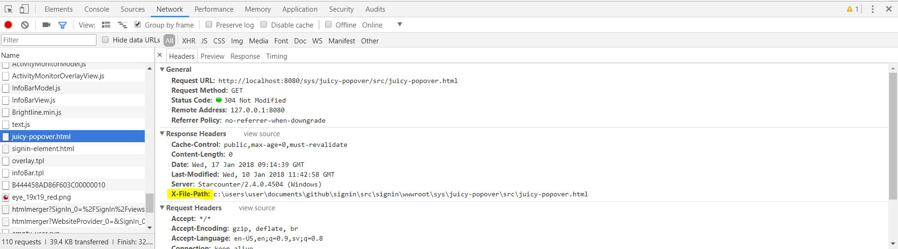

# Debugging

## Introduction

Since views in Starcounter are built on a thin-client architecture and use a different communication protocol - Palindrom instead of REST - they're debugged in a slightly different way. This page describes how to debug views in Starcounter.

## Starcounter DevTools

The primary tool for debugging Starcounter apps is [Starcounter DevTools](https://github.com/Starcounter/DevTools). Starcounter DevTools is a [WebExtension](https://browserext.github.io/browserext/) that lets you inspect view-models, patches sent over Palindrom, and imported packages.

You can download Starcounter DevTools for [Chrome](https://chrome.google.com/webstore/detail/starcounter-devtools/mpchkilmmalfopikamgellgdgoidhmnh) and [Firefox](https://addons.mozilla.org/en-US/firefox/addon/starcounter-devtools/). For other browsers, you can add this code as a bookmarklet:

```javascript
javascript:(function(){var script = document.createElement('script');script.src = 'https://rawgit.com/Starcounter/DevTools/master/build/webextension/injected_script.js';document.body.appendChild(script);script.onload=()=>window.dispatchEvent(new CustomEvent('sc-debug-show-overlay'))})()
```

## Investigating patches

Starcounter apps communicate over Palindrom - a protocol that uses WebSocket with JSON-Patch. When debugging, it's useful to see the patches that are sent and received. This can be done with both Starcounter DevTools and Chrome DevTools.

With Starcounter DevTools, use the "Patches" tab. This tab shows all requests and responses, both HTTP and WebSocket. To filter out the type of requests and responses, use the drop-down in the top left corner. There, you can choose to only see, for example, WebSocket patches or GET requests. The drop-down next to the type drop-down lets you only see requests or responses. 


To investigate patches in Chrome DevTools, go to Network, select WS to only see WebSocket patches, and click the top WebSocket request. If you opened the DevTools after Palindrom established the WebSocket connection, you have to refresh the page to see the connection in DevTools. You can then see all the patches and their content.



## Investigating view-models

To investigate the view-models of a page, use the "View-model" tab of Starcounter DevTools. It lets you view the view-models on the current page, either as an expandable tree or as a plain text JSON tree 



If a property in the tree is not populated as expected - check whether the name in the HTML matches the name of the JSON property name.

## Investigate versions of imported dependencies

There are two ways to check the version of an imported client-side dependency. The first way is to check the header of the imported file with Chrome DevTools. To do this, open DevTools, go to the Network tab, click "Preview". At the top of the file, the author of the dependency should have written the version.



The second way is to use the Imports tab of Starcounter DevTools. There you can click "Get Bower versions" to retrieve the Bower version of all the dependencies.



 To check where the file is imported from, set the [database configuration](../database/database-configuration.md) option `X-File-Path Header` to `true`.  By doing this, you can see whether the imported file has been overridden by another app. This option should be disabled in production.



With `X-File-Path` enabled, you can use Chrome DevTools to find the exact path by locating the header `X-File-Path` in the Network tab.




