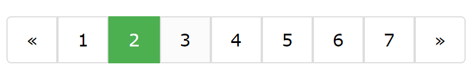

# HTML Views Composition Guidelines

## Introduction

In order to harness the full power of Starcounter, applications should be built to accomodate for complete visual and functional interoperability. To make this process easier for developers, we provide these guidelines for HTML views which, when followed, will allow applications to achieve seamless visual integration with other applications.

To get a technical background, the article [Layout compositions for HTML partials](https://starcounter.io/layout-compositions-html-partials/) covers more of the underlying ideas of what's presented here. It may also be worth to take a look at the following articles:

* [Unobtrusive styling and composing 3rd party HTML content](http://starcounter.io/unobtrusive-styling-composing-3rd-party-html-content/)
* [HTML partials/includes WebComponents-way](http://starcounter.io/html-partialsincludes-webcomponents-way/)

[CompositionProvider](https://github.com/Starcounter/CompositionProvider) has to run for the code in these guidelines to work. There are two ways to start `CompositionProvider`: follow the instructions in the [README file](https://github.com/Starcounter/CompositionProvider/blob/master/README.md), or, when Starcounter is running, go to `http://localhost:8181/#/databases/default/appstore`, click on the download button next to `CompositionProvider`, and click `Start` at `http://localhost:8181/#/databases/yourDatabase`. This requirement is temporary.

## Guideline 1: Separation of Layout and Content

To make applications look great when running independently while also allowing them to look as one while running with other applications, it is beneficial to separate the layout and the content. This is accomplished using the `<template is="declarative-shadow-dom">` element.

The basic boilerplate of a Starcounter HTML view, which is created by adding a `Starcounter HTML template with dom-bind` file in Visual Studio, looks like this:

```markup
<link rel="import" href="/sys/polymer/polymer.html">

<template>
    <template is="dom-bind">

    </template>
</template>
```

To separate the layout and content in this file, the element mentioned above, `<template is="declarative-shadow-dom">` should be used. This element should contain the layout of the HTML view while the `<template is="dom-bind">` should contain the content. Note that this only applies when using Polymer as a templating engine. When using other frameworks, it will not use `dom-bind`, although, the principle of separating the layout from the content will stay constant. In code, this is how it looks:

```markup
<link rel="import" href="/sys/polymer/polymer.html">

<template>
    <template is="dom-bind">
        <!-- content goes here -->
    </template>
    <template is="declarative-shadow-dom">
        <!-- layout goes here-->
    </template>
</template>
```

The content are the elements that either contain information for the user, such as `<h1>`, `<span>`, and `<a>`, or elements that create some kind of interaction between the user and the application, such as `<button>` and `<input>`.

Keep in mind that the only elements that have to be in the `<template is="dom-bind">` are the ones that use Polymer bindings, as denoted with double curly-bracket syntax: `{{model.SomeProperty}}`.

The content of the HTML view is distributed using a Shadow DOM concept called slots, as explained in guideline 4.

## Guideline 2: Defining the Content

When defining the content of a view, it is important to keep in mind that the slotable elements, which are the ones that will be exposed for Composition, have to be on the root of the HTML view. Consider the following HTML view:

```markup
<template>
    <h1>A Headline</h1>
    <p>Some text for te user to read</p>
    <button>A button to click</button>
</template>
```

Here, every element is at the root of the document and will be exposed for Composition after they are attached to slots and distributed in the Shadow DOM. In some cases, putting every element on the root of the view, like we do in the example above, might not be desired. Then, the goal should still be to place as many elements as possible on the root of the view, especially elements like ``, `<table>`, and custom elements that are visually obtrusive and might require Composition to create a high level of interoperability.

Additionally, there might be situations where the developer would like to have a higher level of abstraction on some of his or her content. For example, consider this pagination bar:



Here, it would not make sense to break it up into the respective parts because they do not have any real meaning when presented individually. It would rather make sense to put the parent on the root level so that the whole bar is exposed for Composition, and not the individual buttons.

## Guideline 3: Attaching the Content to Slots

To have better flexibility in blending - to be able to distribute an element individually - the element needs to be assigned to [named slots](https://developer.mozilla.org/en-US/docs/Web/HTML/Element/slot#named-slot), like `<button slot="myapp/submitbutton">Submit</button>`. Such an element could be distributed via `<slot name="myapp/submitbutton"></slot>` in the Shadow DOM. Prefix slot names with the app name, to avoid collisions.

When no slot name is provided for an element it will be distributed in [the default slot](https://w3c.github.io/webcomponents/spec/shadow/#shadow-tree-slots): `<slot></slot>`.


 The first slot in a shadow tree, in tree order, whose name is the empty string, is sometimes known as the "default slot".


Text nodes are also distributed in the default slot.

Use explicit slot names instead of relying on the default slot. The solution owner can remove the default slot from a view composition with the [CompositionEditor](https://github.com/Starcounter/Blending#blending-app-suite). As a result, all elements from the view that don't have a `slot` attribute are not rendered.

It's not necessary to declare the default slot in the `declarative-shadow-dom` part of your view. The Starcounter's HTML merger automatically adds a default slot at the bottom of the composition of your view for fallback reasons.

## Guideline 4: Create the Layout in `declarative-shadow-dom`

As outlined in guideline 1, the layout of the HTML view should be included within the `<template is="declarative-shadow-dom">`.

There is one exception to this. Both slot attributes and `declarative-shadow-dom` can be omitted if the view only contains non-visual elements or if all elements should be bulked together in the default slot. The latter is rarely the case but may be useful for example for prototyping.

The [`<slot>` element](https://developer.mozilla.org/en-US/docs/Web/HTML/Element/slot) is used to distribute the content in the Shadow DOM: `<slot name="appname/elementname"></slot>`.

Consider the following HTML view definition:

```markup
<link rel="import" href="/sys/palindrom-redirect/palindrom-redirect.html" />

<template>
    <template is="dom-bind">
        <style>
            .people-field {
                display: flex;
                flex-direction: row;
                align-items: baseline;
                margin-bottom: 5px;
            }
            .people-field__label {
                flex: 0 0 75px;
                margin-right: 20px;
            }
            .people-field__control {
                flex: 1 1 75px;
            }
        </style>
        <div class="people-field">
            <div class="people-field__label">
                <label slot="people/first-name-label" class="control-label">First name:</label>
            </div>
            <div class="people-field__control">
                <input slot="people/first-name-control" type="text" value="{{model.FirstName$::change}}" placeholder="First name" class="form-control" />
            </div>
         </div>
    </template>
</template>
```

To add `declarative-shadow-dom` to this HTML view, something like this can be done:

```markup
<link rel="import" href="/sys/palindrom-redirect/palindrom-redirect.html" />

<template>
    <template is="dom-bind">
        <label slot="people/first-name-label" class="control-label">First name:</label>
        <input slot="people/first-name-control" type="text" value="{{model.FirstName$::change}}" placeholder="First name" class="form-control" />
    </template>
    <template is="declarative-shadow-dom">
        <style>
            .people-field {
                display: flex;
                flex-direction: row;
                align-items: baseline;
                margin-bottom: 5px;
            }
            .people-field__label {
                flex: 0 0 75px;
                margin-right: 20px;
            }
            .people-field__control {
                flex: 1 1 75px;
            }
        </style>

        <div class="people-field">
            <div class="people-field__label">
                <slot name="People/first-name-label"></slot>
            </div>
            <div class="people-field__control">
                <slot name="People/first-name-control"></slot>
            </div>
         </div>
    </template>
</template>
```

Here, the elements are distributed in the way that the view will look when no Composition is applied or when the app is running in standalone mode.

## Guideline 5: Apply Styling to Avoid Conflicts and Allow Composition

Regarding styling, there are two ways to make the application easier to visually integrate with other apps:

1. Prefix all class names with the name of the app, as outlined in [Avoiding CSS Conflicts](https://docs.starcounter.io/guides/blending/avoiding-css-conflicts/).
2. Keep styling that will affect the layout inside the `declarative-shadow-dom`.
3. To avoid writing the same Shadow DOM CSS on different pages, it can be imported with the CSS `import` rule. The syntax for this is `<style>@import url("/yourapp/css/style.css");</style>`. In the example above it would be done this way:

```markup
<link rel="import" href="/sys/palindrom-redirect/palindrom-redirect.html" />

<template>
    <template is="dom-bind">
        <label slot="People/first-name-label" class="control-label">First name:</label>
        <input slot="People/first-name-control" type="text" value="{{model.FirstName$::change}}" placeholder="First name" class="form-control" />
    </template>
    <template is="declarative-shadow-dom">
        <style>
        @import url("/people/css/style.css");
        </style>

        <div class="people-field">
            <div class="people-field__label">
                <slot name="People/first-name-label"></slot>
            </div>
            <div class="people-field__control">
                <slot name="People/first-name-control"></slot>
            </div>
         </div>
    </template>
</template>
```

## Additional Resources

To find more information about creating HTML View definitions, take a look at [the article linked above](https://starcounter.io/layout-compositions-html-partials/) and the [People app](https://github.com/StarcounterSamples/People/tree/develop/src/People/wwwroot/People/viewmodels) which fully adheres to these guidelines.

