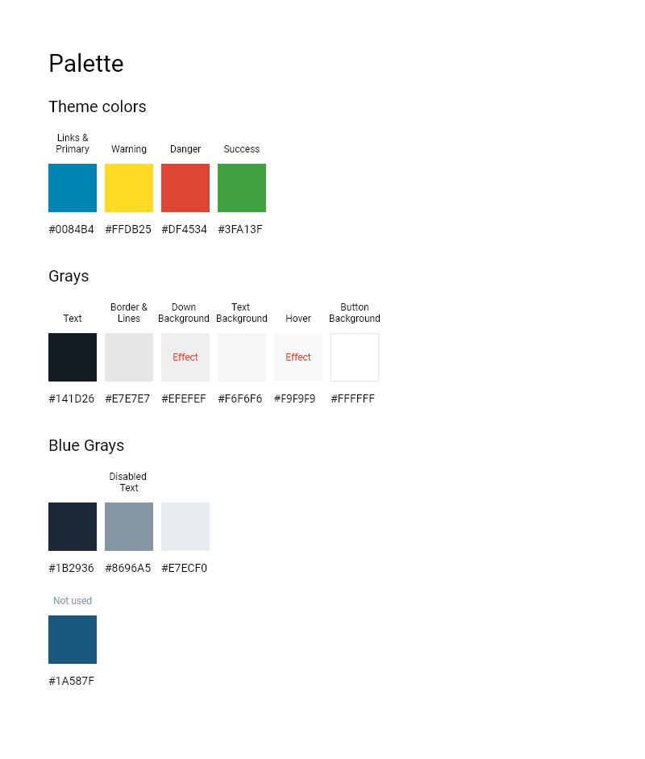

# Starcounter Design System

## Introduction

Starcounter Design System is a set of tools maintained by Starcounter to allow app developers to create blendable web apps with a common look and feel. These tools are Underwear.css, Uniform.css, custom elements and themes.

## Is this really a design system?

Starcounter Design System follows the “convention over configuration” paradigm. If you want to quickly set up an app prototype, you can do it by copy and paste from the reference material, as if Starcounter Design System was your comprehensive toolbox.

Unlike many design systems, the Starcounter Design System is open-ended and themeable. It can be extended to make anything that is possible with HTML, CSS, and JS. It can be adapted by a designer working with BlendingEditor to the extent allowed by Shadow DOM.

## Mental model in 4 layers

Starcounter Design System consists of 4 layers:

1. Underwear.css - a modern-looking default stylesheet
2. Uniform - a library of UI patterns and custom elements to be used in a separated presentation layer
3. Customization through Themes and CSS custom properties
4. Free, hackable world of HTML, CSS & JS

### Underwear.css - a modern-looking default stylesheet

For the most basic layer, Starcounter provides a CSS library [Underwear.css](https://github.com/Starcounter/underwear.css). This small CSS file is based on Normalize.css. It provides a modern-looking alternative for the default user agent stylesheet.

As unopinionated as it gets, Underwear.css provides look and feel only for native HTML. It does not include any CSS classes.

Underwear.css is implicitly loaded for any blendable web app by the Starcounter app shell, so there is no need to load it explicitly in the views.

Underwear.css is configurable using CSS custom properties.

Head to the [demo page of Underwear.css](https://starcounter.github.io/underwear.css/) for a preview.

### Uniform - a library of UI patterns and custom elements

The developer of a blendable web app should apply specific UI components in the presentation layer, which can be altered by a designer without touching the app source code through [View composing](view-composing.md).

For this layer, Starcounter Design System uses the [Uniform.css](https://github.com/Starcounter/uniform.css) library to implement common UI components. Apps that use these components will get a consistent look and feel that is changeable in compositions.

Basic patterns, such as sections, cards, alerts, primary buttons are covered by plain CSS stylesheet and could be applied by using `uni-*` classes in a shadow root.
More advanced components, like date pickers, are [implemented as custom elements](https://github.com/Starcounter/uniform.css/tree/master/components). They are meant to be used in shadow roots as well, to wrap distributed native HTML elements. That allows to serve real progressive enhancement, and what is crucial for a system of blended apps: keep app content's markup semantic and unopinionated, giving solution owner a way to apply own opinion on top of functional elements.

Uniform.css or Uniform components must be explicitly imported in any view shadow root that uses it.

Uniform is configurable using CSS custom properties and themes, for more, read [next section](#customization-through-themes-and-css-custom-properties).

Head to the [demo page of Uniform](https://starcounter.github.io/uniform.css/) for a preview.

Your blendable web app can use any custom elements. However, finding or implementing a good custom element and creating a view-model for it takes time.

Our [KitchenSink](https://github.com/Starcounter/KitchenSink) app demonstrates implementation of some commonly used components, such as a Google map or a combo box, using custom elements that we can endorse.

Head to the [hosted version of KitchenSink](https://kitchensink.starcounter.io/) for a preview.

### Customization through Themes and CSS custom properties

Thanks to the [CSS Custom Properties](https://developer.mozilla.org/en-US/docs/Web/CSS/Using_CSS_variables), it is possible to externally configure values such as color schemes to Underwear.css, Uniform.css, your app custom stylesheets, and custom elements.

One of the tools in the [Blending](https://github.com/Starcounter/Blending) apps suite is a CSS custom properties manager, that stores color schemes in the database. The CSS custom properties can be stored in collections and provided conditionally in specific layouts.

For more sophisticated theming we would love to use native [CSS shadow parts and themes](https://meowni.ca/posts/part-theme-explainer/), unfortunately, it's not supported yet.
Luckily, we are able to mimic its behavior to the satisfactory degree with Themes tailored to our elements, based on [Vaadin themes](https://vaadin.com/themes).
The main difference is that those Themes works on the global level, but given that you can still customize them per each view level - it's the typical case anyway.

We also have a GUI tool in the [Blending](https://github.com/Starcounter/Blending) apps suite to manage themes for specific layouts.

To read more on customizing the design of the blended solution, please check [dedicated page](customizing-solutions-design.md).

### Free, hackable world of HTML, CSS & JS

We are using all those just-released-features of Web, not just because we love using the bleeding edge of the latest technology, but mostly to serve you the best functionality, with solid background and interoperability without limiting the freedom of web development.

Starcounter Design System is to deliver you an easy to use language and building blocks to create unified, consistent UI and UX for your app and solution of apps without a hassle. However, because we are building our features on top of the open Web Platform, at any point you are free to add, enhance, replace or hack the presentation layer using your own HTML, CSS or JavaScript code. The only technical limitation is Shadow DOM encapsulation.

## UI Kit

To make it easier for you to kickstart app design, we have made available a UI kit for Adobe XD that utilizes Starcounter Design System. The kit contains the assets used in Uniform.css and sample design files of an app \([BlendingEditor](https://github.com/Starcounter/Blending)\).

[Download the kit from our Google Drive](https://drive.google.com/drive/folders/1-71NMTdjGFo4IizBfKdvl2oi93z1RUoH?usp).

