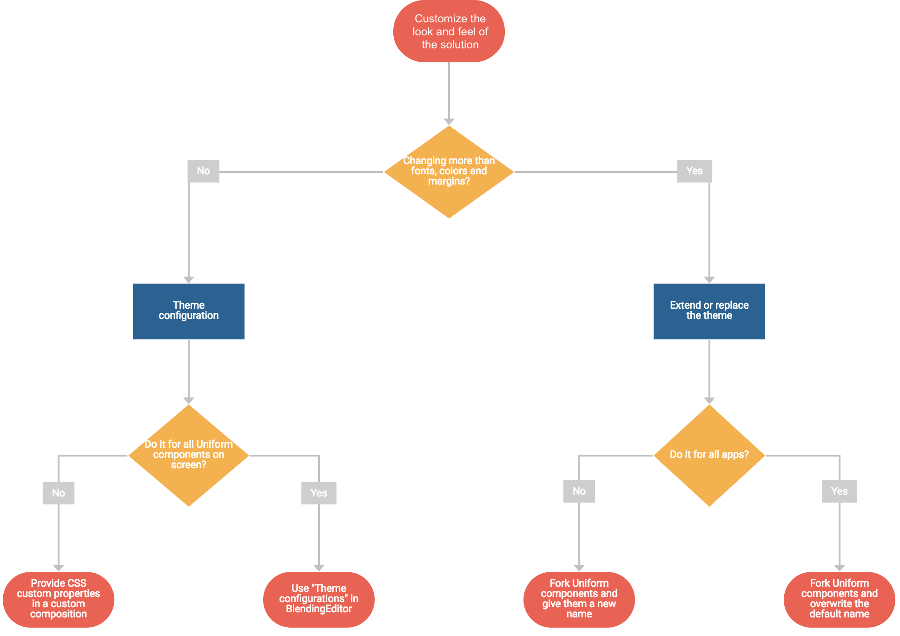

# Uniform Design System

## Introduction

Uniform design system is a user interface toolkit created by Starcounter. It gives a common look and feel to blendable apps. It is a link between app authors and solution owners.

Unlike many design systems, Uniform is open-ended and themeable. It can be configured, extended or replaced in parts to achieve anything that is possible with HTML, CSS, and JavaScript.

## Mental model of client-side rendering by the Starcounter host

Starcounter host follows a layered design that separates the responsibilities of the app author, the design system and the solution owner. Uniform fits in this design as the middle layer. 

The full design consists of:

1. Native HTML5 and Shadow DOM
2. Uniform design system
3. Theme configuration through CSS custom properties
4. Extend or replace the theme with HTML, CSS, and JavaScript

### Native HTML5 and Shadow DOM

As an app author, you provide the views for your apps with a clear separation of the content and the presentation.

In the content part, you provide the UI components that should be rendered by the Starcounter host as unstyled native HTML5 elements. 

To prevent the Starcounter host from controlling the rendering of a UI component, you can use shadow DOM, preferably in a custom element. The shadow root creates a boundary that blocks the Starcounter host's attempt to apply the look and feel on your components automatically.

### Uniform design system

Uniform design system gives a common look and feel to all apps. It consists of CSS custom properties, CSS reset and a library of patterns and components.

The CSS custom properties are the basic set of primitives. They define the fonts, sizes, colors, margins and other values used throughout the reset, patterns and components.

The CSS reset, nicknamed [Underwear.css](https://starcounter.github.io/underwear.css/), overwrites the default user agent stylesheet. It provides the look of the native HTML5 elements such as the headings (H1-H6), links, inputs, buttons, and tables. It is implicitly loaded by the Starcounter app shell, so there is no need to load it explicitly in the views. 

The pattern library, [Uniform.css](https://starcounter.github.io/uniform.css/), is a set of CSS classes that implement visual hierarchy and give specific roles to native elements. It provides sections, cards, titles, column layouts, alerts,  buttons, etc.

The component library, [Uniform components](https://starcounter.github.io/uniform.css/components/), is a set of custom elements that implement interactive UI controls. For the beginning, we provide a form item, a date picker, a data table and a pagination control. 

To use the patterns and the components, you must import them explicitly. They are placed in the shadow root of the view container to wrap the distributed content elements. That allows to serve real progressive enhancement, and what is crucial for a solution of blended apps: keep app content's markup semantic and unopinionated, giving solution owner a way to apply own opinion without changing the app source code.

The names of the CSS custom properties, CSS classes, and custom elements begin with a `uni-` prefix.

Our [KitchenSink](https://kitchensink.starcounter.io/) app demonstrates the use of Uniform design system as well as commonly used 3rd party custom elements that we can endorse, such as a Google map or a combo box.

### Theme configuration through CSS custom properties

Uniform design system comes with a modern-looking default theme.

As a solution owner, you can customize it by providing new values for the [CSS custom properties](https://developer.mozilla.org/en-US/docs/Web/CSS/Using_CSS_variables). This allows changing the fonts, colors, etc. without replacing the stylesheet.

You can provide new values directly in a stylesheet in a custom composition. It requires some skill in CSS and HTML but allows for spectacular results such as providing a theme configuration only for a specific part of the app.

If you don't need that much of control and prefer a simple to use GUI, use the "Theme configurations" feature of [Blending](https://github.com/Starcounter/Blending) app suite. It is an administration tool that stores the values of CSS custom properties in the database. It can provide theme configurations for specific layouts that affect all Uniform components on the screen.

 Attaching CSS custom properties through "Theme configurations" sets them on the global scope - the `body` of the light DOM (https://github.com/Starcounter/Blending/issues/232). Providing CSS custom properties values in custom compositions attaches them in shadow DOM to the scope that you choose. 

 For more sophisticated theming we would love to use native [CSS shadow parts and themes](https://meowni.ca/posts/part-theme-explainer/). Unfortunately, it's not supported yet by any browser. 

### Extend or replace the theme with HTML, CSS and JavaScript

The architecture of Uniform design system is based on the inversion of control. This means that all parts of it can be extended or replaced by the solution owner when needed. It allows you to completely change the look or behavior without changing the app source code.

As a solution owner, you are free to add, enhance, replace or hack the presentation layer using your HTML, CSS or JavaScript code. The only technical limitation is Shadow DOM encapsulation. 

For example, when all apps consistently use Uniform components, all the date pickers are presented using `<uni-date-picker>`. You can drastically change its look or behavior by creating your own custom element.

To apply the new behavior for all date pickers in the solution, you would simply replace the definition of `<uni-date-picker>`. The new definition must be provided by running an app that registers it at the same URI, for example `/sys/uniform.css/components/uni-date-picker/uni-date-picker.html`.

To apply the new behavior just for some date pickers, you would fork `<uni-date-picker>` and give it a new name, such as `<your-date-picker>`. To use it, you would change `<uni-date-picker>` to `<your-date-picker>` in selected custom compositions.

Create your own components by forking [`uni-element`](https://github.com/Starcounter/uniform.css/tree/master/components) or starting from scratch. In your components, you can use Uniform's CSS custom properties to apply common fonts, colors, etc.

You must provide your own components to the Starcounter host by running an app that contains the static files. You can fork [StarcounterClientFiles app](https://github.com/Starcounter/StarcounterClientFiles/) for this purpose.

 The same technique works for any custom element, not only Uniform one. 

The following diagram presents a decision tree of what technique of theming to use in your case.

## UI Kit

To make it easier for you to kickstart app design, we have made available a UI kit for Adobe XD that utilizes Uniform design system. The kit contains the assets used in Uniform and sample design files of an app \([BlendingEditor](https://github.com/Starcounter/Blending)\).

[Download the kit from our Google Drive](https://drive.google.com/drive/folders/1-71NMTdjGFo4IizBfKdvl2oi93z1RUoH?usp).

