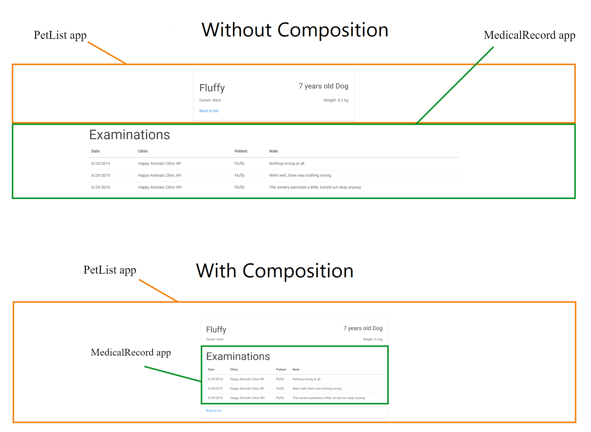
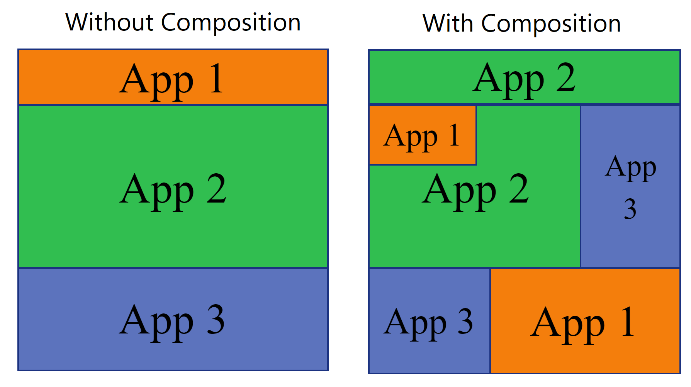
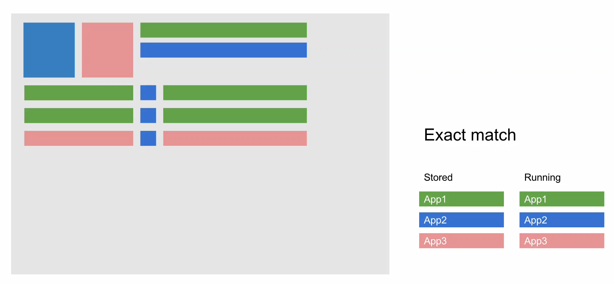
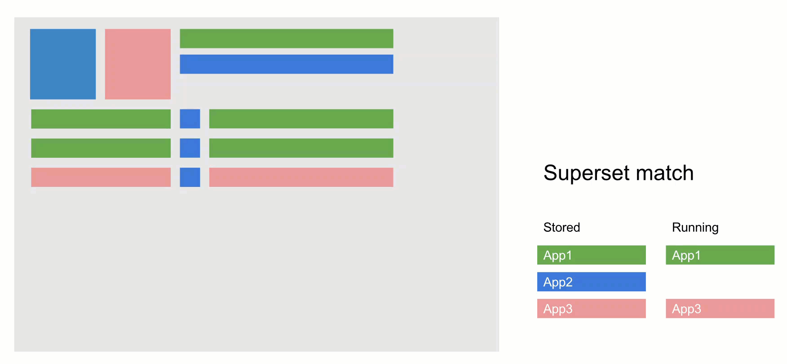
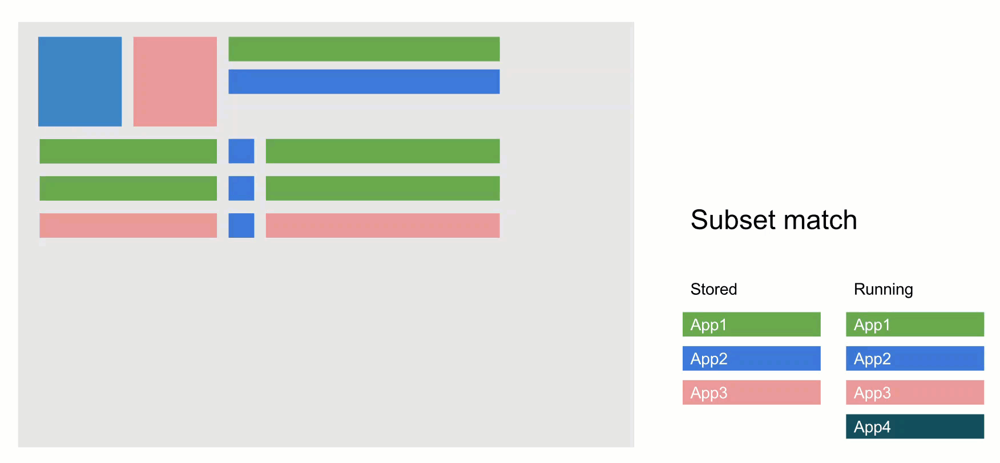
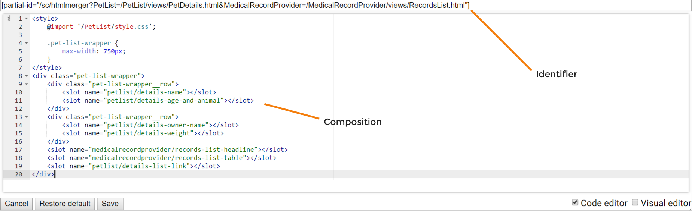
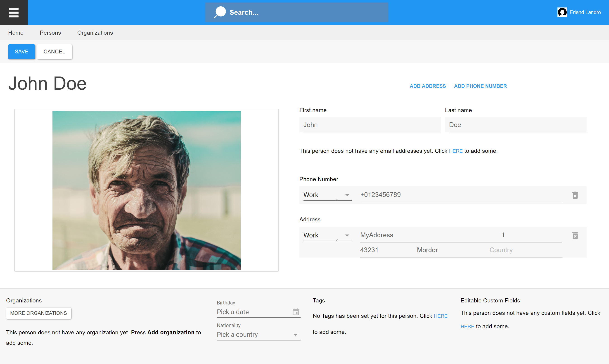

# View Composing

## Introduction

When [Attaching views](view-model-attaching.md) from different apps, the views are stacked on top of each other. In most cases, that's not what we want. Instead, we would like to compose elements in the views to make the result look like one page. That's what View Composing does:



In the example above, there are two apps, PetList and MedicalRecord. By default, they are stacked on top of each other. This makes it seem like the information coming from thems is not related, when it actually is. By Composing, we can move the table of examinations into the card from the PetList app and make it look like one coherent concept. In essence, we are **changing the presentation but not the content** to combine apps that were not explicitly built to share the same screen. This is done without touching the source code of the individual apps.

This ability of modifying the composition of views coming from different apps is crucial, especially when working with many apps. Without it, there would just be a stack of views with no meaningful visual context, as shown in this illustration:




Composing was previously called "client-side-blending"


## Presentation and Content Separation

Composing works by replacing or modifying the default structure of HTML elements used for the presentation. For this to work, content and presentation has to be separated. [Shadow DOM](https://www.html5rocks.com/en/tutorials/webcomponents/shadowdom/) handles this separation - the content is in light DOM and the presentation is in Shadow DOM.

The structure of this separation looks like this:

```markup
<template>
    <h1 slot="myapp/main-heading">My heading</h1>
    <button slot="myapp/left-button">Go left</button>
    <button slot="myapp/right-button">Go right</button>

    <template is="declarative-shadow-dom">
        <style>
            .myapp-direction-controls {
                display: flex;
                justify-content: center;
            }
        </style>
        <slot name="myapp/main-heading"></slot>
        <div class="myapp-direction-controls">
            <slot name="myapp/left-button"></slot>
            <slot name="myapp/right-button"></slot>
        </div>
    </template>
</template>
```

Here, the content of the view is defined on the root level and the presentation is defined inside the `declarative-shadow-dom`. The [slot](https://developer.mozilla.org/en-US/docs/Web/HTML/Element/slot) elements are insertion points for the content into the presentation.

The `declarative-shadow-dom` is used as the default composition that can be further modified or replaced in runtime using the Starcounter  app suite [Blending](https://github.com/Starcounter/Blending) and its feature - composition editor.

## Subset and superset composition matching

The key for the custom compositions is the main view. If there is more than one custom composition, the best matching composition is picked by its distance to the attached views:

1. If there is an exact match of a custom composition to attached views, provide this composition
2. Else, if there are superset custom compositions (compositions that include all of the attached views and more), provide the smallest superset
3. Else, if there are subset custom compositions (compositions that include some of the attached views [*intersection*] and maybe some other views [*complement*]), provide the subset that has the largest intersection and smallest relative complement. For the attached views not included in the composition, use their default composition
4. Else, use the default compositions







### Example

The main view is `/people/person.html` with the attached views `/skyper/callme.html`, `/images/illustration.html`

1. If there is a custom composition for `/people/person.html, [/skyper/callme.html, /images/illustration.html]`, provide this composition
2. Else, if there are the following superset custom compositions, provide the composition (2), because it is the smallest superset:
    1. `/people/person.html, [/skyper/callme.html, /images/illustration.html, /foo/foo.html, /bar/bar.html]`
    2. `/people/person.html, [/skyper/callme.html, /images/illustration.html, /foo/foo.html]`
3. Else, if there are the following subset custom compositions, provide the composition (2). Both (1) and (2) are the smallest intersection with the attached views, both (1) and (2) have no complement and (2) is first alphabetically:
    1. `/people/person.html, [/skyper/callme.html]`
    2. `/people/person.html, [/images/something.html]`
    3. `/people/person.html, [/skyper/callme.html, /foo/foo.html]`
    4. `/people/person.html, [/foo/foo.html]`
4. Else, use the default compositions from `/people/person.html`, `/skyper/callme.html`, `/images/illustration.html`.

### Migration from `Starcounter.HTMLComposition` to `Starcounter.HtmlViewComposition` data model

Versions of BlendingProvider (previously CompositionProvider) prior to 3.0.0 use a legacy `Starcounter.HTMLComposition` data model. Version 3.0.0 and up uses `Starcounter.HtmlViewComposition` and automatically upgrades the legacy data.

On start up, the app converts all existing `Starcounter.HTMLComposition` objects to `Starcounter.HtmlViewComposition` objects. It does not delete `Starcounter.HTMLComposition` objects.

CompositionProvider skips the migration process in case if at least one `Starcounter.HtmlViewComposition` object already exists.


## Composing the attached views

### Default compositions of the attached views

With the MedicalProvider and PetList example we have two views, each with its default composition:

```markup
<style>
    @import '/PetList/style.css';
</style>
<div class="pet-list-wrapper">
    <div class="pet-list-wrapper__row">
        <slot name="petlist/details-name"></slot>
        <slot name="petlist/details-age-and-animal"></slot>
    </div>
    <div class="pet-list-wrapper__row">
        <slot name="petlist/details-owner-name"></slot>
        <slot name="petlist/details-weight"></slot>
    </div>
    <slot name="petlist/details-list-link"></slot>
</div>
```

```markup
<slot name="medicalrecord/records-list-headline"></slot>
<slot name="medicalrecord/records-list-table"></slot>
```

When these two views are attached, the default composition from MedicalRecord is appended at the end of the PetList wrapper. The resulting composition looks like this:

```markup
<style>
    @import '/PetList/style.css';
</style>
<div class="pet-list-wrapper">
    <div class="pet-list-wrapper__row">
        <slot name="petlist/details-name"></slot>
        <slot name="petlist/details-age-and-animal"></slot>
    </div>
    <div class="pet-list-wrapper__row">
        <slot name="petlist/details-owner-name"></slot>
        <slot name="petlist/details-weight"></slot>
    </div>
    <slot name="petlist/details-list-link"></slot>
</div>
<slot name="medicalrecord/records-list-headline"></slot>
<slot name="medicalrecord/records-list-table"></slot>
```

### Custom compositions of the attached views

To create a custom composition, we will move the MedicalRecord table and headline into the `div class="pet-list-wrapper"` and expand the width of the wrapper to fit the table:

```markup
<style>
    @import '/PetList/style.css';
    .pet-list-wrapper {
        max-width: 750px;
    }
</style>
<div class="pet-list-wrapper">
    <div class="pet-list-wrapper__row">
        <slot name="petlist/details-name"></slot>
        <slot name="petlist/details-age-and-animal"></slot>
    </div>
    <div class="pet-list-wrapper__row">
        <slot name="petlist/details-owner-name"></slot>
        <slot name="petlist/details-weight"></slot>
    </div>
    <slot name="medicalrecord/records-list-headline"></slot>
    <slot name="medicalrecord/records-list-table"></slot>
    <slot name="petlist/details-list-link"></slot>
</div>
```

We have now produced the result shown in the image above; the view from the MedicalRecord app has been neatly integrated with the view from PetList.

The tool for creating these custom compositions is the composition editor feature of [BlendingEditor](https://github.com/Starcounter/Blending). When this app is running, you can open it at any page with `Ctrl + E`. When the app opens, it gives you an HTML editor for the composition of your attached views.

There are two main concepts in the composition editor - the identifier and composition \("layout" on the below picture\).



The identifier represents the unique set of the attached views. For example, the identifier for the PetList and MedicalProvider example looks like this:

```text
[partial-id="/sc/htmlmerger?PetList=/PetList/views/PetDetails.html&MedicalRecordProvider=/MedicalRecordProvider/views/RecordsList.html"]
```

The `/sc/htmlmerger` is a prefix that is added every time a view contains views that come from more than one response. In the identifier above, it's the merged views of `PetDetails.html` and `RecordsList.html`.

The composition changes made in the editor are displayed in real time.

Compositions are saved in the database and can be queried for with `SELECT * FROM Starcounter.HtmlViewComposition`. Since the composition editor interacts with the database, it should not run in production. See the [Blending](https://github.com/Starcounter/Blending) repo for more information about the data model of compositions.

### Providing custom compositions

Custom compositions are provided by the [BlendingProvider](https://github.com/Starcounter/Blending) app. When views are merged, this app checks if there's a composition in the database with the same identifier and serves it, otherwise, the default composition is used.

Because of this, the BlendingProvider has to be running if you want to render custom compositions of your views.

## Result



This screenshot is a result of several of our sample apps running together:

* [Website](https://github.com/Starcounter/Website)
* [People](https://github.com/StarcounterApps/People)
* [Images](https://github.com/StarcounterApps/Images)
* [SignIn](https://github.com/StarcounterApps/SignIn)
* [Search](https://github.com/StarcounterApps/Search)

As you can see, they look like one app because of Attaching and Composing.

## Summary

Composing allows us to make views coming from multiple apps to look like one by rearranging the HTML elements the Shadow DOM. Thus, the actual content and functionality defined in the light DOM will stay the same. The revised composition is stored in the database and retrieved when the views are attached. All of this is done without touching the source code of the apps.

## Read More

* [Layout compositions for HTML partials](https://starcounter.io/layout-compositions-html-partials/) - Blog October 2016
* [Html Views Blending Guidelines](html-views-composition-guidelines.md) - Docs
* [Shadow DOM v1: Self-Contained Web Components](https://developers.google.com/web/fundamentals/getting-started/primers/shadowdom) - Google Developers
