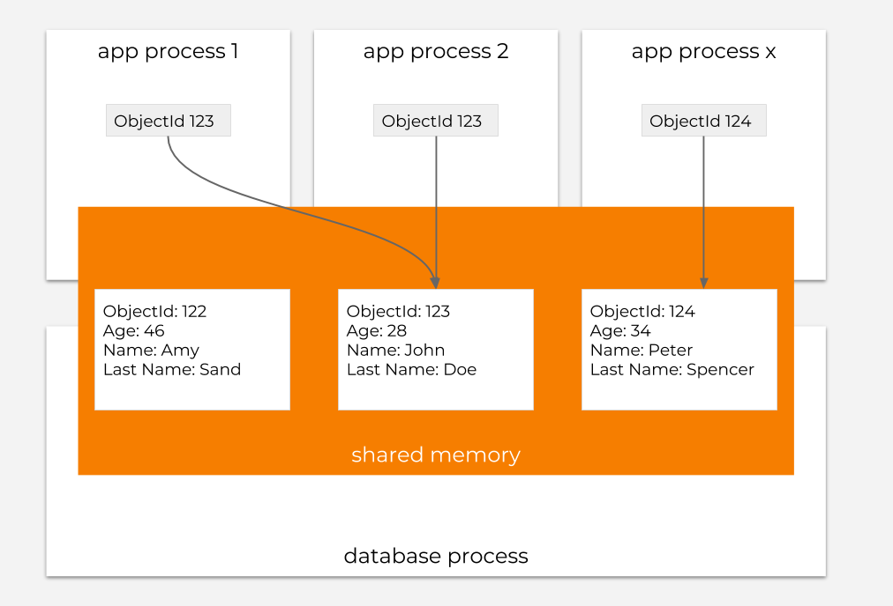

# Database

## Introduction

The database management system \(DBMS\) in Starcounter is the Virtual Machine Database Management System \(VMDBMS\) - a row-based relational in-memory database system. In short, the VMDBMS works like a persistent heap for a virtual machine based language, such as languages built on the .NET Common Language Runtime \(CLR\) or the Java Virtual Machine \(JVM\). It currently works with C\#.

When an app starts, Starcounter allocates a piece of memory to the VMDBMS. Apps run inside the memory of the VMDBMS. With the apps in the VMDBMS - the VMDBMS can store objects from these apps persistently; these objects are called persistent objects. The app can access persistent objects stored in the database. It can also modify these persistent objects like any other objects.

With the VMDBMS, data doesn't move between the app and the database as in traditional DBMS’s. Instead, the VMDBMS modifies the data in place. Keeping data in place increases the performance of data operations, makes the memory footprint smaller and reduces the amount of application code. Since the data object is only stored in one place and the application code only has a reference to that data object, object-relational mappers are not needed.

Apps running in the VMDBMS share the same memory. Thus, all apps immediately see changes to persistent objects. For example, as shown in the figure above, if app process 1 modifies the `Name` property of the object with the identification 123, then all other apps that also hold a reference to that object will see that the `Name` has changed.

