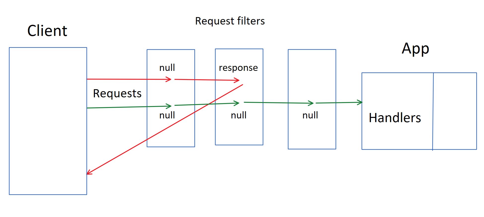
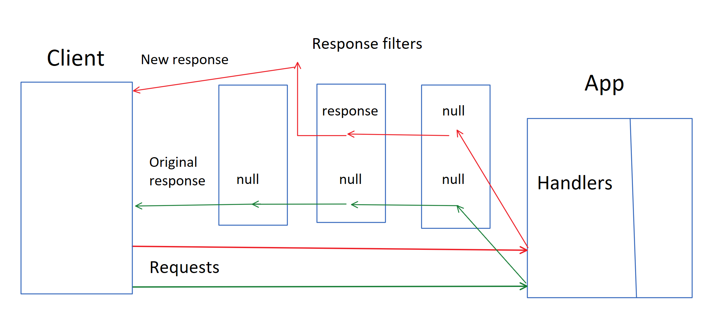

# Middleware

## Introduction

Middleware is code that affects the _request pipeline_. It enables applications to customize how the server handles requests. This customization comes in three different shapes:

1. request filters
2. response filters
3. response and request filters wrapped up in _middleware classes_.

These can help with a range of issues, such as security, logging, wrapping, request modification, and more.

An example of this is the [Launcher](https://github.com/starcounterapps/launcher) which uses request filters to wrap responses from other applications into its own response.

All middleware is registered with the `Application.Current.Use` API which has three overloads corresponding to the different types of middleware listed above. The registration is usually done at the entry point of the application and can look something like this:

```csharp
static void Main()
{
  Application.Current.Use((Request request) => {
    // Request filter goes here
  });

  Application.Current.Use((Request request, Response response) => {
    // Response filter goes here
  });

  Application.Current.Use(new SomeMiddleware());
}
```

Middleware does not impact internal `Self.GET` calls.

## Request filters

When allowing external HTTP requests, it might be useful to pre-process or filter out certain requests before the designated handler is called. Request filters make it possible to do exactly that. They are lists of user-supplied delegates, or filters, that are executed on external requests before the actual handlers are called. These filters are executed one by one until one of the filters returns a non-null `Response`. If a `Response` was returned from the request filter, then this response is returned to the client without calling the handler. If none of the filters returned a `Response` object, then the request will be passed on and dealt with by the handler.



An example of this can be an basic spam filter:

```csharp
Application.Current.Use((Request request) =>
{
    if (request.Uri.Contains("spam"))
    {
        return new Response()
        {
            StatusCode = 406,
            StatusDescription = "Well, thanks, but no thanks!"
        };
    }
    return null;
});
```

When there is an incoming request, this request filter checks if the URI contains the string "spam", and returns a `Response` object if that's the case. This means that the request will be blocked without reaching the handler. Otherwise, it returns `null` and allows the request to move on to the next request filter or go to the handler if there was only one request filter.

### Skip request filters

To let requests to a certain handler bypass all request filters, use the class `HandlerOptions` and set `SkipRequestFilters` to `true`. Like this:

```csharp
Handle.GET("/my-url", () => new Json(), new HandlerOptions() { SkipRequestFilters = true });
```

## Response filters

Response filters do the opposite of request filters; they make alterations to outgoing responses. They work similarly to request filters by being executed one by one until one returns a non-null response. The main difference is that response filters are called after the handler has been called while request filters are called before. Response filters can either create entirely new responses and return those, or modify the response coming from the handler.



For example, response filters makes it possible to add a certain HTTP header to responses for requests with a `/special` URI prefix after the request has been dealt with by the handler:

```csharp
Application.Current.Use((Request request, Response response) =>
{
    if (request.Uri.StartsWith("/special"))
    {
        response.Headers["MyHeaderName"] = "MyHeaderValue";
        return response;
    }
    return null;
});
```

In this case, a new header would be added to the response if the URI of the incoming request started with `/special`. It would then return the response and no other response filters would be called. If the request URI did not start with `/special`, then the next response filter would be called or the response would be returned if there were no more response filters to call. Take a look at this response filter by comparison:

```csharp
Application.Current.Use((Request request, Response response) =>
{
    if (request.Uri.StartsWith("/special"))
    {
        response.Headers["MyHeaderName"] = "MyHeaderValue";
    }
    return response;
});
```

In this case, the next response filter is never called since a response is always returned. That is important to keep in mind when building response filters.

In the examples above, the response filter checks for information in the request. It's also possible to check for information in the response, such as in this example:

```csharp
Application.Current.Use((Request request, Response response) =>
{
    if (response.StatusCode == 404)
    {
        return new Response()
        {
            StatusCode = 404,
            StatusDescription = "Not Found",
            Body = Self.GET("/myapp/404.html").Body
        };
    }
    return null;
});
```

Here, the response filter makes it possible to return a descriptive `404` page by checking the outgoing responses for the `404` status code and return a response containing the "not found" HTML page.

### Skip response filters

For a handler to bypass all response filters, use the class `HandlerOptions` and set `SkipResponseFilters` to `true`. Like this:

```csharp
Handle.GET("/my-url", () => new Json(), new HandlerOptions() { SkipResponseFilters = true });
```

## Response and request filter interaction

When using both request and response filters, response filters will intercept responses coming from request filters. Consider the following example:

```csharp
static void Main()
{
    // Request filter
    Application.Current.Use((Request request) =>
    {
        return new Response()
        {
            StatusCode = 404,
            StatusDescription = "Not Found",
            Body = "THIS IS FROM THE REQUEST FILTER"
        };
    });

    // Response filter
    Application.Current.Use((Request request, Response response) =>
    {
        if (response.StatusCode == 404)
        {
            return new Response()
            {
                StatusCode = 404,
                StatusDescription = "Not Found",
                Body = "THIS IS FROM THE RESPONSE FILTER"
            };
        }
        return null;
    });

    Handle.GET("/Test", () =>
    {
        return "This will never be seen";
    });
}
```

When sending a request to the `/Test` handler, the request filter will intercept it and create a `Response` object. This response is then intercepted by the response filter that creates another `Response` object which will be the one received by the client. When this code runs, "THIS IS FROM THE RESPONSE FILTER" displays.

## Middleware interaction with other applications

Both request and response filters catch requests to handlers in other applications that are running simultaneously.

Consider the following request filter:

```csharp
Application.Current.Use((Request request) =>
{
    return new Response()
    {
        StatusCode = 404,
        StatusDescription = "Not Found",
        Body = "THIS IS FROM THE REQUEST FILTER"
    };
});
```

By having this request filter in one application, all requests, to all applications, will hit the `404` response.

Adding this `if` statement fixes it:

```csharp
Application.Current.Use((Request request) =>
{
    if (request.Uri.StartsWith("/MyApp"))
    {
        return new Response()
        {
            StatusCode = 404,
            StatusDescription = "Not Found",
            Body = "THIS IS FROM THE REQUEST FILTER"
        };
    }
    return null;
});
```

## Middleware classes

`Application.Current.Use` also allows for exposing custom middleware classes. These middleware classes implement the `IMiddleware` interface.

Here's an application using a middleware class:

```csharp
class Blocker : IMiddleware
{
    void IMiddleware.Register(Application application)
    {
        application.Use((Request request) =>
        {
            return new Response()
            {
                StatusCode = 500,
                StatusDescription = "Blocker doesn't allow ANYTHING to get through!"
            };
        });
    }
}

class Program 
{
    static void Main()
    {
        Application.Current.Use(new Blocker());

        Handle.GET("/blocked", () =>
        {
            return "No one will call me :( ";
        });
    }
}
```

Here, we use the `IMiddleware` interface to create a custom middleware class. The middleware created is a request filter that returns an unhelpful response no matter what the incoming request is.

Middleware classes makes it possible to hide the implementation of middleware.

These classes do not have to contain request or response filters. Although, that is the common way of using middleware classes.

### HtmlFromJsonProvider

`HtmlFromJsonProvider` is a custom middleware class provided by Starcounter. It acts as a response filter by intercepting outgoing responses containing JSON objects and instead responding with the corresponding HTML. For example, look at the following application:

```markup
<template>
    <template is="dom-bind">
        <h1>{{model.FirstName}}</h1>
        <h3>{{model.LastName}}</h3>
    </template>
</template>
```

```csharp
{
  "Html": "/person.html",
  "FirstName": "John",
  "LastName": "Doe"
}
```

```csharp
void Main() 
{
  Application.Current.Use(new HtmlFromJsonProvider());

  Handle.GET("/person", () =>
  {
    return new Person();
  });
}
```

When there is a call to`/person`, this is what will happen:

1. The handler returns The JSON object `Person`
2. The `HtmlFromJsonProvider` intercepts the object
3. It looks in the JSON file for the `Html` property and finds `/person.html`
4. It returns the HTML found at that path

If the HTML at the path would be a complete HTML document, this would be enough. Though, because the HTML provided in this example is a HTML template, it's necessary to add another layer of middleware to convert the template to an HTML document that the browser can render. That's what `PartialToStandaloneHtmlProvider` does.

#### ScErrInvalidOperation

 If you have a JSON file without an \`Html\` property, `HtmlFromJsonProvider` will throw this exception:

```text
System.InvalidOperationException: ScErrInvalidOperation (SCERR1025): Operation invalid for the object's current state. Json instance MyJson missing 'Html' property.
```

  
If the JSON has a corresponding HTML file, add an \`Html\` property with the path to the HTML file. That will fix it.

 If you don't have an `Html` property and don't intend to return HTML, but to return the JSON instead, set `IgnoreJsonWithoutHtml` to `true`:

```csharp
Application.Current.Use(new HtmlFromJsonProvider() { IgnoreJsonWithoutHtml = true });
```

### PartialToStandaloneHtmlProvider

This middleware class checks if the HTML is a full document, or essentially if it starts with a `<!DOCTYPE html>`. If it's not a full HTML document, it wraps the existing HTML inside the body of an HTML document that imports the prerequisites for all blendable web apps, called the [app shell](../blendable-web-apps/app-shell.html).

It's possible to override this default HTML by passing a string containing HTML as a parameter. 

Since `PartialToStandaloneHtmlProvider` wraps the actual response from the handler, it will have the HTTP status code of the response.

When building Starcounter applications the recommended way, use the two middleware classes mentioned above to send complete HTML documents to the client even if the handler returns Typed JSON classes.

This is how it should look:

```csharp
static void Main()
{
  Application.Current.Use(new HtmlFromJsonProvider());
  Application.Current.Use(new PartialToStandaloneHtmlProvider());

  // Rest of the application
}
```

