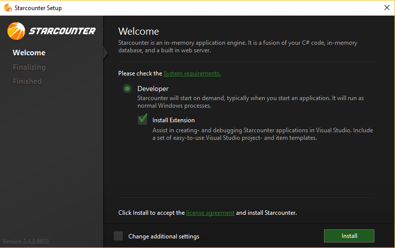
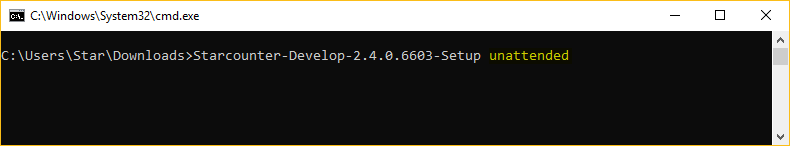

# Installation

Installing Starcounter is straight forward and just like installing any other software application. Following sections guide you through the installation process:

### How to install

* Run the  `<Your setup file name>.exe`  by double clicking on it.
* Check the `Install Extension` checkbox [Recommended] which will create Project Templates in Visual Studio to help you creating applications with Starcounter.
* Click install.



### Installing with command line

* Open a `Command Prompt`window with `Administrator` privileges
* Browse the directory where the Starcounter setup file exists.
* Run the following command :

```text
<Your setup file name>.exe productionmode
```

## Silent Installation

In `Silent Installation`the Starcounter installation process runs seamlessly without prompting any messages to the user or asking about any choices - Yes/No popups. This is particularly useful in production environments where user wants to install Starcounter in an unattended fashion with some commands or scripts.  

### How to install

* Open a `Command Prompt`window with `Administrator` privileges
* Browse the directory where the Starcounter setup file exists.
* Run the following command :

```text
<Your setup file name>.exe Silent productionmode unattended
```



* It should install Starcounter seamlessly

**Note**: By default the  `Starcounter Server Service` runs under the `Local Service` account.

## Docker

Starcounter can also be installed and run in Docker containers. For more information, see [Starcounter.Docker.Windows](https://github.com/Starcounter/Starcounter.Docker.Windows).

