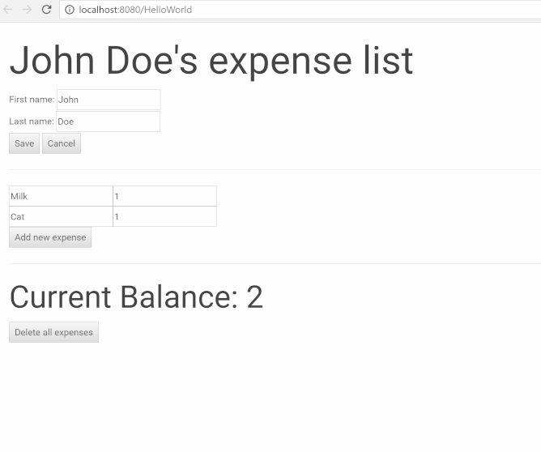

# Cancel and Delete

You have probably noticed that in the current app you can only add new expenses. That means that the database and the list of expenses will continue to grow endlessly.

In this part, we will add a cancel and delete button which allows the user to either cancel a change that has not been committed or delete all the expenses of a person.

Similar to how the "Add new expense" button was implemented, the process to add this functionality requires three steps:  
1. Add trigger properties  
2. Add elements to increment the trigger properties  
3. Add event handlers

### Adding Trigger Properties

We start by adding our needed trigger properties for our future buttons to the `PersonJson.json`.


```javascript
{
  "Html": "/HelloWorld/PersonJson.html",
  "FirstName$": "",
  "LastName$": "",
  "SaveTrigger$": 0,
  "FullName": "",
  "Expenses": [{}],
  "NewExpenseTrigger$": 0,
  "CurrentBalance": 0,
  "CancelTrigger$": 0,
  "DeleteAllTrigger$": 0
}
```

### Add Buttons to the View

Now, let's add the buttons that will increment these values in the same way that our save and new expense button does now.


Delete button:

```markup
<button value="{{model.DeleteAllTrigger$::click}}" onmousedown="++this.value">Delete all expenses</button>
```

Cancel button:

```markup
<button value="{{model.CancelTrigger$::click}}" onmousedown="++this.value">Cancel</button>
```

We'll place the delete button at the bottom of the page and the cancel button next to the save button.


### Create Event Handlers

The next step is to build handlers to react accordingly. We will also do that similar to the way we did with the other buttons.


```csharp
void Handle(Input.CancelTrigger action)
{
    Transaction.Rollback();
}

void Handle(Input.DeleteAllTrigger action)
{
    Db.SlowSQL("DELETE FROM Expense WHERE Spender = ?", this.Data);
    this.Expenses.Clear();
}
```

`Transaction.Rollback()` simply rolls back the state of your application to where you last ran a `Transaction.Commit()`.

The `DeleteAllTrigger` handler deletes all the expenses for the current `Person` in the database and clears the `Expenses` property in the view-model

### Result

You can now run your application again and rollback any mistakes you make or delete all expenses.





If you get any errors, you can check your code against the [source code](https://github.com/StarcounterApps/HelloWorld/commit/7f370fde6c500989c2b1b49b6390279c17094c25).

