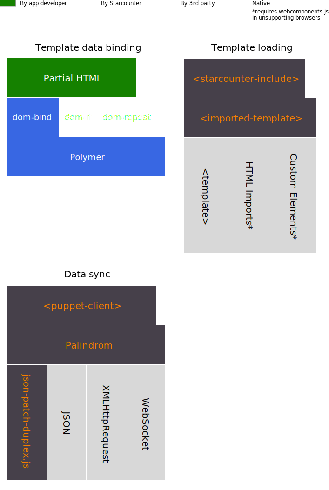

# Client-side stack

Apart from data sync with Palindrom, we propose the complete stack for maximum benefit of building thin client SPAs. The other important parts are: a template engine \(with two-way data binding\) and a template loading infrastructure.

This stack lets you stay on the bleeding edge of development, using the new APIs such as Web Components that turn the web browser into a very powerful, interactive presentation layer for apps.

All the client side libraries mentioned on this page come preinstalled with Starcounter. Starcounter auto-configures this stack for you, so don't bother reading this page unless your are interested in the internals.

The stack attempts to add as few new components as possible. The existing established patterns and web standards are used wherever possible.

## Client side libraries

### Data sync

Palindrom web apps use [Palindrom](https://github.com/Palindrom/Palindrom) for server-client data synchronization. Palindrom makes use of [JSON](http://www.json.org/), [JSON-Patch](https://tools.ietf.org/html/rfc6902) web standards. It uses the JSON, XMLHttpRequest and WebSocket APIs that are built into every modern web browser.

The implementation of JSON-Patch is provided by `json-patch-duplex.js`, which comes from the [fast-json-patch](https://github.com/Starcounter-Jack/JSON-Patch) library and provides tools for applying and generating patches.

The implementation of [operational transformation](https://en.wikipedia.org/wiki/Operational_transformation) in Palindrom is provided by the following libraries: [json-patch-queue](https://github.com/Palindrom/JSON-Patch-Queue), [json-patch-ot-agent](https://github.com/Palindrom/JSON-Patch-OT-agent), [json-patch-ot](https://github.com/Palindrom/JSON-Patch-OT).

To make it easy to use, Palindrom including all the dependencies is wrapped into a helper Custom Element [palindrom-polymer-client](https://github.com/Palindrom/palindrom-polymer-client). Putting this Custom Element in DOM \(single line of code\) automatically loads and configures all the dependencies.

### Template engine

Since Palindrom provides a JavaScript object that reflects the server-side view-model, it needs a template engine to present the UI in web browser DOM. Any JavaScript library \(such as D3 or React\) can consume this object.

Polymer uses HTML Template, HTML Imports and Custom Elements APIs, which are soon to be implemented in all major web browsers. As of 2016, they are already natively implemented in Google Chrome and Opera. Other browsers \(Firefox, Safari, IE11 and Edge\) require the [webcomponents.js](https://github.com/webcomponents/webcomponentsjs) polyfill to be loaded to support for these APIs.

### Template loading

The HTML templates are provided to Polymer template engine using the [imported-template](https://github.com/Juicy/imported-template) Custom Element, which loads the templates from separate HTML files called "partials". It uses the same APIs as Polymer, therefore requires [webcomponents.js](https://github.com/webcomponents/webcomponentsjs) in browsers other than Chrome and Opera \(see above\).

To make it easier to use with Starcounter, this element is wrapped in [starcounter-include](https://github.com/Starcounter/starcounter-include) Custom Element, which additionally sets up the data binding between Palindrom and imported-template.

### The stack, visualised

The following chart shows the bird-eye's view on the client side libraries used.

## Versions

See the file `ClientFiles\bower-list.txt` in your Starcounter installation directory \(usually `C:\Program Files\Starcounter`\) for the list of client side libraries bundled with your Starcounter instance, including their version numbers.

