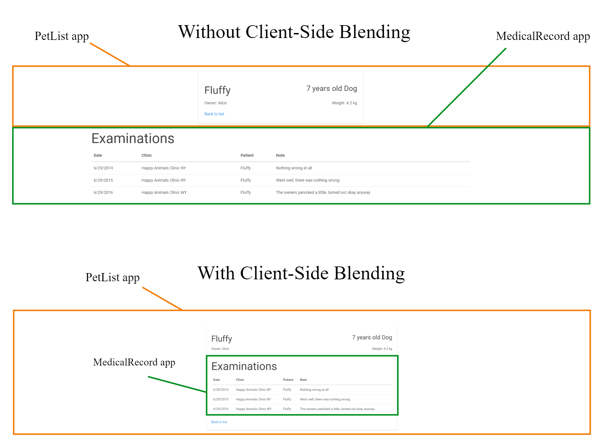

# Client-Side Blending

When merging responses from different apps with [server-side blending](https://github.com/Starcounter/Docs/tree/a457da51e4f68712de07c6ce90f9b1987ce2f3db/guides/blending/client-side-blending/server-side-blending/README.md), the views are stacked on top of each other. In most cases, that's not what we want. Instead, we would like to compose elements in the views to make the result look like one page. That's what client-side blending does:



In the example above, there are two apps, PetList and MedicalRecord. By default, they are stacked on top of each other. This makes it seem like they are not related, when they actually are. With client-side blending, we can move the table of examinations into the card from the PetList app and make it look like one coherent concept. In essence, we are **changing the layout but not the content** to combine apps that were not explicitly built to share screen. This is done without touching the source code of the individual apps.

This ability of modifying the layout of views coming from different apps is crucial, especially when working with many apps. Without it, there would just be a stack of views with no meaningful layout, as shown in this illustration:


## Layout and Content Separation

Client-side blending works by replacing or modifying the default layout. For this to work, content and layout has to be separated. [Shadow DOM](https://www.html5rocks.com/en/tutorials/webcomponents/shadowdom/) handles this separation - the content is in light DOM and the layout is in Shadow DOM.

The structure of this separation looks like this:

```markup
<template>
    <h1 slot="myapp/main-heading">My heading</h1>
    <button slot="myapp/left-button">Go left</button>
    <button slot="myapp/right-button">Go right</button>
    <template is="declarative-shadow-dom">
        <style>
            .myapp-direction-controls {
                display: flex;
                justify-content: center;
            }
        </style>
        <slot name="myapp/main-heading"></slot>
        <div class="myapp-direction-controls">
            <slot name="myapp/left-button"></slot>
            <slot name="myapp/right-button"></slot>
        </div>
    </template>
</template>
```

Here, the content of the view is defined on the root level and the layout is defined inside the `declarative-shadow-dom`. With client-side blending, the layout defined in the `declarative-shadow-dom` can be modified or replaced.

The [slot](https://developer.mozilla.org/en-US/docs/Web/HTML/Element/slot) elements are insertion points for the content into the layout.

## Composing Layouts

With the MedicalProvider and PetList example we have two layouts that we would like to blend:

PetList layout

```markup
<style>
    @import '/PetList/style.css';
</style>
<div class="pet-list-wrapper">
    <div class="pet-list-wrapper__row">
        <slot name="petlist/details-name"></slot>
        <slot name="petlist/details-age-and-animal"></slot>
    </div>
    <div class="pet-list-wrapper__row">
        <slot name="petlist/details-owner-name"></slot>
        <slot name="petlist/details-weight"></slot>
    </div>
    <slot name="petlist/details-list-link"></slot>
</div>
```

MedicalProvider layout

```markup
<slot name="medicalrecord/records-list-headline"></slot>
<slot name="medicalrecord/records-list-table"></slot>
```

When these two layouts are merged with server-side blending, the resulting layout looks like this:

```markup
<style>
    @import '/PetList/style.css';
</style>
<div class="pet-list-wrapper">
    <div class="pet-list-wrapper__row">
        <slot name="petlist/details-name"></slot>
        <slot name="petlist/details-age-and-animal"></slot>
    </div>
    <div class="pet-list-wrapper__row">
        <slot name="petlist/details-owner-name"></slot>
        <slot name="petlist/details-weight"></slot>
    </div>
    <slot name="petlist/details-list-link"></slot>
</div>
<slot name="medicalrecord/records-list-headline"></slot>
<slot name="medicalrecord/records-list-table"></slot>
```

The layout from MedicalRecord is appended at the end of the PetList wrapper. To blend it, we will move the MedicalRecord table and headline into the `div class="pet-list-wrapper"` and expand the width of the wrapper to fit the table:

```markup
<style>
    @import '/PetList/style.css';
    .pet-list-wrapper {
        max-width: 750px;
    }
</style>
<div class="pet-list-wrapper">
    <div class="pet-list-wrapper__row">
        <slot name="petlist/details-name"></slot>
        <slot name="petlist/details-age-and-animal"></slot>
    </div>
    <div class="pet-list-wrapper__row">
        <slot name="petlist/details-owner-name"></slot>
        <slot name="petlist/details-weight"></slot>
    </div>
    <slot name="medicalrecord/records-list-headline"></slot>
    <slot name="medicalrecord/records-list-table"></slot>
    <slot name="petlist/details-list-link"></slot>
</div>
```

We have now produced the result shown in the image above; the view from the MedicalRecord app has been neatly integrated with the view from PetList.

## Creating Layouts

The tool for creating these layouts is the [CompositionEditor](https://github.com/starcounterapps/CompositionEditor). It's a Starcounter app that can be opened at any page with `Ctrl + E`. The app in itself is an HTML editor that can edit the Shadow DOM layout. There are two main concepts in the CompositionEditor - the identifier and layout.


The identifier is created each time a composition is merged with server-side blending. For example, the identifier for the PetList and MedicalProvider example looks like this:

```text
[partial-id="/sc/htmlmerger?PetList=/PetList/views/PetDetails.html&MedicalRecordProvider=/MedicalRecordProvider/views/RecordsList.html"]
```

The `/sc/htmlmerger` is a prefix that is added every time a view contains views that come from more than one response. In the identifier above, it's the merged views of `PetDetails.html` and `RecordsList.html`.

The layout changes made in the editor are displayed in real time.

Layouts are saved in the database and can be queried for with `SELECT * FROM Starcounter.HTMLComposition`. Thus, CompositionEditor should run during development to define the layout and then not during production.

## Providing Layouts

Layouts are provided by the [CompositionProvider](https://github.com/starcounterapps/compositionprovider), another Starcounter app. When responses are merged, it looks if there's a layout in the database with the same identifier and serves it, otherwise, the default layout is served.

Because of this, the CompositionProvider has to be running when client-side blending should be used.

## Result

The overall result of blending can look something like this where every colored box comes from a different app:


## Summary

Client-side blending allows us to compose layouts coming from different apps. It's done by editing the Shadow DOM layout. Thus, the actual content and functionality defined in the light DOM will stay the same. The revised layout is stored in the database and retrieved when responses are merged. All of this is done without touching the source code of the apps.

## Read More

* [Layout compositions for HTML partials](https://starcounter.io/layout-compositions-html-partials/) - Blog October 2016
* [Html Views Blending Guidelines](html-view-blending-guidelines.md) - Docs
* [Shadow DOM v1: Self-Contained Web Components](https://developers.google.com/web/fundamentals/getting-started/primers/shadowdom) - Google Developers

