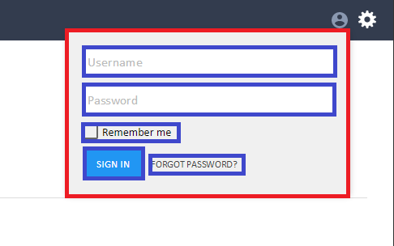

# Avoiding CSS conflicts

Complex web apps are composed of HTML responses from multiple apps. This means that the merged HTML, CSS and JavaScript runs in the global namespace.

With a global namespace, there's always the risk of CSS conflicts and leaks that cause side effects in other apps. We recommend using the Block Element Modifier (BEM) methodology to avoid these side effects.

## BEM

Due to limited browser support for technical solutions to CSS conflicts, the primary way right now to avoid CSS conflicts is to use a naming convention. BEM is one of these naming conventions. 

The basic principle in BEM is to **only use classes in your stylesheets**.

These classes should be named as combinations of Blocks, Elements, and Modifiers. 

A **Block** represents a logical area of your app's UI. For example:

- a menu
- a login form
- a search form

An **Element** is a fragment of the Block that performs a particular function. For example:

- a menu item
- a password input in the login form
- a search button

An Element only makes sense in the context of its Block. It cannot appear outside of the Block.

**Modifiers** represent variations of Blocks and Elements. For example:

- an expanded menu
- an active menu item
- a password input with an invalid value
- a disabled search button

Possible combinations of Blocks, Elements and Modifiers are the following:

```css
.block {}
.block__element {}
.block--modifier {}
.block__element--modifier {}
```

When applied to an HTML structure, the above CSS class names are used in the following way:

```html
<div class="block">
  <div class="block__element"> ... </div>
  <div class="block__element--modifier"> ... </div>
</div>

<div class="block--modifier">
  <div class="block__element"> ... </div>
  <div class="block__element--modifier"> ... </div>
</div>
```

Note here that **everything at the root level is a Block**. A Block can have multiple Element and Modifier sections and every Element and Modifer has to belong to a Block.

Consider the [SignIn app](https://github.com/starcounterapps/signin):



Here, the Block is marked in red and the Element sections in blue. 

From this, these BEM classes can be derived:

```css
.signin-form {}
.signin-form--expanded {}
.signin-form__text-input {}
.signin-form__labeled-checkbox {}
.singin-form__labeled-checkbox--checked {}
```

## BEM in Starcounter apps

We recommend the following rules when using BEM selectors in Starcounter apps.

* __Only use BEM class selectors in your stylesheets__. Do not use element selectors, id selectors, or inline styles for the purpose of styling.

* __Give meaningful names__ to the Block, Element and Modifier sections. For example, `.chatter-avatar` is much more descriptive than `.chatter-img`.

* __Prefix Block sections with the app name__ to isolate the classes from BEM classes in other apps. For example, the class name for a menu block in the "Chatter" app should be `.chatter-menu`.

* __Use lowercase class names__. `.Chatter-Menu` is wrong, `.chatter-menu` is right.

* __Separate words with a hyphen__ when there are multiple words in a Block, Element or Modifier section. For example: `.chatter-chat-message__message-text`.

* __Element sections should be defined after a double underscore__ as in `.block__element`.

* __Modifier should be defined after a double hyphen__. There are only "boolean" style modifiers. For example: `.chatter-menu__item--active`. This is called ["Harry Roberts' style" modifiers](https://en.bem.info/method/naming-convention/).

* __Block and Element must be in the same HTML template__. Otherwise, implicit couplings are created between templates which might break when the partial mapping changes. If you want to define `.chatter-menu` in a parent partial and the menu items in a nested partials, these menu items will become new blocks (`.chatter-menu-item`, not `.chatter-menu__item`).

* __Modifier classes should extend base classes__.

 When you set a `.chatter-menu__item--active` class on an element, it should not be needed to add the `.chatter-menu__item` base class.

 In your stylesheet, the definition for the base class should include all the modifiers, like this:

 ```css
.chatter-menu__item,
.chatter-menu__item--active {
    font-size: 11px;
}

 .chatter-menu__item--active {
    font-weight: bold;
}
```

* __Mixing BEM with Bootstrap__

 Starcounter sample apps use the CSS framework Bootstrap to create a unified look and feel.

 Even though Bootstrap does not follow BEM, there are no issues with mixing Bootstrap and BEM in a single project because there are no collisions. In fact, by just looking at the CSS class name, you can immediately tell if that class name is shared with other apps (Bootstrap) or if it's private to this particular app (BEM).

 It is **not** fine to override Bootstrap classes in your app's stylesheet. The only proper way to extend style is to with a BEM selector, for example:

 
 ```html
 <ul class="chatter-autocomplete">
    <template is="dom-repeat" items="{{model.FoundAttachment}}">
        <li class="chatter-autocomplete__item">
            <button type="button" class="btn btn-sm btn-link chatter-autocomplete__choose" onmousedown="++this.value;" value="{{item.Choose$::click}}">{{item.NameAndType}}</button>
        </li>
    </template>
 </ul>
 ```
 

 For reference, the available Bootstrap CSS class names can be found in [bootstrap.css](https://github.com/Starcounter/Starcounter/blob/develop/src/BuildSystem/ClientFiles/StaticFiles/sys/bootswatch/paper/bootstrap.css).

## The reasons for choosing BEM

We have found BEM to be excellent mix of simplicity and effectiveness to deal with CSS in micro apps, for a number of reasons outlined below.

### Prevents your styles from affecting other apps

Using your Starcounter app name as the prefix in the Block part of the BEM selector makes sure that the stylesheet will affect only your app.

### Prevents accidental styling of nested elements

Adding a `chatter-menu__item` class to a `<li>` element in a menu makes sure that the style is applied only at that specific level, and will not affect nested `<li>` elements.

You might think you are in good control of such cases. The reality shows that when multiple people work on a project, it becomes unclear when it is desired to apply the style to nested elements and when it is an unwanted side effect.

### Encapsulates code for reuse

BEM encourages to define logical parts of the UI that are easily movable within the project.

When you look at the source code, it is immediately obvious what are the HTML elements needed for that logical part and what is the CSS code that styles them.

### Applicable to projects of any size

BEM was designed to make it easier to work on big projects. Yet, even a smallest web app might use CSS that needs to be easily understandable by the team and work without side effects.

By using BEM, you identify that a CSS class definition comes from your app and is used only there.

## Sample apps

Check out the source code of [KitchenSink](https://github.com/StarcounterSamples/KitchenSink). This sample app that shows how to apply BEM in practice.

## Further reading

- [BEM: Key concepts (bem.info)](https://en.bem.info/method/key-concepts/)
- [Naming convention (bem.info)](https://en.bem.info/method/naming-convention/)
- [BEM-like Naming (cssguidelin.es)](http://cssguidelin.es/#bem-like-naming)
- [MindBEMding – getting your head ’round BEM syntax (csswizardry.com)](http://csswizardry.com/2013/01/mindbemding-getting-your-head-round-bem-syntax/)
- [An Introduction to the BEM Methodology (tutsplus.com)](http://webdesign.tutsplus.com/articles/an-introduction-to-the-bem-methodology--cms-19403)

## Future standards way: CSS Scoping

There might be a web standard in future that solves the problem of defining stylesheet for only a part of an HTML document.

[CSS Scoping](https://drafts.csswg.org/css-scoping/) proposal adds a new `scoped` attribute to the `<style>` element. When a stylesheet is provided inside of a `<style scoped>` element, it will only be applied to the current parent element and its children.

So far, this proposal was not approved by Google and Microsoft. [Caniuse.com](http://caniuse.com/#feat=style-scoped) says that the only web browser that implements it as of 2016 is Mozilla Firefox.
