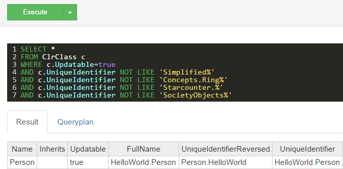

# Query for Database Tables

Sometimes it may be helpful to get the tables in the database. That is possible to do using the class ClrClass.

For example, if the goal is to get all the tables in the database, a query like this would be used in the Starcounter Administrator which is found at `http://localhost:8181/#/databases/default/sql` when Starcounter is running:

```sql
SELECT * FROM ClrClass
```

This would give back all the tables, including the built-in ones.

If the goal is to find all the user-created tables, it is possible to use the following query:

```sql
SELECT *
FROM ClrClass c
WHERE c.Updatable=true
AND c.UniqueIdentifier NOT LIKE 'Simplified%'
AND c.UniqueIdentifier NOT LIKE 'Concepts.Ring%'
AND c.UniqueIdentifier NOT LIKE 'Starcounter.%'
AND c.UniqueIdentifier NOT LIKE 'SocietyObjects%'
```

For example, if the query is run after following the steps in \[part one\]\('/tutorial/create-a-database-class'\) of the tutorial, it should look like this:



