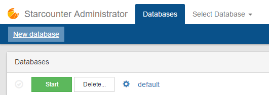
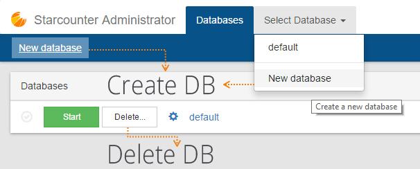
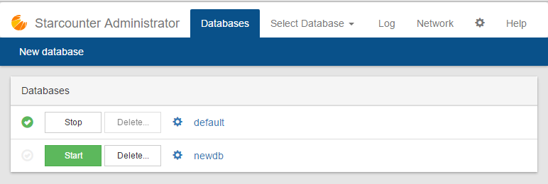
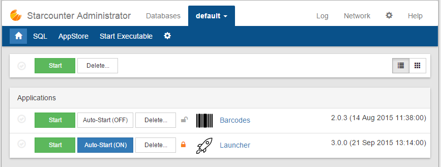
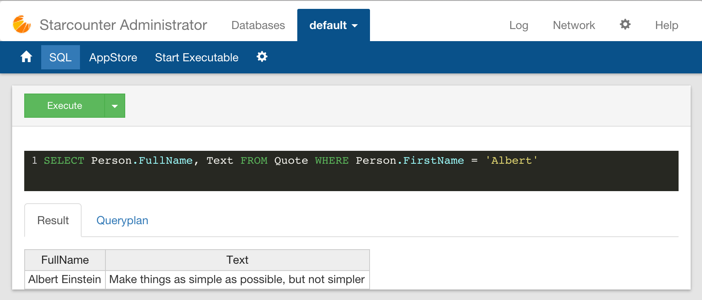
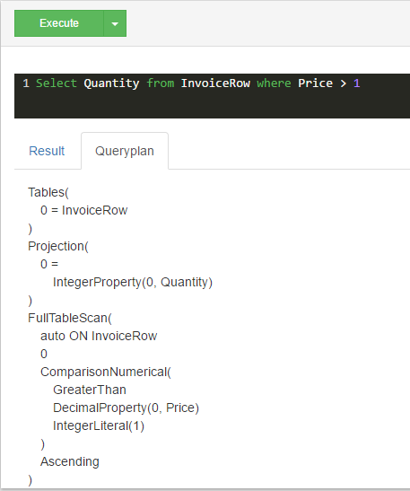
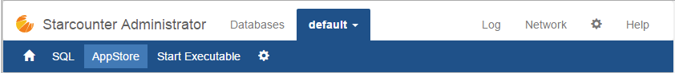
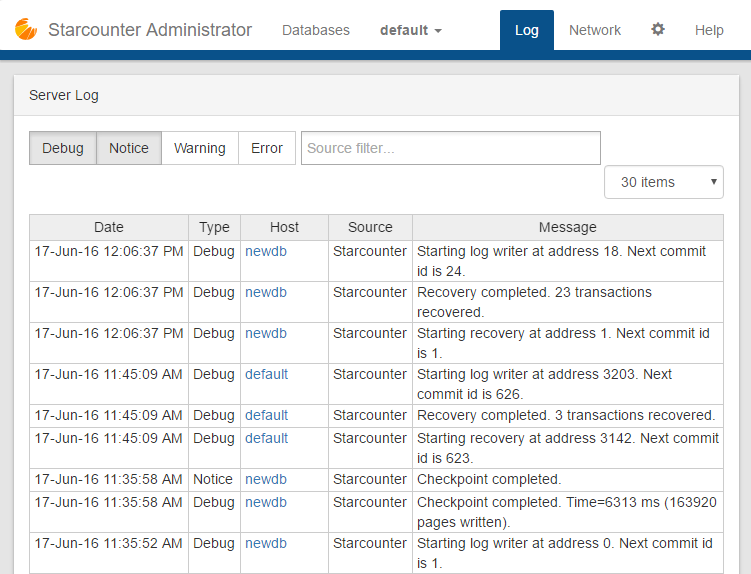

# Administrator Web UI

Administrator is a web based administration tool that comes with Starcounter. It can be started in three different ways:  
1. Run `staradmin start server`  
2. Run an app  
3. Execute `scservice.exe` - the `Starcounter Personal Server` shortcut that is added to the desktop after installation does this

After starting the Administrator, it's accessible from `localhost:8181`.

The default port `8181` can be changed during installation or in the server configuration.

## Handling Databases

Databases are handled from `localhost:8181/#/databases`.



### Default Database

Starcounter creates a default database if an application is started and there is no existing database. Apps in the default database are available at port `8080` by default.

### Create and Delete Databases

It's possible to create and delete databases in the Administrator. To prevent conflicts when running several parallel databases, their ports have to be different. The port can be specified under the "Advanced" options when creating a new database.

Create new databases at `localhost:8181/#/databases` by pressing "New database".



Databases are also deleted in the same view. Deletions have to be verified by entering the name of the database in the pop-up window.

### Start and Stop Databases

Start and stop databases by clicking the "Start" or "Stop" buttons at `localhost:8181/#/databases`:



Databases with a green checkmark are running.

### View Application Output

Go to a database by clicking on its name in the list of databases. Then, click on the application name in the "Applications" list. This will open up a view that displays the output of the application.


### Control Apps

Apps will start together with the database if "Auto-Start" is clicked. The padlock icon shows if an app can be deleted.



## SQL Browser

### Execute SQL Queries

The data of a database can be queried in the SQL browser. See [SQL reference](../sql/) for details on the syntax.

The queries that are supported by the method `Db.SQL` are also supported except that [literals](../sql/literals.md) are used in the SQL browser instead of [variables](../database/variables.md).

The app that defines that table needs to run in order to query it.

For example, the class `Person` can be queried this way:

```sql
SELECT Person.FullName, Text FROM Quote WHERE Person.FirstName = 'Albert'
```

This is the result:



### SQL Query Plan

If you navigate to "Query Plan" after the SQL request, you can see the steps to access the data.



## App Warehouse

Apps can be downloaded to a database from the `App Warehouse` tab. Once an app has been downloaded, it can be started and stopped from its database page.



### Download and Install Apps

Click the `Download` button to download an app. Downloaded apps can be controlled on the database page.


## Starting Executables

You can launch an application in a database by going to `localhost:8181/#/databases/default/executabeStart`.  
Specify the path to your `.exe` application in the field.


## Database Configuration

Access the database settings by going to `localhost:8181/#/databases/default/settings`. The available settings are:

* Database port - 8080 by default
* Scheduler count, defines the degree of parallelization - 4 by default
* Chunks, for advanced users, should not be modified for most databases - 65536 by default


## Log

Go to `localhost:8181/#/server/log` to see debug steps, notices, warnings, and errors. Sort the log by "Source" to see the behavior of specific components.



## Network

Go to `localhost:8181/#/server/network` to see internal environment, the information about network facilities for Starcounter installation that comes with the network gateway.


## Server Configuration

The system port and gateway port can be changed at `localhost:8181/#/server/settings`.


