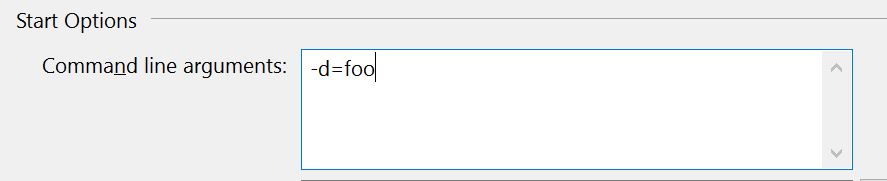

# Starting and stopping apps

## Starting

Starcounter applications are compiled into `.exe` files. These applications are then run inside Starcounter.

Applications in Starcounter are always run in the context of a single database. This means that accessing information in that database is lightning fast. It does not mean that the application is not allowed to access other databases \(more on node-to-node communication later\).

### Running multiple apps

When you run multiple apps in the same database, as with `hello.exe` and `test.cs` in the example below, they are all loaded into the same database process. The code you load keeps adding to the code being loaded into the database.

Starting apps for the first time, even if you have other apps loaded, is fast. The reason for this is that there is no need to recycle the host process. On the other hand, if you want to restart an application, there is one thing that you have to keep in mind: restarting an app requires the host process to be recycled. The consequence of this is that all other apps that are running need to be stopped, unloaded, and started again. Due to this, it takes significantly more time to restart an application when there are other apps running than when you start an application.

For example, if you have three apps up and running and you would like to start another app, let's name it `app4.exe`. Then you would simply run `star app4.exe` which would start the app without much delay. Now, if you want to **restart** two of the other apps, `app1.exe` and `app2.exe` the situation would be different. Simply running `star app1.exe` would require the host process to be recycled, `app2.exe`, `app3.exe`, and `app4.exe` to be stopped, unloaded, and started again. The same would be the case when we restart `app2.exe`. This code describes the gist of the process:

```python
host = [app1, app2, app3, app4]

def star(my_app):
  if my_app in host:
    new_host = []
    for app in host:
      stop(app)
      unload(app)
      start(app)
      new_host.append(app)
    return new_host

  #starts app and adds it to the already running host process
  else:
    start(my_app)
    return host

host = star(app2)
```

To handle this in cases where you would like to restart a set of applications you can run `staradmin stop host` and then start the applications one at a time. This allows us to circumvent the inefficient `for` loop and start the application directly. If you have to restart several applications, this is the preferred approach.

In other cases, where you just want to start an application from scratch or restart one or two applications in a small set of apps, you should simply start, or restart the desired application by running `star myapp.exe`. Starcounter will, in this case, make sure that the state of your applications is maintained and that all applications that were running previously are restarted. This may take some more time, as explained above.

All running Starcounter applications must have a unique name. You cannot run two instances of the same application in a single database.

### Reading the console output

The console output does not go to the standard output \(i.e. console\). After all, your program is likely to run in the cloud or on your local personal server. Instead, any standard output is directed to a server side memory buffer. The Administrator web user interface can monitor the output. If there is no Administrator web session listening to the output, the output is discarded.

In the default Starcounter configuration, the Administrator web interface is available at [http://localhost:8181/](http://localhost:8181/).

To see the console output in Administrator, navigate to the database by clicking on its name \(e.g., `default`\) in the list of databases or navigate to the application by clicking on the application name in the list of applications.

### Starting apps from the command line

To start an app from the command line, you use the `star` command. It accepts .cs files in addition to .exe files.

```bash
C:\> star hello.exe
[Starting "hello.exe" in "Default" on "Personal" (127.0.0.1:8181)]
"hello.exe" started in database "Default". Default port is 8080 (Executable),
8181 (Admin))

C:\> star test.cs
[Starting "test.cs" in "Default" on "Personal" (127.0.0.1:8181)]
"test.cs" started in database "Default". Default port is 8080 (Executable),
8181 (Admin))
```

The command line option `--database` \(or `-d`\) can be used to specify what database to run the application in.

```bash
C:\> star --database=mydb hello.cs
[Starting "hello.cs" in "mydb" on "Personal" (127.0.0.1:8181)]
"hello.cs" started in database "mydb". Default port is 8080 (Executable),
8181 (Admin))
```

### Starting apps from Administrator web interface

In the default Starcounter configuration, the Administrator web interface is available at [http://localhost:8181/](http://localhost:8181/).

Go to [http://localhost:8181/](http://localhost:8181/). Select a database from the "Databases" menu \(e.g. `default`\) or create a new database, then click on "Start Executable". Provide path to the .exe or select it from the disk and press "Start".

### Starting apps from Visual Studio

In Visual Studio, press F5 to start the application. The Starcounter personal server will load the executable and execute it in the Default database context. If the personal server is not running it will be started automatically.

#### Starting app from Visual Studio in a specific database

In fact, Visual Studio plugin supports most of the `star.exe` command line arguments. You can specify particular arguments by altering `Project | Properties | Debug | Command line arguments`. By default, the application is started in a database `default`. To start the application in any other database, such as `foo`, add this to `Command line arguments`: `-d=foo`.



## Stopping

Contrary to desktop programs, the program remains loaded after main has been executed. You can unload all code without stopping the database. The database memory lives in a separate process and the database memory is shared between you program code and the database process.

### Stoping apps from the command line

In order to unload a program, you need to run the `star --stop <application>` command.

```bash
C:\> star --stop hello.cs
[Stopping "hello.cs" in "Default" on "Personal" (127.0.0.1:8181)]
  - Restarting database "Default"
Stopped "hello.cs" in database "Default"
```

### Stopping apps from Administrator web interface

In the default Starcounter configuration, the Administrator web interface is available at [http://localhost:8181/](http://localhost:8181/).

Go to [http://localhost:8181/](http://localhost:8181/). Select a database from the "Databases" menu \(e.g. `default`\). You will see a list of apps running in the selected database. You can use the "Stop" button to unload each of the apps.

### Stopping apps from Visual Studio

You cannot stop an app from Visual Studio.

