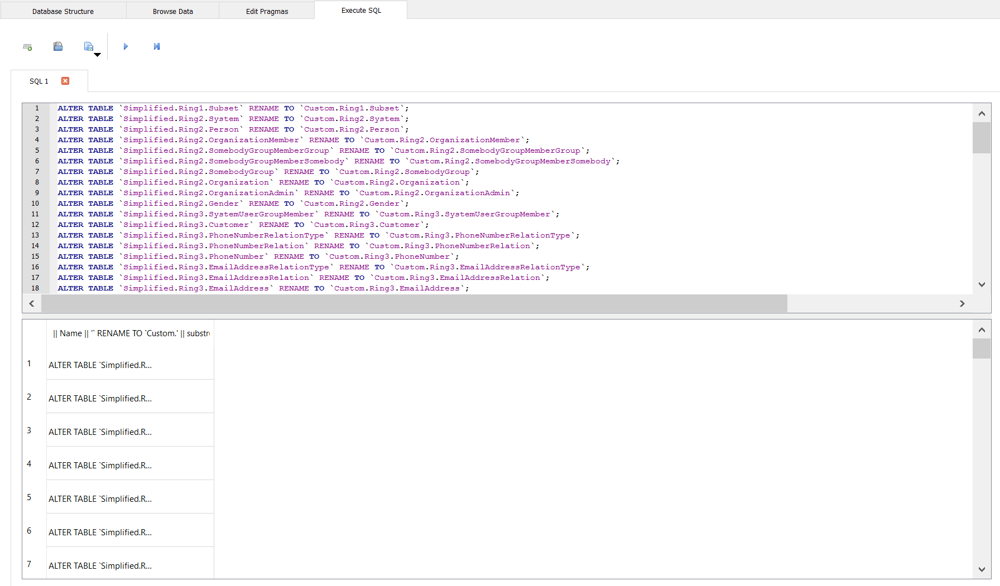
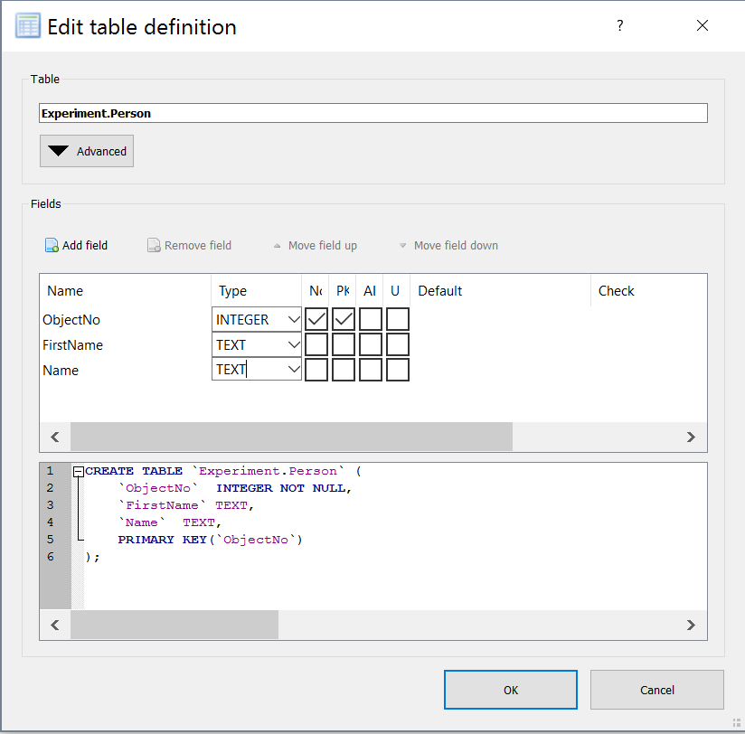
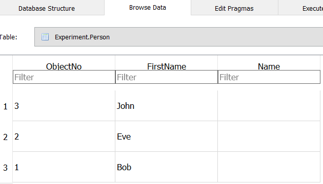
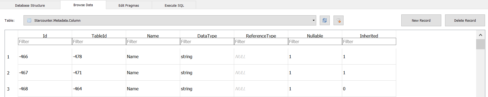

# Using Unload/Reload to Modify Database Schema

When making changes to the database schema of an application, the change has to be made in the database and in the application. This is accomplished by following these steps:

1. Unload the database
2. Modify the schema in the database
3. Modify the schema in the application
4. Reload the database

Before starting this process, make sure that there is a backup of the database in case anything goes awry. Information on how to do that can be found in [Run Starcounter in Production](/guides/working-with-starcounter/run-starcounter-in-production/).

## Unload the Database

To unload the database, the [StarDump](https://github.com/Starcounter/StarDump) tool is used. From Starcounter `2.3.0.5427` and `2.4.0.369` it can found at `C:\Program Files\Starcounter\stardump`.

From the stardump directory, use the `stardump unload` command to unload the database. For example, to unload the `default` database to the Desktop, the following would be used:

```powershell
stardump unload --database default --file C:\Users\[User]\Desktop\Dump
```

This creates the file `Dump.sqlite3` on the desktop.

## Modify the Schema in the Database

In order to open the `sqlite3` file, it is recommended to use [DB Browser for SQLite](http://sqlitebrowser.org/). Using this tool, the schema of the database can be modified. The following examples displays the methods to do almost any schema modification:

### Renaming One Table

If we have the following database schema where we want to change "Teenager" to "Teen":

```cs
[Database]
public class Person
{
    public string FirstName;
}

public class Teenager : Person { }
public class Child : Teenager { }
```

Then, the needed modification is rather limited. In the DB Browser, after unloading the database, the screen should look something like this:


The classes from the application, `Person`, `Teenager` and `Child`, are at the top followed by the `Simplified` tables. The `Simplified` tables can in most cases be disregarded. 

Renaming `Teenager` to `Teen` requires two changes, renaming the table itself, and modifying the metadata accordingly. To rename the table itself, right click on the table in the view above and choose `Modify table...`. Then, simply change `[ApplicationName].Teenager` to `[ApplicationName].Teen`. To make this change in the metadata, go to the tab `Browse Data` and find the table `Starcounter.Metadata.Table`. There, click on `[ApplicationName].Teenager` and rename it to `[ApplicationName].Teen`.

### Renaming Multiple Tables

Renaming multiple tables by going through them one by one is not an efficient strategy if there are many tables to rename. To solve this, an SQL query can be used to generate SQL that makes the changes at once. For example, if the goal is to rename all the `Simplified` tables to go by the name of `Custom`, the following SQL query can be used:

```sql
SELECT 'ALTER TABLE `' || Name || '` RENAME TO `Custom.' || substr(Name, 12) || '`;'
FROM `Starcounter.Metadata.Table`
WHERE Name LIKE 'Simplified.%';
```

This will generate as many SQL queries as there are tables to rename. Copy these generated queries, remove the quotation marks in a text editor, paste them back into the query field in the DB Browser, and run them. It should look something like this:



The tables themselves are now renamed. Lastly, run this query to update the metadata accordingly:

```sql
UPDATE `Starcounter.Metadata.Table`
SET Name = 'Custom.' || substr(Name, 12)
WHERE Name LIKE 'Simplified.%';
```

### Renaming Columns

There is no built in way to rename columns in DB Browser. The method is instead to create a new column with the new name, copy the data into that column, and delete or exclude the old column from the metadata. For example, if the database schema looks like this:

```cs
[Database]
public class Person
{
    public string FirstName;
}

public class Teenager : Person { }
public class Child : Teenager { }
```

The goal is to change `FirstName` to `Name`. To accomplish that, follow these steps:

1. Add a new column. This can be done by right clicking on the table in the `Database Structure` view and choosing `Modify Table...`. In this example case, the change should be applied to `Person`, and the tables that inherits from it, `Teenager` and `Child`. It should look like this:

2. Copy the data to the new column. In the `Person` table, simply copy the data like so:

3. Include new column and exlude old column. In `Starcounter.Metadata.Column`, create new columns by clicking `New Record` and copy all the entries from the old column, except for the Name entry. Then, click on the old columns and delete them by clicking `Delete Record`. In the example it looks like so:


## Modify the Database Schema in the Application

To modify the database schema in the application, simply change it according to the modification done in the database. For example, if the `Teenager` table was renamed to `Teen`, the code would be changed from this:

```cs
[Database]
public class Person
{
    public string FirstName;
}

public class Teenager : Person { }
public class Child : Teenager { }
```

To this:

```cs
[Database]
public class Person
{
    public string FirstName;
}

public class Teen : Person { }
public class Child : Teen { }
```

No matter what change is made, this step is rather trivial. It might even be clever to do this change before modifying the database to get a better overview of the changes.

## Reload the Database

To reload the database, use the `stardump reload` command. For example, to reload the `sqlite3` file "Dump" into the default database, the following would be used:

```powershell
stardump reload --database default --file C:\Users\[User]\Desktop\Dump.sqlite3
```

If the default database already contains data, it is neccessary to delete it and create a new default database first. That is done using the following two commands:

```powershell
stardmin -d=default delete --force db
stardmin -d=default new db DefaultUserHttpPort=8080
```