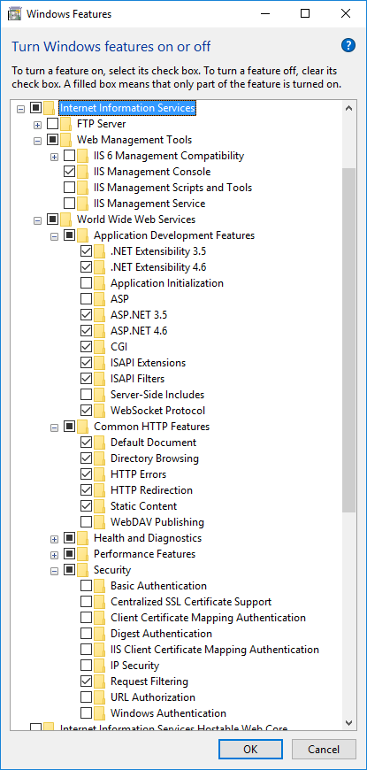
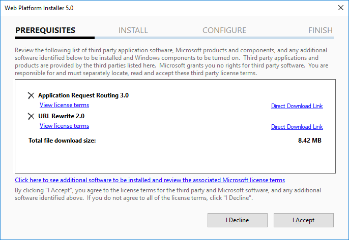
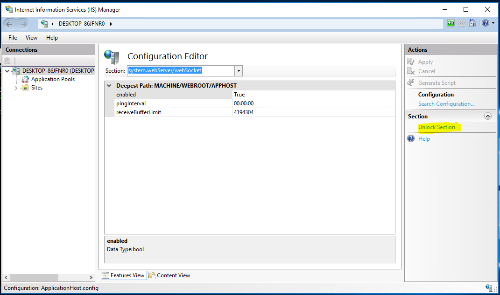
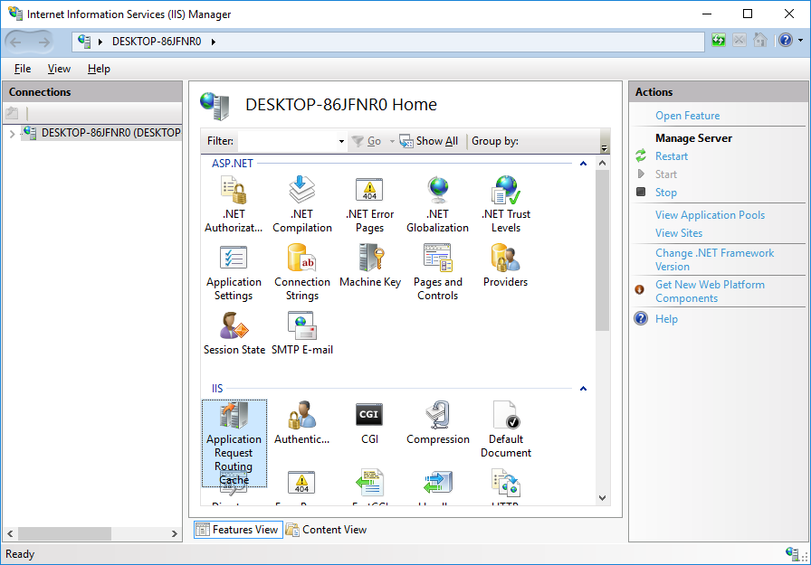
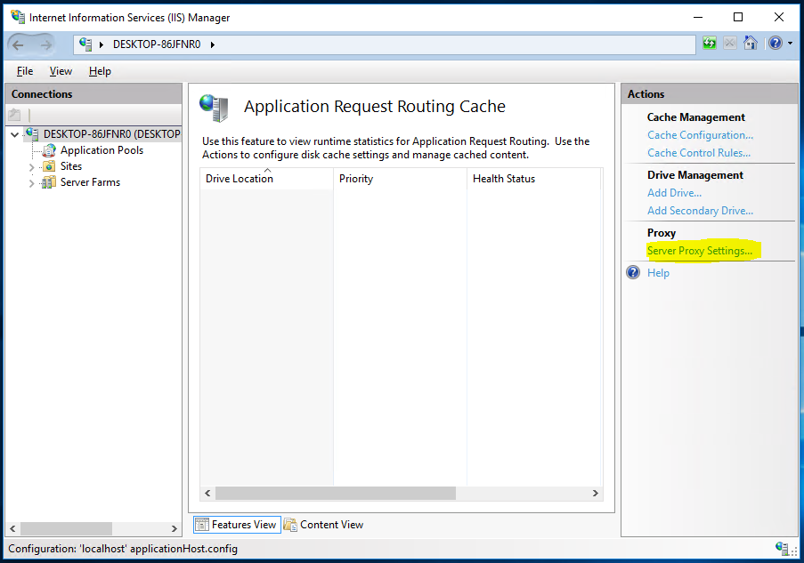
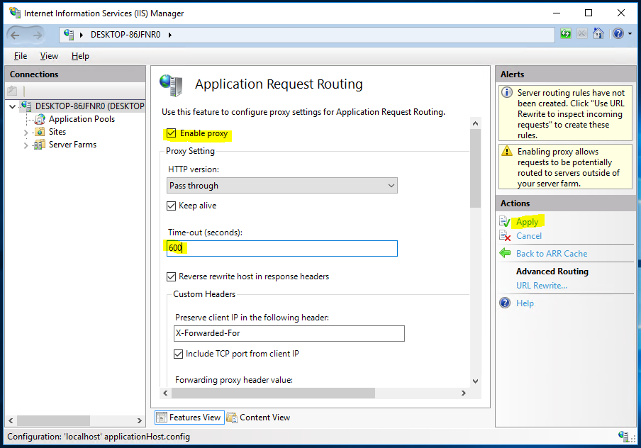

# Using HTTPS on IIS

## Introduction

This article explains how to use Microsoft [Internet Information Server](https://www.iis.net/) \(IIS\) as an HTTPS proxy on top of Starcounter. While NGINX might be a better web server overall, it requires a separate Linux machine. IIS can be installed alongside Starcounter on the same Windows machine.

## Installing IIS

IIS is available from the `Turn Windows features on or off` console.

The following items should be installed.




You can add any extra features if needed.

## Setting up IIS

Open Internet Information Services \(IIS\) Manager from the Start menu. And install the following components with `Get New Web Platform Components`.

* URL Rewrite 2.0
* Application Request Routing 3.0



Enable `system.webServer/webSocket` configuration section via Configuration Editor.




Restart the machine.

Open `Application Request Routing Cache` section and go to it's settings page.





Enable proxy, update timeout to `600` seconds, and click the `Apply` button.




## Setting up IIS Website

By default there should be a `Default Web Site` item in the `Sites` section of IIS. The website should listen on the `80` port. Check that by opening `http://localhost/` in your browser. It should show the default IIS webpage.

Create and configure a new website if the default one is missing or you want to listen on another port rather than `80`.

[Create a self signed HTTPS certificate](https://technet.microsoft.com/en-us/library/cc753127%28v=ws.10%29.aspx) and assign it to the website which should be used as a proxy.

Open `https://localhost/` in your browser and make sure that the default IIS webpage is also shown.

Open or create `web.config` file in the root folder of the website and update it's content to the following.

```markup
<?xml version="1.0" encoding="UTF-8"?>
<configuration>
    <system.webServer>
        <webSocket enabled="true" receiveBufferLimit="4194304" />
        <rewrite>
            <rules>
                <clear />
                <rule name="HTTP -> HTTPS" enabled="true" stopProcessing="true">
                    <match url="(.*)" />
                    <conditions logicalGrouping="MatchAll" trackAllCaptures="false">
                        <add input="{HTTPS}" pattern="^OFF$" />
                    </conditions>
                    <action type="Redirect" url="https://{HTTP_HOST}/{R:1}" redirectType="Temporary" />
                </rule>
                <rule name="80 -> 8080 port" patternSyntax="ECMAScript" stopProcessing="true">
                    <match url="(.*)" />
                    <conditions logicalGrouping="MatchAll" trackAllCaptures="false">
                        <add input="{HTTPS}" pattern="^OFF$" />
                        <add input="{CACHE_URL}" pattern="^(.+)[:][/][/]" />
                    </conditions>
                    <action type="Rewrite" url="{C:1}://localhost:8080/{R:0}" />
                </rule>
                <rule name="80 -> 8080 port, https">
                    <match url="(.*)" />
                    <conditions logicalGrouping="MatchAll" trackAllCaptures="false">
                        <add input="{HTTPS}" pattern="^ON$" />
                    </conditions>
                    <action type="Rewrite" url="http://localhost:8080/{R:0}" />
                </rule>
            </rules>
        </rewrite>
    </system.webServer>
</configuration>
```

**Note:** the rule names can be anything, but better keep it meaningful. The `8080` port should be updated with the port of the Starcounter database IIS should redirect to.

Make sure that Starcounter database is running and the proxy is working.

* `http://localhost/` should redirect to `https://localhost/`
* `https://localhost/` should open `http://localhost:8080/`

