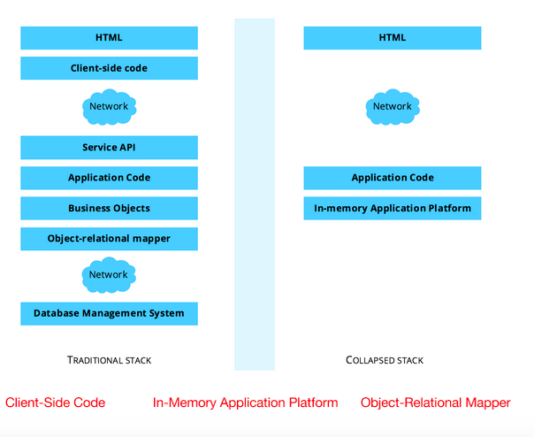

## Complexity and Scalability Tradeoff

In the context of today’s conventional development platforms, the performance capacity of a single server runs out fast. Scaling operations often means scaling out: adding more machines — more layers of complexity — to a multi-tiered network of various kinds of servers, and performance enhancers like multi-node data redundancy, caches, and data grids. An increasing user base leads to a corresponding expansion of tiers and number of machines.

**This scale-out approach comes with some weighty drawbacks:**
– Higher costs for hardware, software, and maintenance
– Increased complexity of development and system control
– Higher disaster risks due to more potential points of failure
– Greater risk for bottlenecks and implementation bugs
– Difficulty identifying roots of problems and their posterior fixings
– The need for costly and mistake-prone inter-module integration and configuration

Together, these drawbacks lead to a drop in performance, reliability, and data consistency — issues impossible to solve by just adding more hardware. This in turn has a negative effect on time-to-market for new releases, user satisfaction, and, as a result, the vitality of the business.

Even if a scaled-out solution contained no complex logic or heavy computations, the amount of hardware required to run it with affordable UX response time is prone to becoming ridiculously large. Unfortunately, such state of affairs reveals not the immaturity of the system’s implementers (as one might reasonably suggest), but rather a considerable fault in the approach itself.

Multi-tier, scale-out, data-excessive architectures can be seen as a tool to solve an effect in popular cases, but not a cause. They work well in different circumstances like social networks, historical data storage, or overnight business intelligence, but produce failures in applications involving the management of valuable resources, including ERP and line-of-business apps.

### Collapsing the Stack

Luckily, instead of attempting to solve the effect—leveraging for local gains with multiple separate tiers—its possible to address the root cause, the development platform itself. Implementing the platform according to updated fundamentals allows for a new breed of applications, globally optimized by simplicity, performance, and modularity. This vision is summarized by the concept of collapsing the stack. For software development, this means making the code concise, eliminating glue code, simplifying system architecture, increasing flexibility, and thus the scalability of the resulting solution. In business terms, this translates to improved agility, competitiveness, and reduced total cost of ownership.

Figure 1: Collapsing the software stack; traditional vs. collapsed

Implementing “the collapsed stack” entails making a shift from engineering the tiers and their integration, to operating within a focused application platform. All features from tiers (like network communication, data persistency, and failover) are available as before. But now the tiers are either virtualized or removed in favor of simpler facilities. The shift does not mean moving from the modularity of layers to a monolithic product, however. The difference is that highly modular solutions can be facilitated without sacrificing performance, simplicity, and cost.